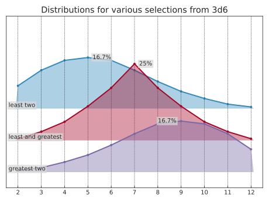

<!---
  Copyright and other protections apply.
  Please see the accompanying LICENSE file for rights and restrictions governing use of this software.
  All rights not expressly waived or licensed are reserved.
  If that file is missing or appears to be modified from its original, then please contact the author before viewing or using this software in any capacity.

  !!!!!!!!!!!!!!!!!!!!!!!!!!!!!!!!!!!!!!!!!!!!!!!!!!!!!!!!!!!!!!!!!!!!
  !!!!!!!!!!!!!!! IMPORTANT: READ THIS BEFORE EDITING! !!!!!!!!!!!!!!!
  !!!!!!!!!!!!!!!!!!!!!!!!!!!!!!!!!!!!!!!!!!!!!!!!!!!!!!!!!!!!!!!!!!!!
  Please keep each sentence on its own unwrapped line.
  It looks like crap in a text editor, but it has no effect on rendering, and it allows much more useful diffs.
  Thank you!
  -->
<!-- BEGIN MONKEY PATCH --
For typing:

>>> import sympy  # type: ignore[import-untyped]
>>> import sympy.abc  # type: ignore[import-untyped]
>>> import sympy.solvers  # type: ignore[import-untyped]
>>> import sympy.solvers.inequalities  # type: ignore[import-untyped]

  -- END MONKEY PATCH -->

# Core concepts

`dyce` provides two core primitives for basic finite discrete probability computations.

[`H` objects][dyce.H] represent finite discrete probability distributions as histograms.
They map outcomes to integer counts.
Each outcome’s probability is its count by the histogram’s total count.

[`P` objects][dyce.P] represent pools (sorted sequences) of histograms.
If all you need is to aggregate outcomes (sums) from rolling a bunch of dice (or perform calculations on aggregate outcomes), [`H` objects][dyce.H] are probably sufficient.
If you need to narrow outcomes prior to computing aggregates (e.g., taking the highest and lowest of each possible roll of *n* dice), that’s where [`P` objects][dyce.P] come in.

As a wise person whose name has been lost to history once said: “Language is imperfect. If at all possible, shut up and point.”
So with that illuminating (or perhaps impenetrable) introduction out of the way, let’s dive into some examples!

## Basic examples

### Histograms

`H(n)` is shorthand for explicitly enumerating outcomes `#!math [{ {1} .. {n} }]`, each with a frequency of 1.
A normal, six-sided die (d6) can be modeled as:

    >>> from dyce import H
    >>> H(6)
    H({1: 1, 2: 1, 3: 1, 4: 1, 5: 1, 6: 1})

Tuples with repeating outcomes are accumulated.
A six-sided “2, 3, 3, 4, 4, 5” die can be modeled as:

    >>> H((2, 3, 3, 4, 4, 5))
    H({2: 1, 3: 2, 4: 2, 5: 1})

A fudge die can be modeled as:

    >>> H((-1, 0, 1))
    H({-1: 1, 0: 1, 1: 1})

Python’s matrix multiplication operator (`@`) is used to express the number of a particular die (roughly equivalent to the “`d`” operator in common notations).
The outcomes of rolling and summing two six-sided dice (2d6) are:

    >>> 2 @ H(6)
    H({2: 1, 3: 2, 4: 3, 5: 4, 6: 5, 7: 6, 8: 5, 9: 4, 10: 3, 11: 2, 12: 1})

That shows one way to make `2`, two ways to make `3`, three ways to make `4`, etc.

[`dyce.d`][dyce.d] has some convenient abbreviations for commonly found dice:

    >>> from dyce.d import d6, h2d6
    >>> d6 == H(6)
    True
    >>> h2d6 == 2 @ d6
    True

### Pools

A pool of two six-sided dice is:

    >>> from dyce import P
    >>> P(d6, d6)
    2@P(H({1: 1, 2: 1, 3: 1, 4: 1, 5: 1, 6: 1}))

Where `n` is an integer, `P(n, ...)` is shorthand for `P(H(n), ...)`.
Python’s matrix multiplication operator (`@`) can also be used with pools.
The above can be expressed more succinctly.

    >>> from dyce.d import p2d6
    >>> 2 @ P(6) == P(d6, d6) == p2d6
    True

When compared with a histogram, a pool is treated as the distribution of its summed outcomes.
We can validate that a pool representing a pair of Sicherman dice is equivalent to a histogram representing 2d6.

??? info "[Sicherman dice](https://en.wikipedia.org/wiki/Sicherman_dice)"

    > Sicherman dice … are a pair of 6-sided dice with non-standard numbers—one with the sides 1, 2, 2, 3, 3, 4 and the other with the sides 1, 3, 4, 5, 6, 8.
    > They are notable as the only pair of 6-sided dice that are not [standard 6-sided] dice, bear only positive integers, and have the same probability distribution for [their] sum as [two standard 6-sided] dice.

<!-- -->

    >>> d_sicherman = P(H((1, 2, 2, 3, 3, 4)), H((1, 3, 4, 5, 6, 8)))
    >>> d_sicherman == h2d6
    True

### Arithmetic and formatting

Both histograms and pools support arithmetic operations.
`3×(2d6+4)` is:

    >>> 3 * (2 @ H(6) + 4)
    H({18: 1, 21: 2, 24: 3, 27: 4, 30: 5, 33: 6, 36: 5, 39: 4, 42: 3, 45: 2, 48: 1})

A pool can be “flattened” to a histogram via its [`P.h` method][dyce.P.h].

    >>> p2d6.h()
    H({2: 1, 3: 2, 4: 3, 5: 4, 6: 5, 7: 6, 8: 5, 9: 4, 10: 3, 11: 2, 12: 1})

Arithmetic operations implicitly flatten pools into histograms.

    >>> 3 * (2 @ P(6) + 4)
    H({18: 1, 21: 2, 24: 3, 27: 4, 30: 5, 33: 6, 36: 5, 39: 4, 42: 3, 45: 2, 48: 1})

Histograms provide rudimentary text formatting for convenience.

    >>> print(h2d6.format_short())
    {avg: 7.00, 2:  2.78%, 3:  5.56%, 4:  8.33%, 5: 11.11%, 6: 13.89%, 7: 16.67%, 8: 13.89%, 9: 11.11%, 10:  8.33%, 11:  5.56%, 12:  2.78%}
    >>> print(h2d6.format(width=65))
    avg |    7.00
    std |    2.42
      2 |   2.78% |#
      3 |   5.56% |##
      4 |   8.33% |####
      5 |  11.11% |#####
      6 |  13.89% |######
      7 |  16.67% |########
      8 |  13.89% |######
      9 |  11.11% |#####
     10 |   8.33% |####
     11 |   5.56% |##
     12 |   2.78% |#

### Outcome selection

Histograms should be sufficient for most calculations.
Pools are useful for “keeping” or “taking” (selecting) some of each roll’s outcomes.
[`P.at`][dyce.P.at] sums the selected outcomes into a histogram.
[`P.rolls_with_counts`][dyce.P.rolls_with_counts] yields the selected rolls and their counts.
Outcomes in rolls are ordered from least to greatest.
Provide one or more integers, slices, or a mix thereof to those methods to select outcomes by their ordered positions.

Taking the least two, least and greatest, or greatest two faces when rolling three six-sided dice:

    >>> p3d6 = 3 @ P(6)
    >>> print(p3d6.at(0, 1).format(width=65))  # least two
    avg |    5.54
    std |    2.21
      2 |   7.41% |###
      3 |  12.50% |######
      4 |  15.74% |#######
      5 |  16.67% |########
      6 |  15.74% |#######
      7 |  12.50% |######
      8 |   8.80% |####
      9 |   5.56% |##
     10 |   3.24% |#
     11 |   1.39% |
     12 |   0.46% |

<!-- -->

    >>> print(p3d6.at(0, -1).format(width=65))  # least and greatest
    avg |    7.00
    std |    1.85
      2 |   0.46% |
      3 |   2.78% |#
      4 |   6.02% |###
      5 |  11.11% |#####
      6 |  17.13% |########
      7 |  25.00% |############
      8 |  17.13% |########
      9 |  11.11% |#####
     10 |   6.02% |###
     11 |   2.78% |#
     12 |   0.46% |

<!-- -->

    >>> print(p3d6.at(slice(-2, None)).format(width=65))  # greatest two
    avg |    8.46
    std |    2.21
      2 |   0.46% |
      3 |   1.39% |
      4 |   3.24% |#
      5 |   5.56% |##
      6 |   8.80% |####
      7 |  12.50% |######
      8 |  15.74% |#######
      9 |  16.67% |########
     10 |  15.74% |#######
     11 |  12.50% |######
     12 |   7.41% |###

!!! bug "Mind your parentheses"

    Parentheses are often needed when constructing a pool and making selections in the same expression.
    This is because `@` has a [lower precedence](https://docs.python.org/3/reference/expressions.html#operator-precedence) than other operators like `.`.

        >>> 3 @ P(6).at(2)  # equivalent to 3 @ (P(6).at(2))
        Traceback (most recent call last):
          ...
        IndexError: tuple index out of range
        >>> (3 @ P(6)).at(2)
        H({1: 1, 2: 7, 3: 19, 4: 37, 5: 61, 6: 91})

Pools are immutable, ordered sequences.
Like histograms are grouped, and groups are sorted.
Slicing creates a new pool with the selected histograms.

    >>> (2 @ P(4, 6, 8))[:3]
    P(2@P(H({1: 1, 2: 1, 3: 1, 4: 1})), H({1: 1, 2: 1, 3: 1, 4: 1, 5: 1, 6: 1}))

!!! note "A pool’s histogram order is distinct from its rolls’ order"

    Histograms are sorted in a pool.

        >>> list(P(4, 6, 20)) == list(P(20, 6, 4))
        True

    Rolls are sorted least-to-greatest, irrespective of the histogram’s position in the pool from which each outcome came.

        >>> odds = H({1: 1, 3: 1})
        >>> evens = H({2: 1, 4: 1})
        >>> list(P(odds, evens).rolls_with_counts())
        [((1, 2), 1), ((2, 3), 1), ((1, 4), 1), ((3, 4), 1)]

    Indexes used in roll selection, such as with [`P.at`][dyce.P.at] and [`P.rolls_with_counts`][dyce.P.rolls_with_counts], reference positions in sorted rolls.

        >>> list(P(odds, evens).rolls_with_counts(-1))
        [((2,), 1), ((3,), 1), ((4,), 2)]

### Comparisons and counting

Outcome comparisons produces a histogram with `False` and `True` outcomes.
Because `==`, `!=`, `<`, etc. compare whole histograms, `H` provides [`H.eq`][dyce.H.eq], [`H.ne`][dyce.H.ne], [`H.lt`][dyce.H.lt], etc. for comparing outcomes.

    >>> H({1: 1, 2: 1, 3: 1}) >= 2  # type: ignore[operator]
    Traceback (most recent call last):
      ...
    TypeError: '>=' not supported between instances of 'H' and 'int'
    >>> H({1: 1, 2: 1, 3: 1}).ge(2)
    H({False: 1, True: 2})

`False` and `True` behave as zero and one in arithmetic.
Summing these outcomes counts how many dice meet the condition.
To calculate the probability that all three d6 outcomes are even:

    >>> from dyce.d import d6
    >>> d6_even = (d6 % 2).eq(0)
    >>> d6_even  # basically a fair coin whose sides are False and True
    H({False: 3, True: 3})
    >>> number_of_evens_in_3d6 = 3 @ d6_even  # our counting trick
    >>> number_of_evens_in_3d6
    H({0: 27, 1: 81, 2: 81, 3: 27})
    >>> all_three_are_even = number_of_evens_in_3d6.eq(3)
    >>> print(all_three_are_even.format_short())
    {avg: 0.12, False: 87.50%, True: 12.50%}

## Visualization

That covers both backends. I’d make the descriptions more concrete and remove “more sophisticated”:

[`H.probability_items`][dyce.H.probability_items] yields outcome and probability pairs for use with plotting packages.
If [Matplotlib](https://matplotlib.org/stable/api/index.html) is installed, [`dyce.viz.matplotlib`][dyce.viz.matplotlib] provides functions for plotting histograms.
[`dyce.viz.plotly`][dyce.viz.plotly] provides figure specifications for use with Plotly.
[`dyceum`](https://github.com/posita/dyceum/) provides additional interactive visualization tools.

=== "Matplotlib"

    ??? example "Visualization source code"

            --8<-- "docs-src/plot_matplotlib_3d6_selection.py:viz"

    <!-- Should match any title of the corresponding plot title -->
    <!--
      TODO(@posita): https://github.com/zensical/zensical/issues/975 -
      source[srcset] should be "images/..."
      -->
    <picture>
      <source media="(prefers-color-scheme: dark)" srcset="../images/plot_matplotlib_3d6_selection_dark.svg">
      <source media="(prefers-color-scheme: light)" srcset="../images/plot_matplotlib_3d6_selection_light.svg">
      
    </picture>

    [Run this example in JupyterLite](jupyter/lab/index.html?path=3d6_selection.ipynb): 

=== "Plotly"

    ??? example "Visualization source code"

            --8<-- "docs-src/plot_plotly_3d6_selection.py:viz"

    --8<-- "docs-src/snippets/plot_plotly_3d6_selection.html"

## Further exploration

See the [examples](examples.md) for worked calculations, or consult the [API reference](dyce.md).

Anywhere you see a JupyterLite logo , you can click on it to immediately start tinkering with a temporal instance of that example.
Just be aware that changes are stored in browser memory, so make sure to download any notebooks you want to preserve.
