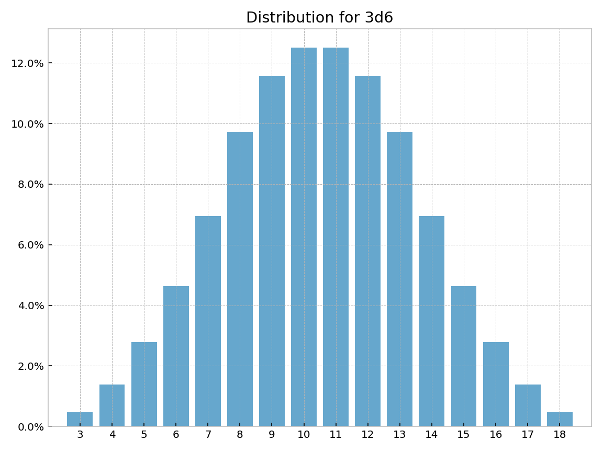

<!---
  Copyright and other protections apply. Please see the accompanying LICENSE file for
  rights and restrictions governing use of this software. All rights not expressly
  waived or licensed are reserved. If that file is missing or appears to be modified
  from its original, then please contact the author before viewing or using this
  software in any capacity.

  !!!!!!!!!!!!!!!!!!!!!!!!!!!!!!!!!!!!!!!!!!!!!!!!!!!!!!!!!!!!!!!!!!!!
  !!!!!!!!!!!!!!! IMPORTANT: READ THIS BEFORE EDITING! !!!!!!!!!!!!!!!
  !!!!!!!!!!!!!!!!!!!!!!!!!!!!!!!!!!!!!!!!!!!!!!!!!!!!!!!!!!!!!!!!!!!!
  Please keep each sentence on its own unwrapped line.
  It looks like crap in a text editor, but it has no effect on rendering, and it allows much more useful diffs.
  Thank you!
-->

``dyce`` provides two core primitives for enumeration[^1].

[^1]:

    ``dyce`` also provides additional primitives ([``R`` objects][dyce.r.R] and their kin) which are useful for producing weighted randomized rolls without the overhead of enumeration.
    These are covered [seperately](rollin.md).


``` python
>>> from dyce import H, P

```

[``H`` objects][dyce.h.H] represent histograms for modeling discrete outcomes.
They encode finite discrete probability distributions as integer counts without any denominator.
[``P`` objects][dyce.p.P] represent pools (ordered sequences) of histograms.
If all you need is to aggregate outcomes (sums) from rolling a bunch of dice (or perform calculations on aggregate outcomes), [``H`` objects][dyce.h.H] are probably sufficient.
If you need to _select_ certain histograms from a group prior to computing aggregate outcomes (e.g., taking the highest and lowest of each possible roll of *n* dice), that’s where [``P`` objects][dyce.p.P] come in.

As a wise person whose name has been lost to history once said: “Language is imperfect. If at all possible, shut up and point.”
So with that illuminating (or perhaps impenetrable) introduction out of the way, let’s dive into some examples!

## Basic examples

A six-sided die can be modeled as:

``` python
>>> H(6)
H({1: 1, 2: 1, 3: 1, 4: 1, 5: 1, 6: 1})

```

``#!python H(n)`` is shorthand for explicitly enumerating outcomes $[{ {1} .. {n} }]$, each with a frequency of 1.

``` python
>>> H(6) == H({1: 1, 2: 1, 3: 1, 4: 1, 5: 1, 6: 1})
True

```

Tuples with repeating outcomes are accumulated.
A six-sided “2, 3, 3, 4, 4, 5” die can be modeled as:

``` python
>>> H((2, 3, 3, 4, 4, 5))
H({2: 1, 3: 2, 4: 2, 5: 1})

```

A fudge die can be modeled as:

``` python
>>> H((-1, 0, 1))
H({-1: 1, 0: 1, 1: 1})

```

Python’s matrix multiplication operator (``@``) is used to express the number of a particular die (roughly equivalent to the “``d``” operator in common notations). The outcomes of rolling two six-sided dice (``2d6``) are:

``` python
>>> 2@H(6)
H({2: 1, 3: 2, 4: 3, 5: 4, 6: 5, 7: 6, 8: 5, 9: 4, 10: 3, 11: 2, 12: 1})

```

A pool of two six-sided dice is:

``` python
>>> P(H(6), H(6))
2@P(H({1: 1, 2: 1, 3: 1, 4: 1, 5: 1, 6: 1}))

```

Where ``#!python n`` is an integer, ``#!python P(n, ...)`` is shorthand for ``#!python P(H(n), ...)``.
Python’s matrix multiplication operator (``@``) can also be used with pools.
The above can be expressed more succinctly.

``` python
>>> 2@P(6)
2@P(H({1: 1, 2: 1, 3: 1, 4: 1, 5: 1, 6: 1}))

```

Pools (in this case, [Sicherman dice](https://en.wikipedia.org/wiki/Sicherman_dice)) can be compared to histograms.

``` python
>>> d_sicherman = P(H((1, 2, 2, 3, 3, 4)), H((1, 3, 4, 5, 6, 8)))
>>> d_sicherman == 2@H(6)
True

```

Both histograms and pools support arithmetic operations.
``3×(2d6+4)`` is:

``` python
>>> 3*(2@H(6)+4)
H({18: 1, 21: 2, 24: 3, 27: 4, 30: 5, 33: 6, 36: 5, 39: 4, 42: 3, 45: 2, 48: 1})

```

The results show there is one way to make ``#!python 18``, two ways to make ``#!python 21``, three ways to make ``#!python 24``, etc.

Histograms provide rudimentary formatting for convenience.

``` python
>>> print((2@H(6)).format())
avg |    7.00
std |    2.42
var |    5.83
  2 |   2.78% |#
  3 |   5.56% |##
  4 |   8.33% |####
  5 |  11.11% |#####
  6 |  13.89% |######
  7 |  16.67% |########
  8 |  13.89% |######
  9 |  11.11% |#####
 10 |   8.33% |####
 11 |   5.56% |##
 12 |   2.78% |#

```

The [Miwin-Distribution](https://en.wikipedia.org/wiki/Miwin%27s_dice#Cumulative_frequency) is:

``` python
>>> miwin_iii = H((1, 2, 5, 6, 7, 9))
>>> miwin_iv = H((1, 3, 4, 5, 8, 9))
>>> miwin_v = H((2, 3, 4, 6, 7, 8))
>>> miwin_dist = miwin_iii + miwin_iv + miwin_v ; miwin_dist
H({4: 1, 5: 2, 6: 3, 7: 4, 8: 7, ..., 22: 7, 23: 4, 24: 3, 25: 2, 26: 1})
>>> print((miwin_dist).format(scaled=True))
avg |   15.00
std |    4.47
var |   20.00
  4 |   0.46% |##
  5 |   0.93% |#####
  6 |   1.39% |#######
  7 |   1.85% |##########
  8 |   3.24% |##################
  9 |   4.17% |#######################
 10 |   4.63% |##########################
 11 |   5.09% |############################
 12 |   7.87% |############################################
 13 |   8.80% |#################################################
 14 |   8.33% |###############################################
 15 |   6.48% |####################################
 16 |   8.33% |###############################################
 17 |   8.80% |#################################################
 18 |   7.87% |############################################
 19 |   5.09% |############################
 20 |   4.63% |##########################
 21 |   4.17% |#######################
 22 |   3.24% |##################
 23 |   1.85% |##########
 24 |   1.39% |#######
 25 |   0.93% |#####
 26 |   0.46% |##

```

One way to model the outcomes of subtracting the lesser of two six-sided dice from the greater is:

``` python
>>> abs(H(6) - H(6))
H({0: 6, 1: 10, 2: 8, 3: 6, 4: 4, 5: 2})

```

Arithmetic operations implicitly “flatten” pools into histograms.

``` python
>>> 3*(2@P(6)+4)
H({18: 1, 21: 2, 24: 3, 27: 4, 30: 5, 33: 6, 36: 5, 39: 4, 42: 3, 45: 2, 48: 1})
>>> abs(P(6) - P(6))
H({0: 6, 1: 10, 2: 8, 3: 6, 4: 4, 5: 2})

```

Histograms should be sufficient for most calculations.
However, pools are useful for “taking” (selecting) only some of each roll’s outcomes.
This is done by providing one or more index arguments to the [``P.h`` method][dyce.p.P.h] or the [``P.rolls_with_counts`` method][dyce.p.P.rolls_with_counts].
Indexes can be integers, slices, or a mix thereof.
Outcome indexes are ordered from least to greatest with negative values counting from the right, as one would expect (i.e., ``#!python [0]``, ``#!python [1]``, …, ``#!python [-2]``, ``#!python [-1]``).
Summing the least two faces when rolling three six-sided dice would be:

``` python
>>> 3@P(6)
3@P(H({1: 1, 2: 1, 3: 1, 4: 1, 5: 1, 6: 1}))
>>> (3@P(6)).h(0, 1)  # see warning below about parentheses
H({2: 16, 3: 27, 4: 34, 5: 36, 6: 34, 7: 27, 8: 19, 9: 12, 10: 7, 11: 3, 12: 1})

```

!!! bug "Mind your parentheses"

    Parentheses are needed in the above example because ``#!python @`` has a [lower precedence](https://docs.python.org/3/reference/expressions.html#operator-precedence) than ``#!python .`` and ``#!python […]``.

    ``` python
    >>> 2@P(6).h(1)  # equivalent to 2@(P(6).h(1))
    Traceback (most recent call last):
    ...
    IndexError: tuple index out of range
    >>> (2@P(6)).h(1)
    H({1: 1, 2: 3, 3: 5, 4: 7, 5: 9, 6: 11})

    ```

Taking the least, middle, or greatest face when rolling three six-sided dice would be:

``` python
>>> p_3d6 = 3@P(6)
>>> p_3d6.h(0)
H({1: 91, 2: 61, 3: 37, 4: 19, 5: 7, 6: 1})
>>> print(p_3d6.h(0).format())
avg |    2.04
std |    1.14
var |    1.31
  1 |  42.13% |#####################
  2 |  28.24% |##############
  3 |  17.13% |########
  4 |   8.80% |####
  5 |   3.24% |#
  6 |   0.46% |

```

``` python
>>> p_3d6.h(1)
H({1: 16, 2: 40, 3: 52, 4: 52, 5: 40, 6: 16})
>>> print(p_3d6.h(1).format())
avg |    3.50
std |    1.37
var |    1.88
  1 |   7.41% |###
  2 |  18.52% |#########
  3 |  24.07% |############
  4 |  24.07% |############
  5 |  18.52% |#########
  6 |   7.41% |###

```

``` python
>>> p_3d6.h(2)
H({1: 1, 2: 7, 3: 19, 4: 37, 5: 61, 6: 91})
>>> print(p_3d6.h(-1).format())
avg |    4.96
std |    1.14
var |    1.31
  1 |   0.46% |
  2 |   3.24% |#
  3 |   8.80% |####
  4 |  17.13% |########
  5 |  28.24% |##############
  6 |  42.13% |#####################

```

Summing the greatest and the least faces when rolling a typical six-die polygonal set would be:

``` python
>>> d10 = H(10)-1 ; d10  # a common “d10” with faces [0 .. 9]
H({0: 1, 1: 1, 2: 1, 3: 1, 4: 1, 5: 1, 6: 1, 7: 1, 8: 1, 9: 1})
>>> h = P(4, 6, 8, d10, 12, 20).h(0, -1)
>>> print(h.format(scaled=True))
avg |   13.48
std |    4.40
var |   19.39
  1 |   0.00% |
  2 |   0.01% |
  3 |   0.06% |
  4 |   0.30% |#
  5 |   0.92% |#####
  6 |   2.03% |###########
  7 |   3.76% |####################
  8 |   5.57% |##############################
  9 |   7.78% |###########################################
 10 |   8.99% |##################################################
 11 |   8.47% |###############################################
 12 |   8.64% |################################################
 13 |   8.66% |################################################
 14 |   6.64% |####################################
 15 |   5.62% |###############################
 16 |   5.16% |############################
 17 |   5.00% |###########################
 18 |   5.00% |###########################
 19 |   5.00% |###########################
 20 |   5.00% |###########################
 21 |   4.50% |#########################
 22 |   2.01% |###########
 23 |   0.73% |####
 24 |   0.18% |

```

Pools are ordered and iterable.

``` python
>>> list(2@P(8, 4, 6))
[H({1: 1, 2: 1, 3: 1, 4: 1}), H({1: 1, 2: 1, 3: 1, 4: 1}), H({1: 1, 2: 1, 3: 1, 4: 1, 5: 1, 6: 1}), H({1: 1, 2: 1, 3: 1, 4: 1, 5: 1, 6: 1}), H({1: 1, 2: 1, 3: 1, 4: 1, 5: 1, 6: 1, 7: 1, 8: 1}), H({1: 1, 2: 1, 3: 1, 4: 1, 5: 1, 6: 1, 7: 1, 8: 1})]

```

Indexing selects particular histograms into a new pool.

``` python
>>> 2@P(8, 4, 6)
P(2@P(H({1: 1, 2: 1, 3: 1, 4: 1})), 2@P(H({1: 1, 2: 1, 3: 1, 4: 1, 5: 1, 6: 1})), 2@P(H({1: 1, 2: 1, 3: 1, 4: 1, 5: 1, 6: 1, 7: 1, 8: 1})))
>>> (2@P(8, 4, 6))[:2]
2@P(H({1: 1, 2: 1, 3: 1, 4: 1}))
>>> (2@P(8, 4, 6))[::3]
P(H({1: 1, 2: 1, 3: 1, 4: 1}), H({1: 1, 2: 1, 3: 1, 4: 1, 5: 1, 6: 1}))

```

An inefficient way to enumerate all possible rolls is:

``` python
>>> import itertools
>>> list(itertools.product(*P(-3, 3)))
[(-3, 1), (-3, 2), (-3, 3), (-2, 1), (-2, 2), (-2, 3), (-1, 1), (-1, 2), (-1, 3)]

```

Both histograms and pools support various comparison operations.
The odds of observing all even faces when rolling $n$ six-sided dice, for $n$ in $[1..6]$ is:

``` python
>>> d6_even = H(6).is_even()
>>> for n in range(6, 0, -1):
...   number_of_evens_in_nd6 = n@d6_even
...   all_even = number_of_evens_in_nd6.eq(n)
...   print(f"{n: >2}d6: {all_even[1] / all_even.total: >6.2%}")
 6d6:  1.56%
 5d6:  3.12%
 4d6:  6.25%
 3d6: 12.50%
 2d6: 25.00%
 1d6: 50.00%

```

The odds of scoring at least one nine or higher on any single die when rolling $n$ “[exploding][dyce.evaluation.explode]” six-sided dice, for $n$ in $[1..10]$ is:

``` python
>>> from dyce.evaluation import explode
>>> # By the time we're rolling a third die, we're guaranteed a nine or higher, so we only need to look that far
>>> exploding_d6 = explode(H(6), limit=2)
>>> for n in range(10, 0, -1):
...   d6e_ge_9 = exploding_d6.ge(9)
...   number_of_nines_or_higher_in_nd6e = n@d6e_ge_9
...   at_least_one_9 = number_of_nines_or_higher_in_nd6e.ge(1)
...   print(f"{n: >2}d6-exploding: {at_least_one_9[1] / at_least_one_9.total: >6.2%}")
10d6-exploding: 69.21%
 9d6-exploding: 65.36%
 8d6-exploding: 61.03%
 7d6-exploding: 56.15%
 6d6-exploding: 50.67%
 5d6-exploding: 44.51%
 4d6-exploding: 37.57%
 3d6-exploding: 29.77%
 2d6-exploding: 20.99%
 1d6-exploding: 11.11%

```

## Dependent probabilities

Where we can identify independent terms and reduce the dependent term to a calculation solely involving independent terms, dependent probabilities can often be compactly expressed via an [``expandable``][dyce.evaluation.expandable]-decorated function or callback passed to [``foreach``][dyce.evaluation.foreach].
First, we express independent terms as histograms or pools.
Second, we express the dependent term as a function that will be called once for each of the Cartesian product of the results from each independent term.
Results are passed to the dependent function from independent histogram terms as [``HResult`` objects][dyce.evaluation.HResult] or from independent pool terms as [``PResult`` objects][dyce.evaluation.PResult].
Finally, we pass the dependent function to [``foreach``][dyce.evaluation.foreach], along with the independent terms, or, in the alternative, we decorate the function with [``expandable``][dyce.evaluation.expandable], and call it with the independent terms.

To illustrate, say we want to roll a d6 and compare whether the result is strictly greater than its distance from some constant.

``` python
>>> from dyce.evaluation import HResult, foreach
>>> d6 = H(6)  # independent term
>>> constant = 4

>>> def outcome_strictly_greater_than_constant(h_result: HResult):
...   return h_result.outcome > abs(h_result.outcome - constant)  # dependent term

>>> print(foreach(outcome_strictly_greater_than_constant, h_result=d6).format())
avg |    0.67
std |    0.47
var |    0.22
  0 |  33.33% |################
  1 |  66.67% |#################################

```

Instead of a constant, let’s use another die as a second independent term.
We’ll roll a d4 and a d6 and compare whether the d6 is strictly greater than the absolute difference between dice.


``` python
>>> d4 = H(4)  # first independent term
>>> d6 = H(6)  # second independent term

>>> def second_is_strictly_greater_than_first(first: HResult, second: HResult):
...   return second.outcome > abs(first.outcome - second.outcome)  # dependent term

>>> h = foreach(second_is_strictly_greater_than_first, first=d4, second=d6)
>>> print(h.format())
avg |    0.83
std |    0.37
var |    0.14
  0 |  16.67% |########
  1 |  83.33% |#########################################

```

In the alternative, one could nest [``expandable``][dyce.evaluation.expandable] functions, where the innermost holds the dependent term, and the outer functions each establish the scope of their respective independent outcomes.
However, this isn’t very readable, and is often less efficient than using a single function.

``` python
>>> from dyce.evaluation import expandable

>>> @expandable
... def sub_first(first: HResult):
...
...   @expandable
...   def sub_second(second: HResult):
...     res = second.outcome > abs(first.outcome - second.outcome)
...     return res
...
...   return sub_second(d6)

>>> sub_first(d4, limit=-1) == h
True

```

This technique also works where the dependent term requires inspection of *rolls* from one or more pools as independent terms.
Let’s say we have two pools.
A roll from the first pool wins if it shows no duplicates but a roll from the second does.
A roll from the second pool wins if it shows no duplicates but a roll from the first does.
Otherwise, it’s a tie (i.e., if neither or both rolls show duplicates).
Let’s compare how three six-sided dice fair against two four-sided dice.

``` python
>>> from dyce.evaluation import PResult
>>> from enum import IntEnum

>>> class DupeVs(IntEnum):
...   SECOND_WINS = -1  # where second.roll shows no duplicates, but first.roll does
...   TIE = 0  # where both rolls show no duplicates or rolls pools have duplicates
...   FIRST_WINS = 1  # where first.roll shows no duplicates, but second.roll does

>>> def compare_duplicates(first: PResult, second: PResult):
...   return DupeVs((len(set(first.roll)) == len(first.roll)) - (len(set(second.roll)) == len(second.roll)))

>>> h = foreach(compare_duplicates, first=P(6, 6, 6), second=P(4, 4)) ; h
H({<DupeVs.SECOND_WINS: -1>: 12,
 <DupeVs.TIE: 0>: 19,
 <DupeVs.FIRST_WINS: 1>: 5})
>>> print(h.format())
avg |   -0.19
std |    0.66
var |    0.43
 -1 |  33.33% |################
  0 |  52.78% |##########################
  1 |  13.89% |######

```

## Visualization

[``H`` objects][dyce.h.H] provide a [``distribution`` method][dyce.h.H.distribution] and a [``distribution_xy`` method][dyce.h.H.distribution_xy] to ease integration with plotting packages like [``matplotlib``](https://matplotlib.org/stable/api/index.html).
In addition, [``anydyce``](https://github.com/posita/anydyce/) provides additional visualization and interactivity conveniences.
(Many of the figures in these docs leverage ``anydyce`` in their construction.)

<!-- Should match any title of the corresponding plot title -->
<picture>
  <source srcset="../assets/plot_histogram_dark.png" media="(prefers-color-scheme: dark)">
  
</picture>

<details>
<summary>
  Source: <a href="https://github.com/posita/dyce/blob/v{{ __vers_str__ }}/docs/assets/plot_histogram.py"><code>plot_histogram.py</code></a><br>
  Interactive version: <a href="../jupyter/lab/?path=histogram.ipynb"></a>
</summary>

``` python
--8<-- "docs/assets/plot_histogram.py"
```
</details>

## Time to get meta-evil on those outcomes!

Thanks to [``numerary``](https://pypi.org/project/numerary/), ``dyce`` offers best-effort support for arbitrary number-like outcomes, including primitives from symbolic expression packages such as [SymPy](https://www.sympy.org/).

``` python
>>> import sympy.abc
>>> d6x = H(6) + sympy.abc.x
>>> d8y = H(8) + sympy.abc.y
>>> P(d6x, d8y, d6x).h()
H({2*x + y + 3: 1, 2*x + y + 4: 3, 2*x + y + 5: 6, ..., 2*x + y + 18: 6, 2*x + y + 19: 3, 2*x + y + 20: 1})

```

[](https://me.me/i/shnomf-nomf-hormf-hom-ive-gots-to-get-my-rib-22441186)

!!! note

    Be aware that, depending on implementation, performance can suffer quite a bit when using symbolic primitives.

For histograms and pools, ``dyce`` remains opinionated about ordering.
For non-critical contexts where relative values are indeterminate, ``dyce`` will attempt a “natural” ordering based on the string representation of each outcome.
This is to accommodate symbolic expressions whose relative values are often unknowable.

``` python
>>> expr = sympy.abc.x < sympy.abc.x * 3 ; expr
x < 3*x
>>> bool(expr)  # nope
Traceback (most recent call last):
  ...
TypeError: cannot determine truth value of Relational

```

SymPy does not even attempt simple relative comparisons between symbolic expressions, even where they are unambiguously resolvable.
Instead, it relies on the caller to invoke its proprietary solver APIs.

``` python
>>> bool(sympy.abc.x < sympy.abc.x + 1)
Traceback (most recent call last):
  ...
TypeError: cannot determine truth value of Relational
>>> import sympy.solvers.inequalities
>>> sympy.solvers.inequalities.reduce_inequalities(sympy.abc.x < sympy.abc.x + 1, [sympy.abc.x])
True

```

``dyce``, of course, is happily ignorant of all that keenness.
(As it should be.)
In practice, that means that certain operations won’t work with symbolic expressions where correctness depends on ordering outcomes according to relative value (e.g., dice selection from pools).

Flattening pools works.

``` python
>>> d3x = H(3) * sympy.abc.x ; d3x
H({2*x: 1, 3*x: 1, x: 1})
>>> p = P(d3x / 3, (d3x + 1) / 3, (d3x + 2) / 3)
>>> p.h()
H({2*x + 1: 7, 3*x + 1: 1, 4*x/3 + 1: 3, 5*x/3 + 1: 6, 7*x/3 + 1: 6, 8*x/3 + 1: 3, x + 1: 1})

```

Selecting the “lowest” die doesn’t.

``` python
>>> p.h(0)
Traceback (most recent call last):
  ...
TypeError: cannot determine truth value of Relational

```

Selecting all dice works, since it’s equivalent to flattening (no sorting is required).

``` python
>>> p.h(slice(None))
H({2*x + 1: 7, 3*x + 1: 1, 4*x/3 + 1: 3, 5*x/3 + 1: 6, 7*x/3 + 1: 6, 8*x/3 + 1: 3, x + 1: 1})

```

Enumerating rolls doesn’t, even where there is no selection, because each roll’s outcomes are sorted least-to-greatest.

``` python
>>> list(p.rolls_with_counts())
Traceback (most recent call last):
  ...
TypeError: cannot determine truth value of Relational

```

[``P.roll``][dyce.p.P.roll] “works” (i.e., falls back to natural ordering of outcomes), but that is a deliberate compromise of convenience.

``` python
>>> p.roll()  # doctest: +SKIP
(2*x/3, 2*x/3 + 1/3, x/3 + 2/3)

```

[``P.umap``][dyce.p.P.umap] can help pave the way back to concrete outcomes.

``` python
>>> f = lambda outcome: outcome.subs({sympy.abc.x: sympy.Rational(1, 3)})
>>> p.umap(f)
P(H({1/9: 1, 2/9: 1, 1/3: 1}), H({4/9: 1, 5/9: 1, 2/3: 1}), H({7/9: 1, 8/9: 1, 1: 1}))
>>> p.umap(f).h(-1)
H({7/9: 9, 8/9: 9, 1: 9})

```

## Further exploration

Consider delving into some [applications and translations](translations.md) for more sophisticated examples, or jump right into the [API](dyce.md).

Anywhere you see a JupyterLite logo , you can click on it to immediately start tinkering with a temporal instance of that example using [``anydyce``](https://posita.github.io/anydyce/).
Just be aware that changes are stored in browser memory, so make sure to download any notebooks you want to preserve.
