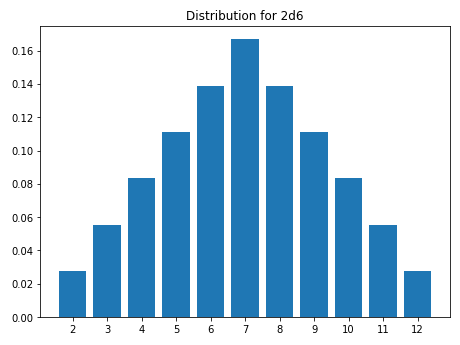

<!--- -*- encoding: utf-8 -*-
  Copyright and other protections apply. Please see the accompanying LICENSE file for
  rights and restrictions governing use of this software. All rights not expressly
  waived or licensed are reserved. If that file is missing or appears to be modified
  from its original, then please contact the author before viewing or using this
  software in any capacity.

  !!!!!!!!!!!!!!!!!!!!!!!!!!!!!!!!!!!!!!!!!!!!!!!!!!!!!!!!!!!!!!!!!!!!
  !!!!!!!!!!!!!!! IMPORTANT: READ THIS BEFORE EDITING! !!!!!!!!!!!!!!!
  !!!!!!!!!!!!!!!!!!!!!!!!!!!!!!!!!!!!!!!!!!!!!!!!!!!!!!!!!!!!!!!!!!!!
  Please keep each sentence on its own unwrapped line.
  It looks like crap in a text editor, but it has no effect on rendering, and it allows much more useful diffs.
  Thank you!
-->

``dyce`` provides two core primitives for enumeration[^1].

[^1]:

    ``dyce`` also provides additional primitives ([``R`` objects][dyce.r.R] and their kin) which are useful for producing weighted randomized rolls without the overhead of enumeration.
    These are covered [seperately](rollin.md).


``` python
>>> from dyce import H, P

```

[``H`` objects][dyce.h.H] represent histograms for modeling discrete outcomes.
They encode finite discrete probability distributions as integer counts without any denominator.
[``P`` objects][dyce.p.P] represent pools (ordered sequences) of histograms.
If all you need is to aggregate outcomes (sums) from rolling a bunch of dice (or perform calculations on aggregate outcomes), [``H`` objects][dyce.h.H] are probably sufficient.
If you need to _select_ certain histograms from a group prior to computing aggregate outcomes (e.g., taking the highest and lowest of each possible roll of *n* dice), that’s where [``P`` objects][dyce.p.P] come in.

As a wise person whose name has been lost to history once said: “Language is imperfect. If at all possible, shut up and point.”
So with that illuminating (or perhaps impenetrable) introduction out of the way, let’s dive into some examples!

## Basic examples

A six-sided die can be modeled as:

``` python
>>> H(6)
H(6)

```

``#!python H(n)`` is shorthand for explicitly enumerating outcomes $[{{1} .. {n}}]$, each with a frequency of 1.

``` python
>>> H(6) == H({1: 1, 2: 1, 3: 1, 4: 1, 5: 1, 6: 1})
True

```

Tuples with repeating outcomes are accumulated.
A six-sided “2, 3, 3, 4, 4, 5” die can be modeled as:

``` python
>>> H((2, 3, 3, 4, 4, 5))
H({2: 1, 3: 2, 4: 2, 5: 1})

```

A fudge die can be modeled as:

``` python
>>> H((-1, 0, 1))
H({-1: 1, 0: 1, 1: 1})

```

Python’s matrix multiplication operator (``@``) is used to express the number of a particular die (roughly equivalent to the “``d``” operator in common notations). The outcomes of rolling two six-sided dice (``2d6``) are:

``` python
>>> 2@H(6)
H({2: 1, 3: 2, 4: 3, 5: 4, 6: 5, 7: 6, 8: 5, 9: 4, 10: 3, 11: 2, 12: 1})

```

A pool of two six-sided dice is:

``` python
>>> 2@P(H(6))
P(6, 6)

```

Where ``#!python n`` is an integer, ``#!python P(n, ...)`` is shorthand for ``#!python P(H(n), ...)``.
The above can be expressed more succinctly.

``` python
>>> 2@P(6)
P(6, 6)

```

Pools (in this case, [Sicherman dice](https://en.wikipedia.org/wiki/Sicherman_dice)) can be compared to histograms.

``` python
>>> d_sicherman = P(H((1, 2, 2, 3, 3, 4)), H((1, 3, 4, 5, 6, 8)))
>>> d_sicherman == 2@H(6)
True

```

Both histograms and pools support arithmetic operations.
``3×(2d6+4)`` is:

``` python
>>> 3*(2@H(6)+4)
H({18: 1, 21: 2, 24: 3, 27: 4, 30: 5, 33: 6, 36: 5, 39: 4, 42: 3, 45: 2, 48: 1})

```

The results show there is one way to make ``#!python 18``, two ways to make ``#!python 21``, three ways to make ``#!python 24``, etc.
Histograms provide rudimentary formatting for convenience.

``` python
>>> print((2@H(6)).format(width=65))
avg |    7.00
std |    2.42
var |    5.83
  2 |   2.78% |#
  3 |   5.56% |##
  4 |   8.33% |####
  5 |  11.11% |#####
  6 |  13.89% |######
  7 |  16.67% |########
  8 |  13.89% |######
  9 |  11.11% |#####
 10 |   8.33% |####
 11 |   5.56% |##
 12 |   2.78% |#

```

The [Miwin-Distribution](https://en.wikipedia.org/wiki/Miwin%27s_dice#Cumulative_frequency) is:

``` python
>>> miwin_iii = H((1, 2, 5, 6, 7, 9))
>>> miwin_iv = H((1, 3, 4, 5, 8, 9))
>>> miwin_v = H((2, 3, 4, 6, 7, 8))
>>> miwin_iii + miwin_iv + miwin_v
H({4: 1, 5: 2, 6: 3, 7: 4, 8: 7, ..., 22: 7, 23: 4, 24: 3, 25: 2, 26: 1})
>>> print((miwin_iii + miwin_iv + miwin_v).format(scaled=True, width=65))
avg |   15.00
std |    4.47
var |   20.00
  4 |   0.46% |##
  5 |   0.93% |#####
  6 |   1.39% |#######
  7 |   1.85% |##########
  8 |   3.24% |##################
  9 |   4.17% |#######################
 10 |   4.63% |##########################
 11 |   5.09% |############################
 12 |   7.87% |############################################
 13 |   8.80% |#################################################
 14 |   8.33% |###############################################
 15 |   6.48% |####################################
 16 |   8.33% |###############################################
 17 |   8.80% |#################################################
 18 |   7.87% |############################################
 19 |   5.09% |############################
 20 |   4.63% |##########################
 21 |   4.17% |#######################
 22 |   3.24% |##################
 23 |   1.85% |##########
 24 |   1.39% |#######
 25 |   0.93% |#####
 26 |   0.46% |##

```

One way to model the outcomes of subtracting the lesser of two six-sided dice from the greater is:

``` python
>>> abs(H(6) - H(6))
H({0: 6, 1: 10, 2: 8, 3: 6, 4: 4, 5: 2})

```

Arithmetic operations implicitly “flatten” pools into histograms.

``` python
>>> 3*(2@P(6)+4)
H({18: 1, 21: 2, 24: 3, 27: 4, 30: 5, 33: 6, 36: 5, 39: 4, 42: 3, 45: 2, 48: 1})
>>> abs(P(6) - P(6))
H({0: 6, 1: 10, 2: 8, 3: 6, 4: 4, 5: 2})

```

Histograms should be sufficient for most calculations.
However, pools are useful for “taking” (selecting) only some of each roll’s outcomes.
This is done by providing one or more index arguments to the [``P.h`` method][dyce.p.P.h] or the [``P.rolls_with_counts`` method][dyce.p.P.rolls_with_counts].
Indexes can be integers, slices, or a mix thereof.
Outcome indexes are ordered from least to greatest with negative values counting from the right, as one would expect (i.e., ``#!python [0]``, ``#!python [1]``, …, ``#!python [-2]``, ``#!python [-1]``).
Summing the least two faces when rolling three six-sided dice would be:

``` python
>>> 3@P(6)
P(6, 6, 6)
>>> (3@P(6)).h(0, 1)  # see warning below about parentheses
H({2: 16, 3: 27, 4: 34, 5: 36, 6: 34, 7: 27, 8: 19, 9: 12, 10: 7, 11: 3, 12: 1})

```

!!! bug "Mind your parentheses"

    Parentheses are needed in the above example because ``#!python @`` has a [lower precedence](https://docs.python.org/3/reference/expressions.html#operator-precedence) than ``#!python .`` and ``#!python […]``.

    ``` python
    >>> 2@P(6).h(1)  # equivalent to 2@(P(6).h(1))
    Traceback (most recent call last):
    ...
    IndexError: tuple index out of range
    >>> (2@P(6)).h(1)
    H({1: 1, 2: 3, 3: 5, 4: 7, 5: 9, 6: 11})

    ```

Taking the least, middle, or greatest face when rolling three six-sided dice would be:

``` python
>>> p_3d6 = 3@P(6)
>>> p_3d6.h(0)
H({1: 91, 2: 61, 3: 37, 4: 19, 5: 7, 6: 1})
>>> print(p_3d6.h(0).format(width=65))
avg |    2.04
std |    1.14
var |    1.31
  1 |  42.13% |#####################
  2 |  28.24% |##############
  3 |  17.13% |########
  4 |   8.80% |####
  5 |   3.24% |#
  6 |   0.46% |

```

``` python
>>> p_3d6.h(1)
H({1: 16, 2: 40, 3: 52, 4: 52, 5: 40, 6: 16})
>>> print(p_3d6.h(1).format(width=65))
avg |    3.50
std |    1.37
var |    1.88
  1 |   7.41% |###
  2 |  18.52% |#########
  3 |  24.07% |############
  4 |  24.07% |############
  5 |  18.52% |#########
  6 |   7.41% |###

```

``` python
>>> p_3d6.h(2)
H({1: 1, 2: 7, 3: 19, 4: 37, 5: 61, 6: 91})
>>> print(p_3d6.h(-1).format(width=65))
avg |    4.96
std |    1.14
var |    1.31
  1 |   0.46% |
  2 |   3.24% |#
  3 |   8.80% |####
  4 |  17.13% |########
  5 |  28.24% |##############
  6 |  42.13% |#####################

```

Summing the greatest and the least faces when rolling a typical six-die polygonal set would be:

``` python
>>> d10 = H(10)-1 ; d10  # a common “d10” with faces [0 .. 9]
H({0: 1, 1: 1, 2: 1, 3: 1, 4: 1, 5: 1, 6: 1, 7: 1, 8: 1, 9: 1})
>>> h = P(4, 6, 8, d10, 12, 20).h(0, -1)
>>> print(h.format(width=65, scaled=True))
avg |   13.48
std |    4.40
var |   19.39
  1 |   0.00% |
  2 |   0.01% |
  3 |   0.06% |
  4 |   0.30% |#
  5 |   0.92% |#####
  6 |   2.03% |###########
  7 |   3.76% |####################
  8 |   5.57% |##############################
  9 |   7.78% |###########################################
 10 |   8.99% |##################################################
 11 |   8.47% |###############################################
 12 |   8.64% |################################################
 13 |   8.66% |################################################
 14 |   6.64% |####################################
 15 |   5.62% |###############################
 16 |   5.16% |############################
 17 |   5.00% |###########################
 18 |   5.00% |###########################
 19 |   5.00% |###########################
 20 |   5.00% |###########################
 21 |   4.50% |#########################
 22 |   2.01% |###########
 23 |   0.73% |####
 24 |   0.18% |

```

Pools are ordered and iterable.

``` python
>>> list(2@P(8, 4, 6))
[H(4), H(4), H(6), H(6), H(8), H(8)]

```

Indexing selects particular histograms into a new pool.

``` python
>>> 2@P(8, 4, 6)
P(4, 4, 6, 6, 8, 8)
>>> (2@P(8, 4, 6))[:2]
P(4, 4)
>>> (2@P(8, 4, 6))[::2]
P(4, 6, 8)

```

A brute-force way to enumerate all possible rolls is:

``` python
>>> import itertools
>>> list(itertools.product(*P(-3, 3)))
[(-3, 1), (-3, 2), (-3, 3), (-2, 1), (-2, 2), (-2, 3), (-1, 1), (-1, 2), (-1, 3)]

```

Both histograms and pools support various comparison operations as well as substitution.
The odds of observing all even faces when rolling $n$ six-sided dice, for $n$ in $[1..6]$ is:

``` python
>>> d6_even = H(6).is_even()
>>> for n in range(6, 0, -1):
...   number_of_evens_in_nd6 = n@d6_even
...   all_even = number_of_evens_in_nd6.eq(n)
...   print(f"{n: >2}d6: {all_even[1] / sum(all_even.counts()): >6.2%}")
 6d6:  1.56%
 5d6:  3.12%
 4d6:  6.25%
 3d6: 12.50%
 2d6: 25.00%
 1d6: 50.00%

```

The odds of scoring at least one nine or higher on any single die when rolling $n$ “[exploding][dyce.h.H.explode]” six-sided dice, for $n$ in $[1..10]$ is:

``` python
>>> exploding_d6 = H(6).explode(max_depth=2)
>>> for n in range(10, 0, -1):
...   d6e_ge_9 = exploding_d6.ge(9)
...   number_of_nines_or_higher_in_nd6e = n@d6e_ge_9
...   at_least_one_9 = number_of_nines_or_higher_in_nd6e.ge(1)
...   print(f"{n: >2}d6-exploding: {at_least_one_9[1] / sum(at_least_one_9.counts()): >6.2%}")
10d6-exploding: 69.21%
 9d6-exploding: 65.36%
 8d6-exploding: 61.03%
 7d6-exploding: 56.15%
 6d6-exploding: 50.67%
 5d6-exploding: 44.51%
 4d6-exploding: 37.57%
 3d6-exploding: 29.77%
 2d6-exploding: 20.99%
 1d6-exploding: 11.11%

```

## Visualization

[``H`` objects][dyce.h.H] provide a [``distribution`` method][dyce.h.H.distribution] and a [``distribution_xy`` method][dyce.h.H.distribution_xy] to ease integration with plotting packages like [``matplotlib``](https://matplotlib.org/stable/api/index.html).

``` python
>>> outcomes, probabilities = (2@H(6)).distribution_xy()
>>> import matplotlib  # doctest: +SKIP
>>> matplotlib.pyplot.bar(
...   [str(v) for v in outcomes],
...   probabilities,
... )  # doctest: +SKIP
>>> matplotlib.pyplot.title(r"Distribution for 2d6")  # doctest: +SKIP
>>> matplotlib.pyplot.show()  # doctest: +SKIP

```

<!-- Should match any title of the corresponding plot title -->
<picture>
  <source srcset="../img/plot_histogram_dark.png" media="(prefers-color-scheme: dark)">
  
</picture>

[``dyce.viz``](dyce.viz.md) provides some experimental, rudimentary conveniences if it detects that ``#!python matplotlib`` is installed (e.g., via [Jupyter](https://jupyter.org/)).

``` python
>>> from dyce.viz import plot_burst
>>> fig, ax = plot_burst(2@H(6))  # doctest: +SKIP
>>> matplotlib.pyplot.show()  # doctest: +SKIP

```

<!-- Should match any title of the corresponding plot title -->
<picture>
  <source srcset="../img/plot_burst_1_dark.png" media="(prefers-color-scheme: dark)">
  
</picture>

The outer ring and corresponding labels can be overridden for interesting, at-a-glance displays.
Overrides apply counter-clockwise, starting from the 12 o‘clock position.

``` python
>>> d20 = H(20)
>>> plot_burst(d20, outer=(
...   ("crit. fail.", d20.le(1)[1]),
...   ("fail.", d20.within(2, 14)[0]),
...   ("succ.", d20.within(15, 19)[0]),
...   ("crit. succ.", d20.ge(20)[1]),
... ), inner_color="RdYlBu_r")  # doctest: +SKIP
>>> matplotlib.pyplot.show()  # doctest: +SKIP

```

<!-- Should match any title of the corresponding plot title -->
<picture>
  <source srcset="../img/plot_burst_2_dark.png" media="(prefers-color-scheme: dark)">
  
</picture>

The outer ring can also be used to compare two histograms directly.
Ever been curious how your four shiny new fudge dice stack up against your trusty ol’ double six-siders?
Well wonder no more!
The ``dyce`` abides.

``` python
>>> df_4 = 4@H((-1, 0, 1))
>>> d6_2 = 2@H(6)
>>> plot_burst(df_4, d6_2, alpha=0.9)  # doctest: +SKIP
>>> matplotlib.pyplot.show()  # doctest: +SKIP

```

<!-- Should match any title of the corresponding plot title -->
<picture>
  <source srcset="../img/plot_burst_3_dark.png" media="(prefers-color-scheme: dark)">
  
</picture>

## Advanced exercise – modeling *Risis*

*[Risus](http://risus.cumberlandgames.com/)* and its many [community-developed alternative rules](http://www.risusiverse.com/home/optional-rules) not only make for entertaining reading, but are fertile ground for stressing ergonomics and capabilities of any discrete outcome modeling tool.
We can easily model its opposed combat system for various starting configurations through the first round.

``` python
>>> for them in range(3, 6):
...   print("---")
...   for us in range(them, them + 3):
...     first_round = (us@H(6)).vs(them@H(6))  # -1 is a loss, 0 is a tie, 1 is a win
...     results = first_round.format(width=0)
...     print(f"{us}d6 vs {them}d6: {results}")
---
3d6 vs 3d6: {..., -1: 45.36%, 0:  9.28%, 1: 45.36%}
4d6 vs 3d6: {..., -1: 19.17%, 0:  6.55%, 1: 74.28%}
5d6 vs 3d6: {..., -1:  6.07%, 0:  2.99%, 1: 90.93%}
---
4d6 vs 4d6: {..., -1: 45.95%, 0:  8.09%, 1: 45.95%}
5d6 vs 4d6: {..., -1: 22.04%, 0:  6.15%, 1: 71.81%}
6d6 vs 4d6: {..., -1:  8.34%, 0:  3.26%, 1: 88.40%}
---
5d6 vs 5d6: {..., -1: 46.37%, 0:  7.27%, 1: 46.37%}
6d6 vs 5d6: {..., -1: 24.24%, 0:  5.79%, 1: 69.96%}
7d6 vs 5d6: {..., -1: 10.36%, 0:  3.40%, 1: 86.24%}

```

This highlights the mechanic’s notorious “death spiral”, which we can visualize as a heat map.

``` python
>>> from typing import List, Tuple
>>> col_names = ["Loss", "Tie", "Win"]  # mapping from [-1, 0, 1], respectively
>>> col_ticks = list(range(len(col_names)))
>>> num_rows = 3
>>> fig, axes = matplotlib.pyplot.subplots(1, num_rows)  # doctest: +SKIP
>>> for i, them in enumerate(range(3, 3 + num_rows)):
...   ax = axes[i]  # doctest: +SKIP
...   row_names: List[str] = []
...   rows: List[Tuple[float, ...]] = []
...   for us in range(them, them + num_rows):
...     row_names.append(f"{us}d6 …")
...     rows.append((us@H(6)).vs(them@H(6)).distribution_xy()[-1])
...   _ = ax.imshow(rows)  # doctest: +SKIP
...   ax.set_title(f"… vs {them}d6")  # doctest: +SKIP
...   ax.set_xticks(col_ticks)  # doctest: +SKIP
...   ax.set_xticklabels(col_names, rotation=90)  # doctest: +SKIP
...   ax.set_yticks(list(range(len(rows))))  # doctest: +SKIP
...   ax.set_yticklabels(row_names)  # doctest: +SKIP
...   for y in range(len(row_names)):
...     for x in range(len(col_names)):
...       _ = ax.text(
...         x, y,
...         f"{rows[y][x]:.0%}",
...         ha="center", va="center",color="w",
...       )  # doctest: +SKIP
>>> fig.tight_layout()  # doctest: +SKIP

```

Calling ``#!python matplotlib.pyplot.show`` presents:

<!-- Should match any title of the corresponding plot title -->
<picture>
  <source srcset="../img/plot_risus_first_round_dark.png" media="(prefers-color-scheme: dark)">
  
</picture>

### Modeling entire multi-round combats

With a little ~~elbow~~ *finger* grease, we can roll up our…erm…fingerless gloves and even model various starting configurations through to completion to get a better sense of the impact of any initial disparity (in this case, applying dynamic programming to avoid redundant computations).

``` python
>>> from typing import Callable, Dict, Tuple
>>> def risus_combat_driver(
...     us: int,  # number of dice we still have
...     them: int,  # number of dice they still have
...     us_vs_them_func: Callable[[int, int], H],
... ) -> H:
...   if us < 0 or them < 0:
...     raise ValueError(f"cannot have negative numbers (us: {us}, them: {them})")
...   if us == 0 and them == 0:
...     return H({0: 1})  # should not happen unless combat(0, 0) is called from the start
...   already_solved: Dict[Tuple[int, int], H] = {}
...
...   def _resolve(us: int, them: int) -> H:
...     if (us, them) in already_solved: return already_solved[(us, them)]
...     elif us == 0: return H({-1: 1})  # we are out of dice, they win
...     elif them == 0: return H({1: 1})  # they are out of dice, we win
...     this_round = us_vs_them_func(us, them)
...
...     def _next_round(_: H, outcome) -> H:
...       if outcome < 0: return _resolve(us - 1, them)  # we lost this round, and one die
...       elif outcome > 0: return _resolve(us, them - 1)  # they lost this round, and one die
...       else: return H({})  # ignore (immediately re-roll) all ties
...
...     already_solved[(us, them)] = this_round.substitute(_next_round)
...     return already_solved[(us, them)]
...
...   return _resolve(us, them)

>>> for t in range(3, 6):
...   print("---")
...   for u in range(t, t + 3):
...     results = risus_combat_driver(
...       u, t,
...       lambda u, t: (u@H(6)).vs(t@H(6))
...     ).format(width=0)
...     print(f"{u}d6 vs {t}d6: {results}")
---
3d6 vs 3d6: {..., -1: 50.00%, 1: 50.00%}
4d6 vs 3d6: {..., -1: 10.50%, 1: 89.50%}
5d6 vs 3d6: {..., -1:  0.66%, 1: 99.34%}
---
4d6 vs 4d6: {..., -1: 50.00%, 1: 50.00%}
5d6 vs 4d6: {..., -1: 12.25%, 1: 87.75%}
6d6 vs 4d6: {..., -1:  1.07%, 1: 98.93%}
---
5d6 vs 5d6: {..., -1: 50.00%, 1: 50.00%}
6d6 vs 5d6: {..., -1: 13.66%, 1: 86.34%}
7d6 vs 5d6: {..., -1:  1.49%, 1: 98.51%}

```

There’s lot going on there.
Let’s dissect it.

``` python
def risus_combat_driver(
    us: int,  # number of dice we still have
    them: int,  # number of dice they still have
    us_vs_them_func: Callable[[int, int], H],
) -> H:
  ...
```

Our “driver” takes three arguments:

1. How many dice we have left (``#!python us``);
1. How many dice the opposition has left (``#!python them``); and
1. A resolution function (``#!python us_vs_them_func``) that takes counts of each party’s remaining dice and returns a histogram encoding the probability of winning or losing a single round akin to the [``H.vs`` method][dyce.h.H.vs]:

    * An outcome of ``#!python -1`` signals the likelihood of the opposition’s victory
    * An outcome of ``#!python 1`` signals the likelihood of our victory.
    * An outcome of ``#!python 0`` signals the likelihood of a tie.

    This is intentional, since we’re going to leverage that very method later.

``` python linenums="6"
  if us < 0 or them < 0:
    raise ValueError(f"cannot have negative numbers (us: {us}, them: {them})")
  if us == 0 and them == 0:
    return H({0: 1})  # should not happen unless combat(0, 0) is called from the start
  already_solved: Dict[Tuple[int, int], H] = {}
```

We make some preliminary checks that guard access to our recursive implementation so that it can be a little cleaner.
We also set up a ``#!python dict`` to keep track of results we‘ve already computed.
For example, we might compute a case where we lose a die, then our opposition loses a die.
We arrive at a similar case where our opposition loses a die, then we lose a die.
Both cases are similar from that point on.
We’ll keep track of those, so we don’t have to recompute them.

``` python linenums="12"
  def _resolve(us: int, them: int) -> H:
    ...
```

``` python linenums="27"
  return _resolve(us, them)
```

Skipping over its implementation for now, we define a our recursive implementation (``#!python _resolve``) and then call it with our initial arguments.

``` python linenums="13"
  def _resolve(us: int, them: int) -> H:
    if (us, them) in already_solved: return already_solved[(us, them)]
    elif us == 0: return H({-1: 1})  # we are out of dice, they win
    elif them == 0: return H({1: 1})  # they are out of dice, we win
```

Getting back to that implementation, these are our base cases.
First we check to see if we’ve already solved for this case (memoization), in which case we can just return it.
Then we check whether either party has run out of dice, in which case the combat is over.
If we have none of those cases, we get to work.

!!! note

    In this function, we do not check for the case where *both* parties are at zero.
    Because only one party can lose a die during each round, the only way both parties can be at zero simultaneously is if they both started at zero.
    Since we guarded against that case in the enclosing function, we don’t have to worry about that here.
    Either ``#!python us`` is zero, ``#!python them`` is zero, or neither is zero.

``` python linenums="17"
    this_round = us_vs_them_func(us, them)
```

Then, we compute the outcomes for _this round_ using the provided resolution function.

``` python linenums="19"
    def _next_round(_: H, outcome) -> H:
      ...
```

``` python linenums="24"
    already_solved[(us, them)] = this_round.substitute(_next_round)
    return already_solved[(us, them)]
```

Keeping in mind that we’re inside our recursive implementation, we define a substitution function specifically for use with [``H.substitute``][dyce.h.H.substitute].
This allows us to take our computation for this round, and “fold in” subsequent rounds.
We keep track of the result in our memoization ``#!python dict`` before returning it.

``` python linenums="19"
    def _next_round(_: H, outcome) -> H:
      if outcome < 0: return _resolve(us - 1, them)  # we lost this round, and one die
      elif outcome > 0: return _resolve(us, them - 1)  # they lost this round, and one die
      else: return H({})  # ignore (immediately re-roll) all ties
```

Our substitution function is pretty straightforward.
Where we are asked whether we want to provide a substitution for a round we lost, we lose a die and recurse.
Where we are asked for a substitution for a round we won, our opposition loses a die and we recurse.
We ignore ties (simulating that we re-roll them in place until they are no longer ties).

``` python linenums="32"
    ... risus_combat_driver(
      u, t,
      lambda u, t: (u@H(6)).vs(t@H(6))
    ) ...
```

At this point, we can define a simple ``#!python lambda`` that wraps [``H.vs``][dyce.h.H.vs] and submit it to our driver to enumerate resolution outcomes from various starting positions.

!!! note

    This is a complicated example that involves some fairly sophisticated programming techniques (recursion, memoization, closures, etc.).
    The point is not to suggest that such techniques are required to be productive.
    However, it is useful to show that ``dyce`` is flexible enough to model these types of outcomes in a couple dozen lines of code.
    It is high-level enough to lean on for nuanced number crunching without a lot of detailed knowledge, while still being low-level enough that authors knowledgeable of advanced programming techniques are not precluded from using them.

### Modeling different combat resolution methods

Using our ``#!python risus_combat_driver`` from above, we can craft a alternative resolution function to model the less death-spirally “Best of Set” alternative mechanic from *[The Risus Companion](https://ghalev.itch.io/risus-companion)* with the optional “Goliath Rule” for resolving ties.

``` python
>>> def deadly_combat_vs(us: int, them: int) -> H:
...   best_us = (us@P(6)).h(-1)
...   best_them = (them@P(6)).h(-1)
...   h = best_us.vs(best_them)
...   # Goliath Rule: tie goes to the party with fewer dice in this round
...   h = h.substitute(lambda h, outcome: (us < them) - (us > them) if outcome == 0 else outcome)
...   return h

>>> for t in range(3, 5):
...   print("---")
...   for u in range(t, t + 3):
...     results = risus_combat_driver(u, t, deadly_combat_vs).format(width=0)
...     print(f"{u}d6 vs {t}d6: {results}")
---
3d6 vs 3d6: {..., -1: 50.00%, 1: 50.00%}
4d6 vs 3d6: {..., -1: 36.00%, 1: 64.00%}
5d6 vs 3d6: {..., -1: 23.23%, 1: 76.77%}
---
4d6 vs 4d6: {..., -1: 50.00%, 1: 50.00%}
5d6 vs 4d6: {..., -1: 40.67%, 1: 59.33%}
6d6 vs 4d6: {..., -1: 30.59%, 1: 69.41%}

```

Modeling the “[Evens Up](http://www.risusiverse.com/home/optional-rules/evens-up)” alternative dice mechanic is currently beyond the capabilities of ``dyce`` without additional work.
This is for two reasons.
First, with [one narrow exception][dyce.h.H.substitute], ``dyce`` only provides a mechanism to substitute outcomes, not counts.
This means we can’t arbitrarily *increase* the likelihood of achieving a particular outcome through substitution.
Second, ``dyce``’s substitution mechanism only resolves outcomes through a fixed number of iterations (not an infinite series).
Most of the time, this is good enough.

Both of these limitations can be circumvented where infinite series can be computed and encoded as histograms.
For this mechanic, we can observe that a single six-sided die (``1d6``) has a $\frac{1}{2}$ chance of coming up even, thereby earning a “success”.
We can also observe that it has a $\frac{1}{6}$ chance of showing a six, earning an additional roll.
That second roll has a $\frac{1}{2}$ chance of coming up even, as well as a $\frac{1}{6}$ chance of earning another roll, and so on.
In other words, the number of successes one can expect to roll are:

$$
\frac{1}{2}
+ \frac{1}{6} \left( \frac{1}{2}
  + \frac{1}{6} \left( \frac{1}{2}
    + \frac{1}{6} \left( \frac{1}{2}
      + \ldots
    \right)
  \right)
\right)
$$

Or, in the alternative:

$$
\frac{1}{2}
+ \frac{1}{2}\frac{1}{6}
+ \frac{1}{2}\frac{1}{6}\frac{1}{6}
+ \frac{1}{2}\frac{1}{6}\frac{1}{6}\frac{1}{6}
+ \ldots
$$

Or simply:

$$
\frac{1}{{2} \times {6}^{0}}
+ \frac{1}{{2} \times {6}^{1}}
+ \frac{1}{{2} \times {6}^{2}}
+ \frac{1}{{2} \times {6}^{3}}
+ \ldots
$$

So what is that? We probably don’t know unless we do math for a living, or at least as an active hobby.
(The author does neither, which is partially what motivated the creation of this library.)
Computing the value to the first hundred iterations offers a clue.

``` python
>>> 1/2 * sum(1 / (6 ** i) for i in range(100))
0.59999999999999975575093458246556110680103302001953125

```

It appears convergent around $\frac{3}{5}$.
Let’s see if we can validate that.
An [article from MathIsFun.com](https://www.mathsisfun.com/algebra/infinite-series.html) provides useful guidance.
The section on geometric series is easily adapted to our problem.

$$
\begin{matrix}
S
& = &
\frac{1}{{2} \times {6}^{0}}
+ \frac{1}{{2} \times {6}^{1}}
+ \frac{1}{{2} \times {6}^{2}}
+ \frac{1}{{2} \times {6}^{3}}
+ \frac{1}{{2} \times {6}^{4}}
+ \ldots \\
& = &
\overbrace{ \frac{1}{2} }
+ \underbrace{ \frac{1}{12} + \frac{1}{72} + \frac{1}{432} + \frac{1}{2\,592} + \ldots } \\
\end{matrix}
$$

$$
\begin{matrix}
\frac{1}{6}S
& = &
\frac{1}{6}\frac{1}{{2} \times {6}^{0}}
+ \frac{1}{6}\frac{1}{{2} \times {6}^{1}}
+ \frac{1}{6}\frac{1}{{2} \times {6}^{2}}
+ \frac{1}{6}\frac{1}{{2} \times {6}^{3}}
+ \ldots \\
& = &
\underbrace{ \frac{1}{12} + \frac{1}{72} + \frac{1}{432} + \frac{1}{2\,592} + \ldots } \\
\end{matrix}
$$

$$
S = \overbrace{ \frac{1}{2} } + \underbrace{ \frac{1}{6}S }
$$

$$
S - \frac{1}{6}S = \frac{1}{2}
$$

$$
\frac{5}{6}S = \frac{1}{2}
$$

$$
S = \frac{3}{5}
$$

Well, butter my butt and call me a biscuit! Math really _is_ fun! 🧈 🤠 🧮

!!! info

    The Archimedean visualization technique mentioned in the [aforementioned article](https://www.mathsisfun.com/algebra/infinite-series.html) also adapts well to this case.
    It involves no algebra and is left as an exercise to the reader…at least one with nothing more pressing to do.

Armed with this knowledge, we can now model “Evens Up” using our ``#!python risus_combat_driver`` from above.
We can also deploy a trick using ``#!python partial`` to parameterize use of the Goliath Rule.

``` python
>>> from functools import partial
>>> d6_evens_exploding_on_six = H({1: 3, 0: 2})  # 3 dubyas, 2 doughnuts

>>> def evens_up_vs(us: int, them: int, goliath: bool = False) -> H:
...   h = (us@d6_evens_exploding_on_six).vs(them@d6_evens_exploding_on_six)
...   if goliath:
...     h = h.substitute(lambda h, outcome: (us < them) - (us > them) if outcome == 0 else outcome)
...   return h

>>> for t in range(3, 5):
...   print("- - - - - - - With Goliath Rule - - - - - -  Without Goliath Rule - - - -")
...   for u in range(t, t + 3):
...     goliath_results = risus_combat_driver(u, t, partial(evens_up_vs, goliath=True)).format(width=0)
...     no_goliath_results = risus_combat_driver(u, t, partial(evens_up_vs, goliath=False)).format(width=0)
...     print(f"{u}d6 vs {t}d6:   {goliath_results}   {no_goliath_results}")
- - - - - - - With Goliath Rule - - - - - -  Without Goliath Rule - - - -
3d6 vs 3d6:   {..., -1: 50.00%, 1: 50.00%}   {..., -1: 50.00%, 1: 50.00%}
4d6 vs 3d6:   {..., -1: 27.49%, 1: 72.51%}   {..., -1: 14.38%, 1: 85.62%}
5d6 vs 3d6:   {..., -1:  9.27%, 1: 90.73%}   {..., -1:  1.99%, 1: 98.01%}
- - - - - - - With Goliath Rule - - - - - -  Without Goliath Rule - - - -
4d6 vs 4d6:   {..., -1: 50.00%, 1: 50.00%}   {..., -1: 50.00%, 1: 50.00%}
5d6 vs 4d6:   {..., -1: 28.50%, 1: 71.50%}   {..., -1: 16.44%, 1: 83.56%}
6d6 vs 4d6:   {..., -1: 10.50%, 1: 89.50%}   {..., -1:  2.86%, 1: 97.14%}

```

## Time to get meta-evil on those outcomes!

``dyce`` offers best-effort support for arbitrary number-like outcomes, including primitives from symbolic expression packages such as [SymPy](https://www.sympy.org/).

``` python
>>> import sympy.abc
>>> d6x = H(6) + sympy.abc.x
>>> d8y = H(8) + sympy.abc.y
>>> P(d6x, d8y, d6x).h()
H({2*x + y + 3: 1, 2*x + y + 4: 3, 2*x + y + 5: 6, ..., 2*x + y + 18: 6, 2*x + y + 19: 3, 2*x + y + 20: 1})

```

[](https://me.me/i/shnomf-nomf-hormf-hom-ive-gots-to-get-my-rib-22068260)

!!! note

    Be aware that, depending on implementation, performance can suffer quite a bit when using symbolic primitives.

For histograms and pools, ``dyce`` remains opinionated about ordering.
For non-critical contexts where relative values are indeterminate, ``dyce`` will attempt a “natural” ordering based on the string representation of each outcome.
This is to accommodate symbolic expressions whose relative values are often unknowable.

``` python
>>> expr = sympy.abc.x < sympy.abc.x * 3 ; expr
x < 3*x
>>> bool(expr)  # nope
Traceback (most recent call last):
  ...
TypeError: cannot determine truth value of Relational

```

SymPy does not even attempt simple relative comparisons between symbolic expressions, even where they are unambiguously resolvable.
Instead, it relies on the caller to invoke its proprietary solver APIs.

``` python
>>> bool(sympy.abc.x < sympy.abc.x + 1)
Traceback (most recent call last):
  ...
TypeError: cannot determine truth value of Relational
>>> import sympy.solvers.inequalities
>>> sympy.solvers.inequalities.reduce_inequalities(sympy.abc.x < sympy.abc.x + 1, [sympy.abc.x])
True

```

``dyce``, of course, is happily ignorant of all that keenness.
(As it should be.)
In practice, that means that certain operations won’t work with symbolic expressions where correctness depends on ordering outcomes according to relative value (e.g., dice selection from pools).

Flattening pools works.

``` python
>>> d3x = H(3) * sympy.abc.x ; d3x
H({2*x: 1, 3*x: 1, x: 1})
>>> p = P(d3x / 3, (d3x + 1) / 3, (d3x + 2) / 3)
>>> p.h()
H({2*x + 1: 7, 3*x + 1: 1, 4*x/3 + 1: 3, 5*x/3 + 1: 6, 7*x/3 + 1: 6, 8*x/3 + 1: 3, x + 1: 1})

```

Selecting the “lowest” die doesn’t.

``` python
>>> p.h(0)
Traceback (most recent call last):
  ...
TypeError: cannot determine truth value of Relational

```

Selecting all dice works, since it’s equivalent to flattening (no sorting is required).

``` python
>>> p.h(slice(None))
H({2*x + 1: 7, 3*x + 1: 1, 4*x/3 + 1: 3, 5*x/3 + 1: 6, 7*x/3 + 1: 6, 8*x/3 + 1: 3, x + 1: 1})

```

Enumerating rolls doesn’t, even where there is no selection, because each roll’s outcomes are sorted least-to-greatest.

``` python
>>> list(p.rolls_with_counts())
Traceback (most recent call last):
  ...
TypeError: cannot determine truth value of Relational

```

[``P.roll``][dyce.p.P.roll] “works” (i.e., falls back to natural ordering of outcomes), but that is a deliberate compromise of convenience.

``` python
>>> p.roll()  # doctest: +SKIP
(2*x/3, 2*x/3 + 1/3, x/3 + 2/3)

```

[``P.umap``][dyce.p.P.umap] can help pave the way back to concrete outcomes.

``` python
>>> f = lambda outcome: outcome.subs({sympy.abc.x: sympy.Rational(1, 3)})
>>> p.umap(f)
P(H({1/9: 1, 2/9: 1, 1/3: 1}), H({4/9: 1, 5/9: 1, 2/3: 1}), H({7/9: 1, 8/9: 1, 1: 1}))
>>> p.umap(f).h(-1)
H({7/9: 9, 8/9: 9, 1: 9})

```

## Further exploration

Consider delving into some [applications and translations](translations.md) for more sophisticated examples, or jump right into the [API][dyce].
