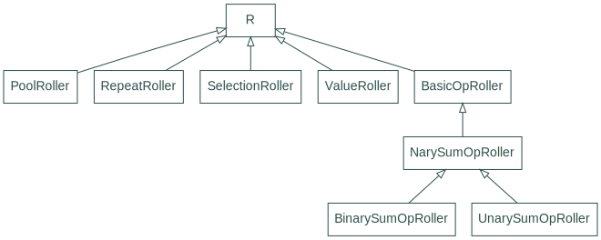

<!--- -*- encoding: utf-8 -*-
  Copyright and other protections apply. Please see the accompanying LICENSE file for
  rights and restrictions governing use of this software. All rights not expressly
  waived or licensed are reserved. If that file is missing or appears to be modified
  from its original, then please contact the author before viewing or using this
  software in any capacity.

  !!!!!!!!!!!!!!!!!!!!!!!!!!!!!!!!!!!!!!!!!!!!!!!!!!!!!!!!!!!!!!!!!!!!
  !!!!!!!!!!!!!!! IMPORTANT: READ THIS BEFORE EDITING! !!!!!!!!!!!!!!!
  !!!!!!!!!!!!!!!!!!!!!!!!!!!!!!!!!!!!!!!!!!!!!!!!!!!!!!!!!!!!!!!!!!!!
  Please keep each sentence on its own unwrapped line.
  It looks like crap in a text editor, but it has no effect on rendering, and it allows much more useful diffs.
  Thank you!
-->

# ``#!python dyce.r`` package reference

!!! warning "Experimental"

    This package is an attempt to provide primitives for producing weighted randomized rolls without the overhead of enumeration.
    Rolls can be inspected to understand how specific values are derived.
    It should be considered experimental.
    Be warned that future release may introduce incompatibilities or remove this package altogether.
    [Suggestions and contributions](contrib.md) are welcome.

## Roller class hierarchy

<picture>
  <source srcset="../img/graph_classes_dyce_r_dark.svg" media="(prefers-color-scheme: dark)">
  
</picture>

::: dyce.r
    rendering:
      show_if_no_docstring: true
    selection:
      members:
        - "R"
        - "ValueRoller"
        - "RepeatRoller"
        - "OperationRollerBase"
        - "ChainRoller"
        - "SumRoller"
        - "BinaryOperationRoller"
        - "UnaryOperationRoller"
        - "PoolRoller"
        - "SelectionRoller"
        - "Roll"
        - "RollOutcome"
        - "RollOutcomeOperatorT"
        - "walk"
