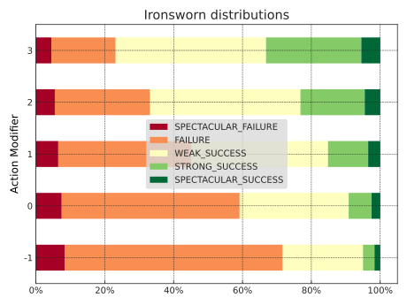

<!---
  Copyright and other protections apply.
  Please see the accompanying LICENSE file for rights and restrictions governing use of this software.
  All rights not expressly waived or licensed are reserved.
  If that file is missing or appears to be modified from its original, then please contact the author before viewing or using this software in any capacity.

  !!!!!!!!!!!!!!!!!!!!!!!!!!!!!!!!!!!!!!!!!!!!!!!!!!!!!!!!!!!!!!!!!!!!
  !!!!!!!!!!!!!!! IMPORTANT: READ THIS BEFORE EDITING! !!!!!!!!!!!!!!!
  !!!!!!!!!!!!!!!!!!!!!!!!!!!!!!!!!!!!!!!!!!!!!!!!!!!!!!!!!!!!!!!!!!!!
  Please keep each sentence on its own unwrapped line.
  It looks like crap in a text editor, but it has no effect on rendering, and it allows much more useful diffs.
  Thank you!
  -->

# Modeling *Ironsworn*’s core mechanic

[Shawn Tomlin’s *Ironsworn*](https://www.ironswornrpg.com/) melds a number of different influences in a fresh way.
Its core mechanic involves rolling an *action die* (a d6), adding a modifier, and comparing the result to two *challenge dice* (d10s).
If the modified value from the action die is strictly greater than both challenge dice, the result is a strong success.
If it is strictly greater than only one challenge die, the result is a weak success.
If it is equal to or less than both challenge dice, it’s a failure.

A verbose way to model this is to enumerate the product of the three dice and then perform logical comparisons.
[`expand`][dyce.expand] can calculate the challenge-dice results for each action-die outcome.
We can also deploy a counting trick with the two d10s.

    >>> from dyce import H, HResult, expand
    >>> from enum import IntEnum
    >>> from typing import cast
    >>> d6 = H(6)
    >>> d10 = H(10)
    >>> action_mods = list(range(-1, 4))

    >>> class IronResult(IntEnum):
    ...     FAILURE = 0
    ...     WEAK_SUCCESS = 1
    ...     STRONG_SUCCESS = 2

    >>> def iron_dependent_term(action: HResult[int]) -> H[int]:
    ...     return 2 @ d10.lt(action.outcome)

    >>> expand(iron_dependent_term, d6 + 1)  # expected results for an action modifier of +1
    H({0: 271, 1: 238, 2: 91})

<!-- -->

    >>> iron_distributions_by_action_mod = {
    ...     action_mod: H.from_counts(
    ...         expand(iron_dependent_term, d6 + action_mod),
    ...         cast("dict[int, int]", dict.fromkeys(IronResult, 0)),
    ...         preserve_zero_counts=True,
    ...     )
    ...     for action_mod in action_mods
    ... }
    >>> for action_mod, iron_distribution in iron_distributions_by_action_mod.items():
    ...     print(
    ...         "{:+} -> {}".format(
    ...             action_mod,
    ...             {
    ...                 IronResult(outcome).name: f"{float(prob):6.2%}"
    ...                 for outcome, prob in iron_distribution.probability_items()
    ...             },
    ...         )
    ...     )
    -1 -> {'FAILURE': '71.67%', 'WEAK_SUCCESS': '23.33%', 'STRONG_SUCCESS': ' 5.00%'}
    +0 -> {'FAILURE': '59.17%', 'WEAK_SUCCESS': '31.67%', 'STRONG_SUCCESS': ' 9.17%'}
    +1 -> {'FAILURE': '45.17%', 'WEAK_SUCCESS': '39.67%', 'STRONG_SUCCESS': '15.17%'}
    +2 -> {'FAILURE': '33.17%', 'WEAK_SUCCESS': '43.67%', 'STRONG_SUCCESS': '23.17%'}
    +3 -> {'FAILURE': '23.17%', 'WEAK_SUCCESS': '43.67%', 'STRONG_SUCCESS': '33.17%'}

!!! question "What’s with that `2 @ d10.lt(action.outcome)`?"

    Let’s break it down.
    `H(10).lt(value)` will tell us how often a single d10 is less than `value`.

            >>> H(10).lt(5)  # how often a d10 is strictly less than 5
            H({False: 6, True: 4})

    By taking advantage of the fact that, in Python, `bool`s act like `int`s when it comes to arithmetic operators, we can count how often that happens with more than one interchangeable d10 by “summing” them.

            >>> d10_lt5 = H(10).lt(5)
            >>> d10_lt5 + d10_lt5
            H({0: 36, 1: 48, 2: 16})
            >>> (d10_lt5 + d10_lt5).total
            100

    How do we interpret those results?
    36 times out of a hundred, neither d10 will be strictly less than five.
    48 times out of a hundred, exactly one of the d10s will be strictly less than five.
    16 times out of a hundred, both d10s will be strictly less than five.

    [`H`][dyce.H]’s `@` operator provides a shorthand.

            >>> 2 @ d10_lt5 == d10_lt5 + d10_lt5
            True

!!! question "Why doesn’t `2 @ H(6).gt(H(10)` work?"

    `H(6).gt(H(10))` will compute how often a six-sided die is strictly greater than a ten-sided die.
    `2 @ H(6).gt(H(10))` will show the frequencies that a first six-sided die is strictly greater than a first ten-sided die and a second six-sided die is strictly greater than a second ten-sided die.
    This isn’t quite what we want, since the mechanic calls for rolling a single six-sided die and comparing that result to each of two ten-sided dice.

Now for a *twist*.
A failure or success is particularly spectacular when the d10s come up doubles.
The doubles rule uses both challenge-die outcomes.
To model it, evaluate each combination of outcomes from the modified d6 and both d10s.

[`expand`][dyce.expand] evaluates combinations from multiple source histograms or pools.

    --8<-- "docs-src/plot_matplotlib_ironsworn.py:core"

The callback accepts `mod` as a keyword-only parameter, which lets us pass values to it through [`expand`][dyce.expand] for visualization.

Table:

    --8<-- "docs-src/plot_matplotlib_ironsworn.py:table"

<table id="T_ironsworn">
  <thead>
    <tr>
      <th class="blank level0" >&nbsp;</th>
      <th id="T_ironsworn_level0_col0" class="col_heading level0 col0" >SPECTACULAR_FAILURE</th>
      <th id="T_ironsworn_level0_col1" class="col_heading level0 col1" >FAILURE</th>
      <th id="T_ironsworn_level0_col2" class="col_heading level0 col2" >WEAK_SUCCESS</th>
      <th id="T_ironsworn_level0_col3" class="col_heading level0 col3" >STRONG_SUCCESS</th>
      <th id="T_ironsworn_level0_col4" class="col_heading level0 col4" >SPECTACULAR_SUCCESS</th>
    </tr>
    <tr>
      <th class="index_name level0" >Action Modifier</th>
      <th class="blank col0" >&nbsp;</th>
      <th class="blank col1" >&nbsp;</th>
      <th class="blank col2" >&nbsp;</th>
      <th class="blank col3" >&nbsp;</th>
      <th class="blank col4" >&nbsp;</th>
    </tr>
  </thead>
  <tbody>
    <tr>
      <th id="T_ironsworn_level0_row0" class="row_heading level0 row0" >-1</th>
      <td id="T_ironsworn_row0_col0" class="data row0 col0" >8.33%</td>
      <td id="T_ironsworn_row0_col1" class="data row0 col1" >63.33%</td>
      <td id="T_ironsworn_row0_col2" class="data row0 col2" >23.33%</td>
      <td id="T_ironsworn_row0_col3" class="data row0 col3" >3.33%</td>
      <td id="T_ironsworn_row0_col4" class="data row0 col4" >1.67%</td>
    </tr>
    <tr>
      <th id="T_ironsworn_level0_row1" class="row_heading level0 row1" >0</th>
      <td id="T_ironsworn_row1_col0" class="data row1 col0" >7.50%</td>
      <td id="T_ironsworn_row1_col1" class="data row1 col1" >51.67%</td>
      <td id="T_ironsworn_row1_col2" class="data row1 col2" >31.67%</td>
      <td id="T_ironsworn_row1_col3" class="data row1 col3" >6.67%</td>
      <td id="T_ironsworn_row1_col4" class="data row1 col4" >2.50%</td>
    </tr>
    <tr>
      <th id="T_ironsworn_level0_row2" class="row_heading level0 row2" >1</th>
      <td id="T_ironsworn_row2_col0" class="data row2 col0" >6.50%</td>
      <td id="T_ironsworn_row2_col1" class="data row2 col1" >38.67%</td>
      <td id="T_ironsworn_row2_col2" class="data row2 col2" >39.67%</td>
      <td id="T_ironsworn_row2_col3" class="data row2 col3" >11.67%</td>
      <td id="T_ironsworn_row2_col4" class="data row2 col4" >3.50%</td>
    </tr>
    <tr>
      <th id="T_ironsworn_level0_row3" class="row_heading level0 row3" >2</th>
      <td id="T_ironsworn_row3_col0" class="data row3 col0" >5.50%</td>
      <td id="T_ironsworn_row3_col1" class="data row3 col1" >27.67%</td>
      <td id="T_ironsworn_row3_col2" class="data row3 col2" >43.67%</td>
      <td id="T_ironsworn_row3_col3" class="data row3 col3" >18.67%</td>
      <td id="T_ironsworn_row3_col4" class="data row3 col4" >4.50%</td>
    </tr>
    <tr>
      <th id="T_ironsworn_level0_row4" class="row_heading level0 row4" >3</th>
      <td id="T_ironsworn_row4_col0" class="data row4 col0" >4.50%</td>
      <td id="T_ironsworn_row4_col1" class="data row4 col1" >18.67%</td>
      <td id="T_ironsworn_row4_col2" class="data row4 col2" >43.67%</td>
      <td id="T_ironsworn_row4_col3" class="data row4 col3" >27.67%</td>
      <td id="T_ironsworn_row4_col4" class="data row4 col4" >5.50%</td>
    </tr>
  </tbody>
</table>

Visualization: 

    --8<-- "docs-src/plot_matplotlib_ironsworn.py:viz"

<!-- Should match any title of the corresponding plot title -->
<!--
  TODO(@posita): https://github.com/zensical/zensical/issues/975 -
  source[srcset] should be "images/..."
  -->
<picture>
  <source media="(prefers-color-scheme: dark)" srcset="../images/plot_matplotlib_ironsworn_dark.svg">
  <source media="(prefers-color-scheme: light)" srcset="../images/plot_matplotlib_ironsworn_light.svg">
  
</picture>
