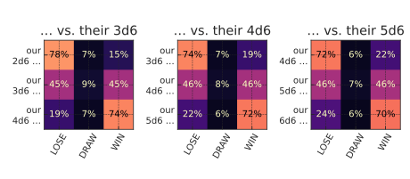
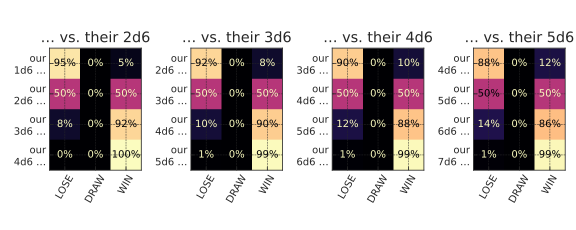

<!---
  Copyright and other protections apply.
  Please see the accompanying LICENSE file for rights and restrictions governing use of this software.
  All rights not expressly waived or licensed are reserved.
  If that file is missing or appears to be modified from its original, then please contact the author before viewing or using this software in any capacity.

  !!!!!!!!!!!!!!!!!!!!!!!!!!!!!!!!!!!!!!!!!!!!!!!!!!!!!!!!!!!!!!!!!!!!
  !!!!!!!!!!!!!!! IMPORTANT: READ THIS BEFORE EDITING! !!!!!!!!!!!!!!!
  !!!!!!!!!!!!!!!!!!!!!!!!!!!!!!!!!!!!!!!!!!!!!!!!!!!!!!!!!!!!!!!!!!!!
  Please keep each sentence on its own unwrapped line.
  It looks like crap in a text editor, but it has no effect on rendering, and it allows much more useful diffs.
  Thank you!
  -->

# Modeling *Risus* combat

[S. John Ross’s *Risus*](https://www.risusiverse.com/) and its many [community-developed alternative rules](http://www.risusiverse.com/home/optional-rules) not only make for entertaining reading, but are fertile ground for stressing ergonomics and capabilities of any discrete outcome modeling tool.
We can easily model the first round of its opposed combat system for various starting configurations.
Our first step is a callback for [`H.apply`][dyce.H.apply] for refereeing a head-to-head contest of values:

    --8<-- "docs-src/plot_matplotlib_risus.py:base"

!!! note

    As an aside, this reasonably common “versus” pattern can be characterized in a more concise (albeit less readable) way:

            >>> from dyce.d import d6
            >>> ours = 2 @ d6
            >>> theirs = 3 @ d6
            >>> (ours - theirs).apply(
            ...     lambda outcome: outcome // abs(outcome) if outcome else outcome
            ... ).lowest_terms()
            H({-1: 1009, 0: 90, 1: 197})

Example use for a single round of combat:

    --8<-- "docs-src/plot_matplotlib_risus.py:base-use"

```linenums="0"
--8<-- "docs-src/plot_matplotlib_risus_evens_up_base_use.txt"
```

This highlights the mechanic’s notorious “death spiral”, which we can visualize as a heat map.

    --8<-- "docs-src/plot_matplotlib_risus.py:display"

??? example "Visualization source code"

        --8<-- "docs-src/plot_matplotlib_risus.py:display-detail"

Visualization: [](https://dycelib.org/latest/jupyter/lab/?path=risus.ipynb)

    --8<-- "docs-src/plot_matplotlib_risus.py:viz-first-round"

<!-- Should match any title of the corresponding plot title -->
<!--
  TODO(@posita): https://github.com/zensical/zensical/issues/975 -
  source[srcset] should be "images/..."
  -->
<picture>
  <source media="(prefers-color-scheme: dark)" srcset="../images/plot_matplotlib_risus_first_round_dark.svg">
  <source media="(prefers-color-scheme: light)" srcset="../images/plot_matplotlib_risus_first_round_light.svg">
  
</picture>

## Modeling entire multi-round combats

With a little ~~elbow~~ *finger* grease, we can roll up our … erm … fingerless gloves and even model how various starting conditions affect combat completion (in this case, applying dynamic programming to avoid redundant computations).

    --8<-- "docs-src/plot_matplotlib_risus.py:driver"

There’s lot going on there.
Thankfully, it’s heavily annotated.
It’s worth going back and dissecting as a fairly nuanced application of [`expand`][dyce.expand].

!!! note

    This is a complicated example that involves some fairly sophisticated programming techniques (recursion, memoization, nested functions, etc.).
    The point is not to suggest that such techniques are required to be productive.
    However, it is useful to show that `dyce` is flexible enough to model these types of outcomes in a couple dozen lines of code.
    It is high-level enough to lean on for nuanced number crunching without a lot of detailed knowledge, while still being low-level enough that authors knowledgeable of advanced programming techniques are not precluded from using them.

When called with its default arguments, `risus_combat_driver` satisfies the `VersusFuncT` interface.
This means we can use it directly with our `vs_scenarios_dataframes` helper to enumerate resolution outcomes from various starting positions.

Visualization: [](https://dycelib.org/latest/jupyter/lab/?path=risus.ipynb)

    --8<-- "docs-src/plot_matplotlib_risus.py:viz-multi-round-standard"

<!-- Should match any title of the corresponding plot title -->
<!--
  TODO(@posita): https://github.com/zensical/zensical/issues/975 -
  source[srcset] should be "images/..."
  -->
<picture>
  <source media="(prefers-color-scheme: dark)" srcset="../images/plot_matplotlib_risus_multi_round_standard_dark.svg">
  <source media="(prefers-color-scheme: light)" srcset="../images/plot_matplotlib_risus_multi_round_standard_light.svg">
  
</picture>

## Modeling different combat resolution methods

Using our `risus_combat_driver` from above, we can craft a alternative resolution function to model the less death-spirally “Best of Set” alternative mechanic from *[The Risus Companion](https://i.4pcdn.org/tg/1366392953060.pdf)* (free with membership to the [IOR](https://www.risusiverse.com/home/ior-charter)) with the optional “Goliath Rule” for resolving ties.


    --8<-- "docs-src/plot_matplotlib_risus.py:goliath-rule"

    --8<-- "docs-src/plot_matplotlib_risus.py:vs-best-of-set"

Python’s [`functools.partial`](https://docs.python.org/3/library/functools.html#functools.partial) allows us to override individual function details, but still leverage our current callback machinery.
This pattern will come up again below, so we’ll capture it in a helper function.

    --8<-- "docs-src/plot_matplotlib_risus.py:viz-multi-round-goliath-helper"

??? example "Visualization Goliath Rule helper source code"

        --8<-- "docs-src/plot_matplotlib_risus.py:viz-multi-round-goliath-helper-detail"

We’ll use that Goliath Rule helper to approximate a complete “Best-of-Set” combat and compare it to a “standard” one.

Visualization: [](https://dycelib.org/latest/jupyter/lab/?path=risus.ipynb)

    --8<-- "docs-src/plot_matplotlib_risus.py:viz-multi-round-best-of-set"

<!-- Should match any title of the corresponding plot title -->
<!--
  TODO(@posita): https://github.com/zensical/zensical/issues/975 -
  source[srcset] should be "images/..."
  -->
<picture>
  <source media="(prefers-color-scheme: dark)" srcset="../images/plot_matplotlib_risus_multi_round_best_of_set_dark.svg">
  <source media="(prefers-color-scheme: light)" srcset="../images/plot_matplotlib_risus_multi_round_best_of_set_light.svg">
  
</picture>

The “[Evens Up](http://www.risusiverse.com/home/optional-rules/evens-up)” alternative dice mechanic presents some challenges.

First, `dyce`’s substitution mechanism only resolves outcomes through a fixed number of iterations, so it can only approximate probabilities for infinite series.
Most of the time, the implications are largely theoretical for a sufficient number of iterations.
This is no exception.

Another limitation is that `dyce` only provides a mechanism to directly expand outcomes, not counts.
This means we can’t arbitrarily *increase* the likelihood of achieving a particular outcome through replacement.
With some creativity, we can work around that, too.

In the case of “Evens Up”, we need to keep track of whether an even number was rolled, but we also need to keep rolling (and accumulating) as long as sixes are rolled.
This behaves a lot like an exploding die with three values (miss, hit, and hit-and-explode).
Further, we can observe that every “run” will be zero or more exploding hits terminated by either a miss or a non-exploding hit.

If we choose our values carefully, we can encode how many times we’ve encountered relevant events as we explode.

    --8<-- "docs-src/plot_matplotlib_risus.py:evens-up-base"

```linenums="0"
--8<-- "docs-src/plot_matplotlib_risus_evens_up_base.txt"
```

For every outcome in that distribution that is even, our streak ended in a miss (i.e., zero or more `HIT_EXPLODE` values followed by a `MISS`).
For every outcome that is odd, out streak ended in a non-exploding hit that will need to be tallied (i.e., zero or more `HIT_EXPLODE` values followed by a `HIT`).

An outcome of `0` indicates a `MISS`. An outcome of `1` indicates a `HIT`. An outcome of `2` indicates a `HIT_EXPLODE` followed by a `MISS`. An outcome of `5` indicates a `HIT_EXPLODE` followed by another `HIT_EXPLODE` followed by a `HIT`.

In other words, dividing by two will tell us how many exploding hits we had along the way. The remainder will tell us whether exploding ended in a miss or a hit.

    --8<-- "docs-src/plot_matplotlib_risus.py:evens-up-decode-hits"

```linenums="0"
--8<-- "docs-src/plot_matplotlib_risus_evens_up_decode_hits.txt"
```

Now we can craft an “Evens Up” implementation suitable for passing to our `risus_combat_driver`.

    --8<-- "docs-src/plot_matplotlib_risus.py:evens-up"

We’ll use that to approximate a complete “Evens Up” combat, continuing to leveraging our Goliath Rule helper from above.

Visualization: [](https://dycelib.org/latest/jupyter/lab/?path=risus.ipynb)

    --8<-- "docs-src/plot_matplotlib_risus.py:viz-multi-round-evens-up"

<!-- Should match any title of the corresponding plot title -->
<!--
  TODO(@posita): https://github.com/zensical/zensical/issues/975 -
  source[srcset] should be "images/..."
  -->
<picture>
  <source media="(prefers-color-scheme: dark)" srcset="../images/plot_matplotlib_risus_multi_round_evens_up_dark.svg">
  <source media="(prefers-color-scheme: light)" srcset="../images/plot_matplotlib_risus_multi_round_evens_up_light.svg">
  
</picture>

*Phew!*
What a journey!
Hopefully this highlights some of `dyce`’s flexibility and capabilities.
If you’d like help using `dyce` with modeling your own complicated mechanics, [drop me a line](https://dycelib.org/latest/contrib/#starting-discussions-and-filing-issues)!
