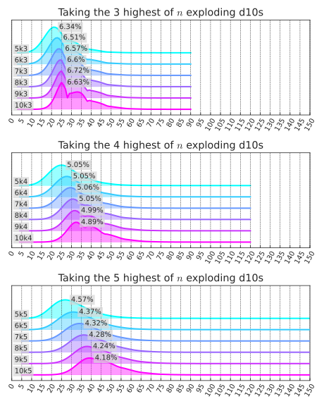
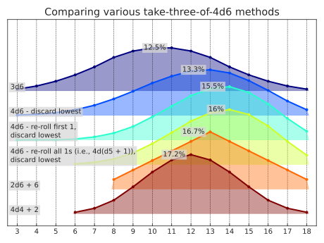
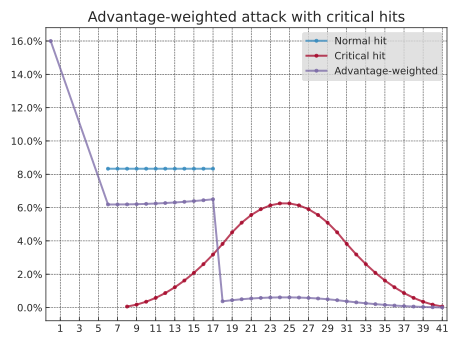

<!---
  Copyright and other protections apply.
  Please see the accompanying LICENSE file for rights and restrictions governing use of this software.
  All rights not expressly waived or licensed are reserved.
  If that file is missing or appears to be modified from its original, then please contact the author before viewing or using this software in any capacity.

  !!!!!!!!!!!!!!!!!!!!!!!!!!!!!!!!!!!!!!!!!!!!!!!!!!!!!!!!!!!!!!!!!!!!
  !!!!!!!!!!!!!!! IMPORTANT: READ THIS BEFORE EDITING! !!!!!!!!!!!!!!!
  !!!!!!!!!!!!!!!!!!!!!!!!!!!!!!!!!!!!!!!!!!!!!!!!!!!!!!!!!!!!!!!!!!!!
  Please keep each sentence on its own unwrapped line.
  It looks like crap in a text editor, but it has no effect on rendering, and it allows much more useful diffs.
  Thank you!
  -->

# Examples

The examples and translations below are intended to showcase `dyce`’s flexibility.

### Advanced topics

- [Checking Angry’s math on the Tension Pool](examples-tension-pool.md)
- [Modeling *Ironsworn*’s core mechanic](examples-ironsworn.md)
- [Modeling *Risus* combat](examples-risus.md)
- [Expansion and recursion](examples-expand.md)
- [Symbolic outcomes](examples-symbolic.md)

## Translation of the accepted answer to “[Roll and Keep in Anydice?](https://rpg.stackexchange.com/a/166637)”

Source:

```
\ How best to model this in a way that allows testing 1k1 to 10k5? \
output [highest 3 of 10d [explode d10]] named "10k3"
```

Translation:

    --8<-- "docs-src/plot_matplotlib_d10_explode.py:core"

Visualization: [](https://dycelib.org/latest/jupyter/lab/?path=d10_explode.ipynb)

??? example "Visualization source code"

        --8<-- "docs-src/plot_matplotlib_d10_explode.py:viz"

<!-- Should match any title of the corresponding plot title -->
<!--
  TODO(@posita): https://github.com/zensical/zensical/issues/975 -
  source[srcset] should be "images/..."
  -->
<picture>
  <source media="(prefers-color-scheme: dark)" srcset="../images/plot_matplotlib_d10_explode_dark.svg">
  <source media="(prefers-color-scheme: light)" srcset="../images/plot_matplotlib_d10_explode_light.svg">
  
</picture>

## Modeling “[The Probability of 4d6, Drop the Lowest, Reroll 1s](http://prestonpoulter.com/2010/11/19/the-probability-of-4d6-drop-the-lowest-reroll-1s/)”

    --8<-- "docs-src/plot_matplotlib_4d6_variants.py:core"

Visualization: [](https://dycelib.org/latest/jupyter/lab/?path=4d6_variants.ipynb)

    --8<-- "docs-src/plot_matplotlib_4d6_variants.py:viz"

<!-- Should match any title of the corresponding plot title -->
<!--
  TODO(@posita): https://github.com/zensical/zensical/issues/975 -
  source[srcset] should be "images/..."
  -->
<picture>
  <source media="(prefers-color-scheme: dark)" srcset="../images/plot_matplotlib_4d6_variants_dark.svg">
  <source media="(prefers-color-scheme: light)" srcset="../images/plot_matplotlib_4d6_variants_light.svg">
  
</picture>

## Attack damage with advantage and critical hits

Source example from [`LordSembor/DnDice`](https://github.com/LordSembor/DnDice#examples):

    from DnDice import d, advantage, plot

    normal_hit = 1*d(12) + 5
    critical_hit = 3*d(12) + 5

    result = d()
    for value, probability in advantage():
      if value == 20:
        result.layer(critical_hit, weight=probability)
      elif value + 5 >= 14:
        result.layer(normal_hit, weight=probability)
      else:
        result.layer(d(0), weight=probability)
    result.normalizeExpectancies()
    # …

Translation:

    --8<-- "docs-src/plot_matplotlib_advantage.py:core"

Visualization: [](https://dycelib.org/latest/jupyter/lab/?path=advantage.ipynb)

    --8<-- "docs-src/plot_matplotlib_advantage.py:viz"

<!-- Should match any title of the corresponding plot title -->
<!--
  TODO(@posita): https://github.com/zensical/zensical/issues/975 -
  source[srcset] should be "images/..."
  -->
<picture>
  <source media="(prefers-color-scheme: dark)" srcset="../images/plot_matplotlib_advantage_dark.svg">
  <source media="(prefers-color-scheme: light)" srcset="../images/plot_matplotlib_advantage_light.svg">
  
</picture>

## Translation of the accepted answer to “[Modelling opposed dice pools with a swap](https://rpg.stackexchange.com/a/112951)”

Source of basic `brawl`:

```
function: brawl A:s vs B:s {
  SA: A >= 1@B
  SB: B >= 1@A
  if SA-SB=0 {
    result:(A > B) - (A < B)
  }
  result:SA-SB
}
output [brawl 3d6 vs 3d6] named "A vs B Damage"
```

Translation:

    >>> from dyce.evaluation import PResult

    >>> def brawl(p_result_a: PResult[int], p_result_b: PResult[int]) -> int:
    ...     a_successes = sum(1 for v in p_result_a.roll if v >= p_result_b.roll[-1])
    ...     b_successes = sum(1 for v in p_result_b.roll if v >= p_result_a.roll[-1])
    ...     return a_successes - b_successes

Rudimentary textual visualization using built-in methods:

    >>> from dyce import P, expand
    >>> p3d6 = 3 @ P(6)
    >>> res = expand(brawl, p3d6, p3d6)
    >>> print(res.format(width=65))
    avg |    0.00
    std |    1.73
     -3 |   7.86% |###
     -2 |  15.52% |#######
     -1 |  16.64% |########
      0 |  19.96% |#########
      1 |  16.64% |########
      2 |  15.52% |#######
      3 |   7.86% |###

Source of `brawl` with an optional dice swap:

```
function: set element I:n in SEQ:s to N:n {
  NEW: {}
  loop J over {1 .. #SEQ} {
    if I = J { NEW: {NEW, N} }
    else { NEW: {NEW, J@SEQ} }
  }
  result: NEW
}
function: brawl A:s vs B:s with optional swap {
  if #A@A >= 1@B {
    result: [brawl A vs B]
  }
  AX: [sort [set element #A in A to 1@B]]
  BX: [sort [set element 1 in B to #A@A]]
  result: [brawl AX vs BX]
}
output [brawl 3d6 vs 3d6 with optional swap] named "A vs B Damage"
```

Translation:

    >>> def brawl_w_optional_swap(p_result_a: PResult[int], p_result_b: PResult[int]) -> int:
    ...     roll_a, roll_b = p_result_a.roll, p_result_b.roll
    ...     if roll_a[0] < roll_b[-1]:
    ...         roll_a, roll_b = roll_a[1:] + roll_b[-1:], roll_a[:1] + roll_b[:-1]
    ...         # Sort greatest-to-least after the swap
    ...         roll_a = tuple(sorted(roll_a, reverse=True))
    ...         roll_b = tuple(sorted(roll_b, reverse=True))
    ...     else:
    ...         # Reverse to be greatest-to-least
    ...         roll_a = roll_a[::-1]
    ...         roll_b = roll_b[::-1]
    ...     a_successes = sum(1 for v in roll_a if v >= roll_b[0])
    ...     b_successes = sum(1 for v in roll_b if v >= roll_a[0])
    ...     return a_successes - b_successes or (roll_a > roll_b) - (roll_a < roll_b)

Rudimentary visualization using built-in methods:

    >>> res = expand(brawl_w_optional_swap, p3d6, p3d6)
    >>> print(res.format(width=65))
    avg |    2.36
    std |    0.88
     -1 |   1.42% |
      0 |   0.59% |
      1 |  16.65% |########
      2 |  23.19% |###########
      3 |  58.15% |#############################

    >>> p4d6 = 4 @ P(6)
    >>> res = expand(brawl_w_optional_swap, p4d6, p4d6)
    >>> print(res.format(width=65))
    avg |    2.64
    std |    1.28
     -2 |   0.06% |
     -1 |   2.94% |#
      0 |   0.31% |
      1 |  18.16% |#########
      2 |  19.97% |#########
      3 |  25.19% |############
      4 |  33.37% |################
