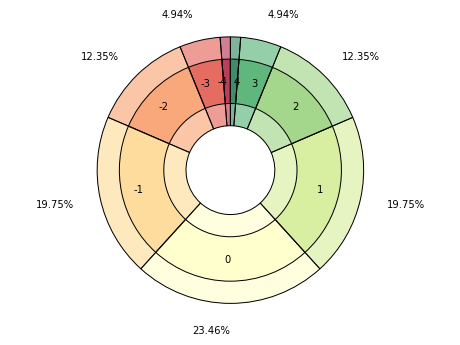
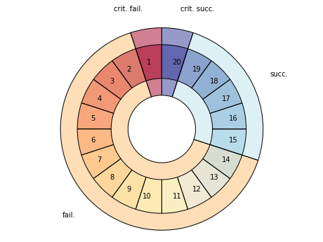

<!--- -*- encoding: utf-8 -*-
  Copyright and other protections apply. Please see the accompanying LICENSE file for
  rights and restrictions governing use of this software. All rights not expressly
  waived or licensed are reserved. If that file is missing or appears to be modified
  from its original, then please contact the author before viewing or using this
  software in any capacity.

  !!!!!!!!!!!!!!!!!!!!!!!!!!!!!!!!!!!!!!!!!!!!!!!!!!!!!!!!!!!!!!!!!!!!
  !!!!!!!!!!!!!!! IMPORTANT: READ THIS BEFORE EDITING! !!!!!!!!!!!!!!!
  !!!!!!!!!!!!!!!!!!!!!!!!!!!!!!!!!!!!!!!!!!!!!!!!!!!!!!!!!!!!!!!!!!!!
  Please keep each sentence on its own unwrapped line.
  It looks like crap in a text editor, but it has no effect on rendering, and it allows much more useful diffs.
  Thank you!
-->

[](https://pypi.python.org/pypi/dycelib/0.2.0)
[](https://pypi.python.org/pypi/dycelib/0.2.0)
[](http://opensource.org/licenses/MIT)
[](https://pypi.python.org/pypi/dycelib/0.2.0)
[](https://pypi.python.org/pypi/dycelib/0.2.0)
[](https://github.com/posita/dyce)

# Introduction to ``dyce``

``dyce`` is a pure-Python library for exploring dice probabilities designed to be immediately and broadly useful with minimal additional investment beyond basic knowledge of Python.
``dyce`` is an [AnyDice](https://anydice.com/) replacement that leverages Pythonic syntax and operators for rolling dice and computing weighted outcomes.
While Python is not as terse as a dedicated grammar, it is quite sufficient, and often more expressive.
Those familiar with various [game notations](https://en.wikipedia.org/wiki/Dice_notation) should be able to adapt quickly.

``dyce`` is fairly low level by design, prioritizing ergonomics and composability.
While any AnyDice generously affords a very convenient platform for simple computations, its idiosyncrasies can lead to [confusion](https://duckduckgo.com/?q=site%3Astackexchange.com+title%3Aanydice) and complicated workarounds.
Like AnyDice, it avoids stochastic simulation, but instead determines outcomes through enumeration and discrete computation.
Unlike AnyDice, however, it is an open source library that can be run locally and modified as desired.
Because it exposes Python primitives rather than defining a dedicated grammar and interpreter, one can easily integrate it with other Python tools and libraries.
In an intentional departure from [RFC 1925, § 2.2](https://datatracker.ietf.org/doc/html/rfc1925#section-2), it provides minor formatting conveniences for casual tinkering.
However, it really shines when used in larger contexts such as [Matplotlib](https://matplotlib.org/) or [Jupyter](https://jupyter.org/).

``dyce`` should be sufficient to replicate or replace AnyDice and most other dice probability modeling libraries.
It strives to be [fully documented](https://posita.github.io/dyce/latest/) and relies heavily on examples to develop understanding.
If you find its functionality or documentation confusing or lacking in any way, please consider [contributing an issue](contrib.md) to start a discussion.
Source code is [available on GitHub](https://github.com/posita/dyce).

## Examples

``dyce`` provides two key primitives. [``H`` objects](dyce.md#dyce.h.H) represent histograms for modeling or outcomes and individual dice, and [``P`` objects](dyce.md#dyce.p.P) represent pools (ordered sequences) of histograms:

```python
>>> from dyce import H, P

```

Both support arithmetic operations.
A six-sided die can be modeled as:

```python
>>> H(6)
H(6)

```

``H(n)`` is shorthand for explicitly enumerating faces $[{{1} .. {n}}]$, each with a frequency of 1:

```python
>>> H(6) == H({1: 1, 2: 1, 3: 1, 4: 1, 5: 1, 6: 1})
True

```

Tuples with repeating faces are accumulated.
A six-sided “2, 3, 3, 4, 4, 5” die can be modeled as:

```python
>>> H((2, 3, 3, 4, 4, 5))
H({2: 1, 3: 2, 4: 2, 5: 1})

```

A fudge die can be modeled as:

```python
>>> H((-1, 0, 1))
H({-1: 1, 0: 1, 1: 1})

```

Python’s matrix multiplication operator (``@``) is used to express the number of a particular die (roughly equivalent to the “``d``” operator in common notations).
A pool of two six-sided dice (``2d6``) is:

```python
>>> 2@P(H(6))
P(6, 6)

```

Where ``n`` is an integer, ``P(n, ...)`` is shorthand for ``P(H(n), ...)``.
The above can be expressed more succinctly:

```python
>>> 2@P(6)
P(6, 6)

```

Pools (in this case [Sicherman dice](https://en.wikipedia.org/wiki/Sicherman_dice)) can be compared to histograms:

```python
>>> d_sicherman = P(H((1, 2, 2, 3, 3, 4)), H((1, 3, 4, 5, 6, 8)))
>>> d_sicherman == 2@H(6)
True

```

Arithmetic operations implicitly flatten pools into histograms.
``3×(2d6+4)`` is:

```python
>>> 3*(2@P(6)+4)
H({18: 1, 21: 2, 24: 3, 27: 4, 30: 5, 33: 6, 36: 5, 39: 4, 42: 3, 45: 2, 48: 1})

```

In interpreting the results, we see there is one way to make ``18``, two ways to make ``21``, three ways to make ``24``, etc.

One way to model subtracting the least of two six-sided dice from the greatest is:

```python
>>> abs(H(6) - H(6))
H({0: 6, 1: 10, 2: 8, 3: 6, 4: 4, 5: 2})

```

Histograms should be sufficient for most calculations.
However, pools are useful for selecting (or “taking”) only some of the pool’s faces.
This is done by providing the optional *key* argument to the [``h`` method][dyce.p.P.h].
Indexes can be integers, slices, or iterables thereof.
Faces are ordered from least to greatest (i.e., ``0``, ``1``, …, ``-2``, ``-1``).
Summing the least two faces when rolling three six-sided dice would be:

```python
>>> 3@P(6)
P(6, 6, 6)

>>> (3@P(6)).h(slice(2))  # see warning below about parentheses
H({2: 16, 3: 27, 4: 34, 5: 36, 6: 34, 7: 27, 8: 19, 9: 12, 10: 7, 11: 3, 12: 1})

```

!!! warning "Mind your parentheses"

    Parentheses are needed in the above example because ``@`` has a [lower precedence](https://docs.python.org/3/reference/expressions.html#operator-precedence) than ``[…]``.

    ```python
    >>> 2@P(6).h(1)  # equivalent to 2@(P(6).h(1))
    Traceback (most recent call last):
    ...
    IndexError: tuple index out of range
    >>> (2@P(6)).h(1)
    H({1: 1, 2: 3, 3: 5, 4: 7, 5: 9, 6: 11})

    ```

Histograms provide rudimentary formatting for convenience:

```python
>>> print((2@H(6)).format(width=65))
avg |    7.00
  2 |   2.78% |#
  3 |   5.56% |##
  4 |   8.33% |####
  5 |  11.11% |#####
  6 |  13.89% |######
  7 |  16.67% |########
  8 |  13.89% |######
  9 |  11.11% |#####
 10 |   8.33% |####
 11 |   5.56% |##
 12 |   2.78% |#

```

Selecting the least, middle, or greatest face when rolling three six-sided dice would be:

```python
>>> (3@P(6)).h(0)
H({1: 91, 2: 61, 3: 37, 4: 19, 5: 7, 6: 1})
>>> print(_.format(width=65))
avg |    2.04
  1 |  42.13% |#####################
  2 |  28.24% |##############
  3 |  17.13% |########
  4 |   8.80% |####
  5 |   3.24% |#
  6 |   0.46% |

>>> (3@P(6)).h(1)
H({1: 16, 2: 40, 3: 52, 4: 52, 5: 40, 6: 16})
>>> print(_.format(width=65))
avg |    3.50
  1 |   7.41% |###
  2 |  18.52% |#########
  3 |  24.07% |############
  4 |  24.07% |############
  5 |  18.52% |#########
  6 |   7.41% |###

>>> (3@P(6)).h(-1)
H({1: 1, 2: 7, 3: 19, 4: 37, 5: 61, 6: 91})
>>> print(_.format(width=65))
avg |    4.96
  1 |   0.46% |
  2 |   3.24% |#
  3 |   8.80% |####
  4 |  17.13% |########
  5 |  28.24% |##############
  6 |  42.13% |#####################

```

Summing the greatest and the least faces when rolling an entire standard six-die polygonal set would be:

```python
>>> H(10)-1  # a common “d10” with faces [0 .. 9]
H({0: 1, 1: 1, 2: 1, 3: 1, 4: 1, 5: 1, 6: 1, 7: 1, 8: 1, 9: 1})
>>> P(4, 6, 8, _, 12, 20).h((0, -1))
H({1: 1, 2: 32, 3: 273, 4: 1384, ..., 21: 20736, 22: 9240, 23: 3360, 24: 810})

```

Note that pools are ordered and iterable:

```python
>>> list(2@P(8, 4, 6))
[H(4), H(4), H(6), H(6), H(8), H(8)]

```

Indexing selects particular histograms in a pool:

```python
>>> (2@P(8, 4, 6))[1:3]
(H(4), H(6))

```

If desired, one way to enumerate all possible rolls is:

```python
>>> import itertools
>>> list(itertools.product(*P(-3, 3)))
[(-3, 1), (-3, 2), (-3, 3), (-2, 1), (-2, 2), (-2, 3), (-1, 1), (-1, 2), (-1, 3)]

```

If [``matplotlib``](https://matplotlib.org/stable/api/index.html) is installed (e.g., via [Jupyter](https://jupyter.org/)), [``dyce.plt``](dyce.plt.md) provides some experimental, rudimentary conveniences:

```python
>>> from dyce.plt import plot_burst
>>> fig, ax = plot_burst(2@H(6))  # doctest: +SKIP

```

Calling ``matplotlib.pyplot.show`` presents:



The outer ring and corresponding labels can be overridden for interesting, at-a-glance displays.
Overrides apply counter-clockwise, starting from the 12 o‘clock position:

```python
>>> p_d20 = P(20)
>>> fig, ax = plot_burst(p_d20.h(), outer=(
...   ("crit. fail.", p_d20.le(1).h(1)),
...   ("fail.", p_d20.within(2, 14).h(0)),
...   ("succ.", p_d20.within(15, 19).h(0)),
...   ("crit. succ.", p_d20.ge(20).h(1)),
... ), graph_color="RdYlBu_r")  # doctest: +SKIP

```

Calling ``matplotlib.pyplot.show`` presents:



## License

``dyce`` is licensed under the [MIT License](https://opensource.org/licenses/MIT).
See the [``LICENSE``](license.md) file for details.
Source code is [available on GitHub](https://github.com/posita/dyce).

## Installation

Installation can be performed via ``pip`` (which will download and install the [latest release](https://pypi.python.org/pypi/dyce/)):

```sh
% pip install dycelib
...

```

Alternately, you can download the sources (e.g., [from GitHub](https://github.com/posita/dyce)) and run ``setup.py``:

```sh
% git clone https://github.com/posita/dyce
...
% cd dyce
% python setup.py install
...

```

### Requirements

A modern version of Python is required:

* [cPython](https://www.python.org/) (3.6+)
* [PyPy](http://pypy.org/) (Python 3.6+ compatible)

``dyce`` has the following dependencies (which will be installed automatically):

* [``typing``](https://pypi.org/project/typing/)
* [``typing-extensions``](https://pypi.org/project/typing-extensions/)
