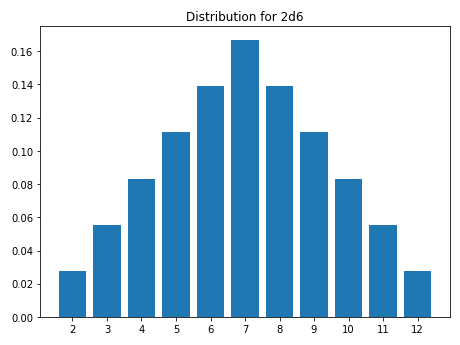
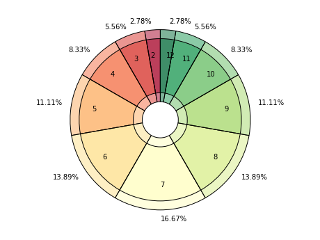
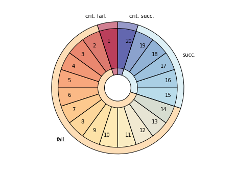
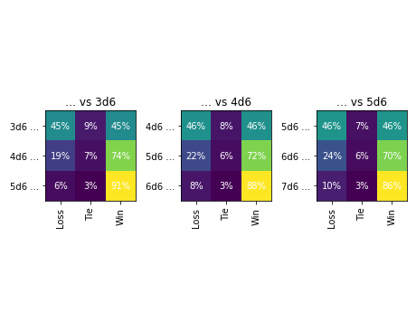

<!--- -*- encoding: utf-8 -*-
  Copyright and other protections apply. Please see the accompanying LICENSE file for
  rights and restrictions governing use of this software. All rights not expressly
  waived or licensed are reserved. If that file is missing or appears to be modified
  from its original, then please contact the author before viewing or using this
  software in any capacity.

  !!!!!!!!!!!!!!!!!!!!!!!!!!!!!!!!!!!!!!!!!!!!!!!!!!!!!!!!!!!!!!!!!!!!
  !!!!!!!!!!!!!!! IMPORTANT: READ THIS BEFORE EDITING! !!!!!!!!!!!!!!!
  !!!!!!!!!!!!!!!!!!!!!!!!!!!!!!!!!!!!!!!!!!!!!!!!!!!!!!!!!!!!!!!!!!!!
  Please keep each sentence on its own unwrapped line.
  It looks like crap in a text editor, but it has no effect on rendering, and it allows much more useful diffs.
  Thank you!
-->

[](https://pypi.python.org/pypi/dycelib)
[](https://pypi.python.org/pypi/dycelib)
[](http://opensource.org/licenses/MIT)
[](https://pypi.python.org/pypi/dycelib)
[](https://pypi.python.org/pypi/dycelib)
[](https://github.com/posita/dyce)

# Introduction to ``dyce``

``dyce`` is a pure-Python library for exploring dice probabilities designed to be immediately and broadly useful with minimal additional investment beyond basic knowledge of Python.
``dyce`` is an [AnyDice](https://anydice.com/) replacement that leverages Pythonic syntax and operators for rolling dice and computing weighted outcomes.
While Python is not as terse as a dedicated grammar, it is quite sufficient, and often more expressive.
Those familiar with various [game notations](https://en.wikipedia.org/wiki/Dice_notation) should be able to adapt quickly.

``dyce`` is fairly low level by design, prioritizing ergonomics and composability.
While any AnyDice generously affords a very convenient platform for simple computations, its idiosyncrasies can lead to [confusion](https://duckduckgo.com/?q=site%3Astackexchange.com+title%3Aanydice) and complicated workarounds.
Like AnyDice, it avoids stochastic simulation, but instead determines outcomes through enumeration and discrete computation.
Unlike AnyDice, however, it is an open source library that can be run locally and modified as desired.
Because it exposes Python primitives rather than defining a dedicated grammar and interpreter, one can easily integrate it with other Python tools and libraries.
In an intentional departure from [RFC 1925, § 2.2](https://datatracker.ietf.org/doc/html/rfc1925#section-2), it provides minor computation optimizations (e.g., the [``H.lowest_terms`` method][dyce.h.H.lowest_terms] and various shorthands) and formatting conveniences (e.g., the [``H.data``][dyce.h.H.data], [``H.data_xy``][dyce.h.H.data_xy], and [``H.format``][dyce.h.H.format] methods) for casual tinkering.
However, it really shines when used in larger contexts such as with [Matplotlib](https://matplotlib.org/) or [Jupyter](https://jupyter.org/).

``dyce`` should be sufficient to replicate or replace AnyDice and most other dice probability modeling libraries.
It strives to be [fully documented](https://posita.github.io/dyce/latest/) and relies heavily on examples to develop understanding.
If you find its functionality or documentation confusing or lacking in any way, please consider [contributing an issue](contrib.md) to start a discussion.
Source code is [available on GitHub](https://github.com/posita/dyce).

## Examples

``dyce`` provides two key primitives:

```python
>>> from dyce import H, P

```

[``H`` objects](dyce.md#dyce.h.H) represent histograms for modeling individual dice and outcomes.
[``P`` objects](dyce.md#dyce.p.P) represent pools (ordered sequences) of histograms.

A six-sided die can be modeled as:

```python
>>> H(6)
H(6)

```

``H(n)`` is shorthand for explicitly enumerating faces $[{{1} .. {n}}]$, each with a frequency of 1:

```python
>>> H(6) == H({1: 1, 2: 1, 3: 1, 4: 1, 5: 1, 6: 1})
True

```

Tuples with repeating faces are accumulated.
A six-sided “2, 3, 3, 4, 4, 5” die can be modeled as:

```python
>>> H((2, 3, 3, 4, 4, 5))
H({2: 1, 3: 2, 4: 2, 5: 1})

```

A fudge die can be modeled as:

```python
>>> H((-1, 0, 1))
H({-1: 1, 0: 1, 1: 1})

```

Python’s matrix multiplication operator (``@``) is used to express the number of a particular die (roughly equivalent to the “``d``” operator in common notations). The outcomes of rolling two six-sided dice (``2d6``) are:

```python
>>> 2@H(6)
H({2: 1, 3: 2, 4: 3, 5: 4, 6: 5, 7: 6, 8: 5, 9: 4, 10: 3, 11: 2, 12: 1})

```

A pool of two six-sided dice is:

```python
>>> 2@P(H(6))
P(6, 6)

```

Where ``n`` is an integer, ``P(n, ...)`` is shorthand for ``P(H(n), ...)``.
The above can be expressed more succinctly:

```python
>>> 2@P(6)
P(6, 6)

```

Pools (in this case [Sicherman dice](https://en.wikipedia.org/wiki/Sicherman_dice)) can be compared to histograms:

```python
>>> d_sicherman = P(H((1, 2, 2, 3, 3, 4)), H((1, 3, 4, 5, 6, 8)))
>>> d_sicherman == 2@H(6)
True

```

Both histograms and pools support arithmetic operations.
``3×(2d6+4)`` is:

```python
>>> 3*(2@H(6)+4)
H({18: 1, 21: 2, 24: 3, 27: 4, 30: 5, 33: 6, 36: 5, 39: 4, 42: 3, 45: 2, 48: 1})

```

The results show there is one way to make ``18``, two ways to make ``21``, three ways to make ``24``, etc.
One way to model outcomes from subtracting the least of two six-sided dice from the greatest is:

```python
>>> abs(H(6) - H(6))
H({0: 6, 1: 10, 2: 8, 3: 6, 4: 4, 5: 2})

```

Arithmetic operations implicitly “flatten” pools into histograms:

```python
>>> 3*(2@P(6)+4)
H({18: 1, 21: 2, 24: 3, 27: 4, 30: 5, 33: 6, 36: 5, 39: 4, 42: 3, 45: 2, 48: 1})
>>> abs(P(6) - P(6))
H({0: 6, 1: 10, 2: 8, 3: 6, 4: 4, 5: 2})

```

Histograms should be sufficient for most calculations.
However, pools are useful for “taking” (selecting) only some of the pool’s faces.
This is done by providing one or more index arguments to the [``h`` method][dyce.p.P.h].
Indexes can be integers, slices, or iterables thereof.
Face indexes are ordered from least to greatest (i.e., ``0``, ``1``, …, ``-2``, ``-1``).
Summing the least two faces when rolling three six-sided dice would be:

```python
>>> 3@P(6)
P(6, 6, 6)
>>> (3@P(6)).h(0, 1)  # see warning below about parentheses
H({2: 16, 3: 27, 4: 34, 5: 36, 6: 34, 7: 27, 8: 19, 9: 12, 10: 7, 11: 3, 12: 1})

```

!!! warning "Mind your parentheses"

    Parentheses are needed in the above example because ``@`` has a [lower precedence](https://docs.python.org/3/reference/expressions.html#operator-precedence) than ``[…]``.

    ```python
    >>> 2@P(6).h(1)  # equivalent to 2@(P(6).h(1))
    Traceback (most recent call last):
    ...
    IndexError: tuple index out of range
    >>> (2@P(6)).h(1)
    H({1: 1, 2: 3, 3: 5, 4: 7, 5: 9, 6: 11})

    ```

Histograms provide rudimentary formatting for convenience:

```python
>>> print((2@H(6)).format(width=65))
avg |    7.00
std |    2.42
var |    5.83
  2 |   2.78% |#
  3 |   5.56% |##
  4 |   8.33% |####
  5 |  11.11% |#####
  6 |  13.89% |######
  7 |  16.67% |########
  8 |  13.89% |######
  9 |  11.11% |#####
 10 |   8.33% |####
 11 |   5.56% |##
 12 |   2.78% |#

```

Taking the least, middle, or greatest face when rolling three six-sided dice would be:

```python
>>> p_3d6 = 3@P(6)
>>> p_3d6.h(0)
H({1: 91, 2: 61, 3: 37, 4: 19, 5: 7, 6: 1})
>>> print(p_3d6.h(0).format(width=65))
avg |    2.04
std |    1.14
var |    1.31
  1 |  42.13% |#####################
  2 |  28.24% |##############
  3 |  17.13% |########
  4 |   8.80% |####
  5 |   3.24% |#
  6 |   0.46% |

```

```python
>>> p_3d6.h(1)
H({1: 16, 2: 40, 3: 52, 4: 52, 5: 40, 6: 16})
>>> print(p_3d6.h(1).format(width=65))
avg |    3.50
std |    1.37
var |    1.88
  1 |   7.41% |###
  2 |  18.52% |#########
  3 |  24.07% |############
  4 |  24.07% |############
  5 |  18.52% |#########
  6 |   7.41% |###

```

```python
>>> p_3d6.h(-1)
H({1: 1, 2: 7, 3: 19, 4: 37, 5: 61, 6: 91})
>>> print(p_3d6.h(-1).format(width=65))
avg |    4.96
std |    1.14
var |    1.31
  1 |   0.46% |
  2 |   3.24% |#
  3 |   8.80% |####
  4 |  17.13% |########
  5 |  28.24% |##############
  6 |  42.13% |#####################

```

Summing the greatest and the least faces when rolling a typical six-die polygonal set would be:

```python
>>> d10 = H(10)-1  # a common “d10” with faces [0 .. 9]
>>> d10
H({0: 1, 1: 1, 2: 1, 3: 1, 4: 1, 5: 1, 6: 1, 7: 1, 8: 1, 9: 1})
>>> h = P(4, 6, 8, d10, 12, 20).h(0, -1)
>>> print(h.format(width=65, scaled=True))
avg |   13.48
std |    4.40
var |   19.39
  1 |   0.00% |
  2 |   0.01% |
  3 |   0.06% |
  4 |   0.30% |#
  5 |   0.92% |#####
  6 |   2.03% |###########
  7 |   3.76% |####################
  8 |   5.57% |##############################
  9 |   7.78% |###########################################
 10 |   8.99% |##################################################
 11 |   8.47% |###############################################
 12 |   8.64% |################################################
 13 |   8.66% |################################################
 14 |   6.64% |####################################
 15 |   5.62% |###############################
 16 |   5.16% |############################
 17 |   5.00% |###########################
 18 |   5.00% |###########################
 19 |   5.00% |###########################
 20 |   5.00% |###########################
 21 |   4.50% |#########################
 22 |   2.01% |###########
 23 |   0.73% |####
 24 |   0.18% |

```

Note that pools are ordered and iterable:

```python
>>> list(2@P(8, 4, 6))
[H(4), H(4), H(6), H(6), H(8), H(8)]

```

Indexing selects particular histograms in a pool:

```python
>>> (2@P(8, 4, 6))[1:3]
(H(4), H(6))

```

If desired, one way to enumerate all possible rolls is:

```python
>>> import itertools
>>> list(itertools.product(*P(-3, 3)))
[(-3, 1), (-3, 2), (-3, 3), (-2, 1), (-2, 2), (-2, 3), (-1, 1), (-1, 2), (-1, 3)]

```

Both histograms and pools support various comparison operations as well as substitution. The odds of observing all even faces when rolling $n$ six-sided dice, for $n$ in $[1..6]$ is:

```python
>>> d6_even = H(6).even()
>>> for n in range(6, 0, -1):
...   number_of_evens_in_nd6 = n@d6_even
...   all_even = number_of_evens_in_nd6.eq(n)
...   print("{: >2}d6: {: >6.2%}".format(n, all_even[1] / sum(all_even.counts())))
 6d6:  1.56%
 5d6:  3.12%
 4d6:  6.25%
 3d6: 12.50%
 2d6: 25.00%
 1d6: 50.00%

```

The odds of scoring at least one nine or higher when rolling $n$ “[exploding][dyce.h.H.explode]” six-sided dice, for $n$ in $[1..10]$ is:

```python
>>> exploding_d6 = H(6).explode(max_depth=2)
>>> for n in range(10, 0, -1):
...   d6e_ge_9 = exploding_d6.ge(9)
...   number_of_nines_or_higher_in_nd6e = n@d6e_ge_9
...   at_least_one_9 = number_of_nines_or_higher_in_nd6e.ge(1)
...   print("{: >2}d6-exploding: {: >6.2%}".format(n, at_least_one_9[1] / sum(at_least_one_9.counts())))
10d6-exploding: 69.21%
 9d6-exploding: 65.36%
 8d6-exploding: 61.03%
 7d6-exploding: 56.15%
 6d6-exploding: 50.67%
 5d6-exploding: 44.51%
 4d6-exploding: 37.57%
 3d6-exploding: 29.77%
 2d6-exploding: 20.99%
 1d6-exploding: 11.11%

```

### Visualization (e.g., with Matplotlib)

[``H`` objects][dyce.h.H] provide a [``data`` method][dyce.h.H.data] and a [``data_xy`` method][dyce.h.H.data_xy] to ease integration with plotting packages like [``matplotlib``](https://matplotlib.org/stable/api/index.html):

```python
>>> faces, probabilities = (2@H(6)).data_xy()
>>> import matplotlib  # doctest: +SKIP
>>> matplotlib.pyplot.bar(
...   [str(f) for f in faces],
...   probabilities,
... )  # doctest: +SKIP
>>> matplotlib.pyplot.show()  # doctest: +SKIP

```

<a href="plot_histogram_light.png"><picture>
  <source srcset="plot_histogram_dark.png" media="(prefers-color-scheme: dark)" />
  
</picture></a>

[``dyce.plt``](dyce.plt.md) provides some experimental, rudimentary conveniences if it detects that ``matplotlib`` is installed (e.g., via [Jupyter](https://jupyter.org/)):

```python
>>> from dyce.plt import plot_burst
>>> fig, ax = plot_burst(2@H(6))  # doctest: +SKIP
>>> matplotlib.pyplot.show()  # doctest: +SKIP

```

<a href="plot_burst_1_light.png"><picture>
  <source srcset="plot_burst_1_dark.png" media="(prefers-color-scheme: dark)" />
  
</picture></a>

The outer ring and corresponding labels can be overridden for interesting, at-a-glance displays.
Overrides apply counter-clockwise, starting from the 12 o‘clock position:

```python
>>> d20 = H(20)
>>> fig, ax = plot_burst(d20, outer=(
...   ("crit. fail.", d20.le(1)[1]),
...   ("fail.", d20.within(2, 14)[0]),
...   ("succ.", d20.within(15, 19)[0]),
...   ("crit. succ.", d20.ge(20)[1]),
... ), graph_color="RdYlBu_r")  # doctest: +SKIP
>>> matplotlib.pyplot.show()  # doctest: +SKIP

```

<a href="plot_burst_2_light.png"><picture>
  <source srcset="plot_burst_2_dark.png" media="(prefers-color-scheme: dark)" />
  
</picture></a>

### Modeling *Risis*

*[Risus](http://risus.cumberlandgames.com/)* and its many [community-developed alternative rules](http://www.risusiverse.com/home/optional-rules) are fertile ground for stressing ergonomics and capabilities of any discrete outcome modeling tool.
We can easily model its opposed combat system for various starting configurations through the first round:

```python
>>> for them in range(3, 6):
...   print("---")
...   for us in range(them, them + 3):
...     first_round = (us@H(6)).vs(them@H(6))  # -1 is a loss, 0 is a tie, 1 is a win
...     print("{}d6 vs {}d6: {}".format(us, them, first_round.format(width=0)))
---
3d6 vs 3d6: {..., -1: 45.36%, 0:  9.28%, 1: 45.36%}
4d6 vs 3d6: {..., -1: 19.17%, 0:  6.55%, 1: 74.28%}
5d6 vs 3d6: {..., -1:  6.07%, 0:  2.99%, 1: 90.93%}
---
4d6 vs 4d6: {..., -1: 45.95%, 0:  8.09%, 1: 45.95%}
5d6 vs 4d6: {..., -1: 22.04%, 0:  6.15%, 1: 71.81%}
6d6 vs 4d6: {..., -1:  8.34%, 0:  3.26%, 1: 88.40%}
---
5d6 vs 5d6: {..., -1: 46.37%, 0:  7.27%, 1: 46.37%}
6d6 vs 5d6: {..., -1: 24.24%, 0:  5.79%, 1: 69.96%}
7d6 vs 5d6: {..., -1: 10.36%, 0:  3.40%, 1: 86.24%}

```

This highlights the mechanic’s notorious “death spiral”, which we can visualize as a heat map:

```python
>>> from typing import List, Tuple
>>> col_names = ["Loss", "Tie", "Win"]  # mapping from [-1, 0, 1], respectively
>>> col_ticks = list(range(len(col_names)))
>>> num_rows = 3
>>> fig, axes = matplotlib.pyplot.subplots(1, num_rows)  # doctest: +SKIP
>>> for i, them in enumerate(range(3, 3 + num_rows)):
...   ax = axes[i]  # doctest: +SKIP
...   row_names: List[str] = []
...   rows: List[Tuple[float, ...]] = []
...   for us in range(them, them + num_rows):
...     row_names.append("{}d6 …".format(us))
...     rows.append((us@H(6)).vs(them@H(6)).data_xy()[-1])
...   _ = ax.imshow(rows)  # doctest: +SKIP
...   ax.set_title("… vs {}d6".format(them))  # doctest: +SKIP
...   ax.set_xticks(col_ticks)  # doctest: +SKIP
...   ax.set_xticklabels(col_names, rotation=90)  # doctest: +SKIP
...   ax.set_yticks(list(range(len(rows))))  # doctest: +SKIP
...   ax.set_yticklabels(row_names)  # doctest: +SKIP
...   for y in range(len(row_names)):
...     for x in range(len(col_names)):
...       _ = ax.text(
...         x, y,
...         "{:.0%}".format(rows[y][x]),
...         ha="center", va="center",color="w",
...       )  # doctest: +SKIP
>>> fig.tight_layout()  # doctest: +SKIP

```

Calling ``matplotlib.pyplot.show`` presents:

<a href="plot_risus_first_round_light.png"><picture>
  <source srcset="plot_risus_first_round_dark.png" media="(prefers-color-scheme: dark)" />
  
</picture></a>

We can even model various starting configurations through to completion to get a better sense of the impact of any disparity (in this case, applying dynamic programming to avoid redundant computations):

```python
>>> from typing import Callable, Dict, Tuple
>>> def risus_combat_driver(
...     us: int,
...     them: int,
...     us_vs_them_func: Callable[[int, int], H],
... ) -> H:
...   if us < 0 or them < 0:
...     raise ValueError("can't have negative numbers (us: {}, them: {})".format(us, them))
...   if us == 0 and them == 0:
...     return H({0: 1})  # shouldn't happen unless combat(0, 0) is called from the start
...   solved: Dict[Tuple[int, int], H] = {}
...
...   def _resolve(us: int, them: int) -> H:
...     if (us, them) in solved: return solved[(us, them)]
...     elif us == 0: return H({-1: 1})  # we're out of dice, they win
...     elif them == 0: return H({1: 1})  # they're out of dice, we win
...     this_round = us_vs_them_func(us, them)
...
...     def _next_round(h: H, f: int) -> H:
...       if f < 0: return _resolve(us - 1, them)
...       elif f > 0: return _resolve(us, them - 1)
...       else: return H({})  # ignore (immediately reroll) all ties
...
...     solved[(us, them)] = this_round.substitute(_next_round)
...     return solved[(us, them)]
...
...   return _resolve(us, them)

>>> for t in range(3, 6):
...   print("---")
...   for u in range(t, t + 3):
...     print("{}d6 vs {}d6: {}".format(
...       u, t,
...       risus_combat_driver(
...         u, t,
...         lambda u, t: (u@H(6)).vs(t@H(6))
...       ).format(width=0),
...     ))
---
3d6 vs 3d6: {..., -1: 50.00%, 1: 50.00%}
4d6 vs 3d6: {..., -1: 10.50%, 1: 89.50%}
5d6 vs 3d6: {..., -1:  0.66%, 1: 99.34%}
---
4d6 vs 4d6: {..., -1: 50.00%, 1: 50.00%}
5d6 vs 4d6: {..., -1: 12.25%, 1: 87.75%}
6d6 vs 4d6: {..., -1:  1.07%, 1: 98.93%}
---
5d6 vs 5d6: {..., -1: 50.00%, 1: 50.00%}
6d6 vs 5d6: {..., -1: 13.66%, 1: 86.34%}
7d6 vs 5d6: {..., -1:  1.49%, 1: 98.51%}

```

Using our ``risus_combat_driver`` from above, we can model the less death-spirally “Best of Set” alternative mechanic from *[The Risus Companion](https://ghalev.itch.io/risus-companion)* with the optional “Goliath Rule”:

```python
>>> def deadly_combat_vs(us: int, them: int) -> H:
...   best_us = (us@P(6)).h(-1)
...   best_them = (them@P(6)).h(-1)
...   h = best_us.vs(best_them)
...   # Goliath rule for resolving ties
...   h = h.substitute(lambda h, f: int(us < them) - int(us > them) if f == 0 else f)
...   return h

>>> for t in range(3, 5):
...   print("---")
...   for u in range(t, t + 3):
...     print("{}d6 vs {}d6: {}".format(
...       u, t,
...       risus_combat_driver(u, t, deadly_combat_vs).format(width=0),
...     ))
---
3d6 vs 3d6: {..., -1: 50.00%, 1: 50.00%}
4d6 vs 3d6: {..., -1: 36.00%, 1: 64.00%}
5d6 vs 3d6: {..., -1: 23.23%, 1: 76.77%}
---
4d6 vs 4d6: {..., -1: 50.00%, 1: 50.00%}
5d6 vs 4d6: {..., -1: 40.67%, 1: 59.33%}
6d6 vs 4d6: {..., -1: 30.59%, 1: 69.41%}

```

Modeling the “[Evens Up](http://www.risusiverse.com/home/optional-rules/evens-up)” alternative dice mechanic is currently beyond the capabilities of ``dyce`` without additional computation.
This is for two reasons.
First, ``dyce`` only provides mechanisms to approximate outcomes through a fixed number of iterations (not an infinite series).
Most of the time, this is good enough, however.
Second, with [one narrow exception][dyce.h.H.substitute], ``dyce`` only provides a mechanism to substitute face values, not counts.

Both of these limitations can be circumvented where probabilities can be computed and encoded as a histogram.
In this case, we can observe that a single d6 has a $\frac{1}{2}$ chance of coming up even, thereby earning a “success”.
We can also observe that it has a $\frac{1}{6}$ chance of showing a six, earning an additional roll.
That second roll has a $\frac{1}{2}$ chance of coming up even, as well as a $\frac{1}{6}$ chance of earning another roll, and so on.
In other words, the number of successes you can expect to roll are:

$$
\frac{1}{2}
+ \frac{1}{6} \left( \frac{1}{2}
  + \frac{1}{6} \left( \frac{1}{2}
    + \frac{1}{6} \left( \frac{1}{2}
      + \ldots
    \right)
  \right)
\right)
$$

Or, in the alternative:

$$
\frac{1}{2}
+ \frac{1}{2}\frac{1}{6}
+ \frac{1}{2}\frac{1}{6}\frac{1}{6}
+ \frac{1}{2}\frac{1}{6}\frac{1}{6}\frac{1}{6}
+ \ldots
$$

Or simply:

$$
\frac{1}{{2} \times {6}^{0}}
+ \frac{1}{{2} \times {6}^{1}}
+ \frac{1}{{2} \times {6}^{2}}
+ \frac{1}{{2} \times {6}^{3}}
+ \ldots
$$

So what is that? We probably don’t know unless we do math for a living, or at least as an active hobby.
(The author does neither, which is partially what motivated the creation of this library.)
Computing the value to the first hundred iterations offers a clue:

```python
>>> 1/2 * sum(1 / (6 ** i) for i in range(100))
0.59999999999999975575093458246556110680103302001953125

```

It appears convergent around $\frac{3}{5}$.
Let’s see if we can validate that.
An [article from MathIsFun.com](https://www.mathsisfun.com/algebra/infinite-series.html) provides useful guidance.
The section on geometric series is easily adapted to our problem:

$$
\begin{matrix}
S
& = &
\frac{1}{{2} \times {6}^{0}}
+ \frac{1}{{2} \times {6}^{1}}
+ \frac{1}{{2} \times {6}^{2}}
+ \frac{1}{{2} \times {6}^{3}}
+ \frac{1}{{2} \times {6}^{4}}
+ \ldots \\
& = &
\overbrace{ \frac{1}{2} }
+ \underbrace{ \frac{1}{12} + \frac{1}{72} + \frac{1}{432} + \frac{1}{2\,592} + \ldots } \\
\end{matrix}
$$

$$
\begin{matrix}
\frac{1}{6}S
& = &
\frac{1}{6}\frac{1}{{2} \times {6}^{0}}
+ \frac{1}{6}\frac{1}{{2} \times {6}^{1}}
+ \frac{1}{6}\frac{1}{{2} \times {6}^{2}}
+ \frac{1}{6}\frac{1}{{2} \times {6}^{3}}
+ \ldots \\
& = &
\underbrace{ \frac{1}{12} + \frac{1}{72} + \frac{1}{432} + \frac{1}{2\,592} + \ldots } \\
\end{matrix}
$$

$$
S = \overbrace{ \frac{1}{2} } + \underbrace{ \frac{1}{6}S }
$$

$$
S - \frac{1}{6}S = \frac{5}{6}S = \frac{1}{2}
$$

$$
S = \frac{6}{10} = \frac{3}{5}
$$

Well, butter my butt and call me a biscuit! Math really _is_ fun! 🧈🤠🧮

!!! info "As an aside, the Archimedean visualization technique mentioned in the [aforementioned article](https://www.mathsisfun.com/algebra/infinite-series.html) also adapts well to this case. It involves no algebra and is left as an exercise to the reader."

Armed with this knowledge, we can now model “Evens Up” using our ``risus_combat_driver`` from above:

```python
>>> from functools import partial
>>> d6_evens_exploding_on_six = H({0: 2, 1: 3})  # 2/5 odd; 3/5 even

>>> def evens_up_vs(us: int, them: int, goliath: bool = False) -> H:
...   h = (us@d6_evens_exploding_on_six).vs(them@d6_evens_exploding_on_six)
...   if goliath:
...     h = h.substitute(lambda h, f: int(us < them) - int(us > them) if f == 0 else f)
...   return h

>>> for t in range(3, 5):
...   print("---")
...   for u in range(t, t + 3):
...     print("{}d6 vs {}d6: {}".format(
...       u, t,
...       risus_combat_driver(u, t, partial(evens_up_vs, goliath=True)).format(width=0),
...     ))
---
3d6 vs 3d6: {..., -1: 50.00%, 1: 50.00%}
4d6 vs 3d6: {..., -1: 27.49%, 1: 72.51%}
5d6 vs 3d6: {..., -1:  9.27%, 1: 90.73%}
---
4d6 vs 4d6: {..., -1: 50.00%, 1: 50.00%}
5d6 vs 4d6: {..., -1: 28.50%, 1: 71.50%}
6d6 vs 4d6: {..., -1: 10.50%, 1: 89.50%}

```

## License

``dyce`` is licensed under the [MIT License](https://opensource.org/licenses/MIT).
See the [``LICENSE``](license.md) file for details.
Source code is [available on GitHub](https://github.com/posita/dyce).

## Installation

Installation can be performed via ``pip`` (which will download and install the [latest release](https://pypi.python.org/pypi/dyce/)):

```sh
% pip install dycelib
...

```

Alternately, you can download the sources (e.g., [from GitHub](https://github.com/posita/dyce)) and run ``setup.py``:

```sh
% git clone https://github.com/posita/dyce
...
% cd dyce
% python setup.py install
...

```

### Requirements

A modern version of Python is required:

* [cPython](https://www.python.org/) (3.6+)
* [PyPy](http://pypy.org/) (Python 3.6+ compatible)

``dyce`` has the following dependencies (which will be installed automatically):

* [``typing``](https://pypi.org/project/typing/)
* [``typing-extensions``](https://pypi.org/project/typing-extensions/)
