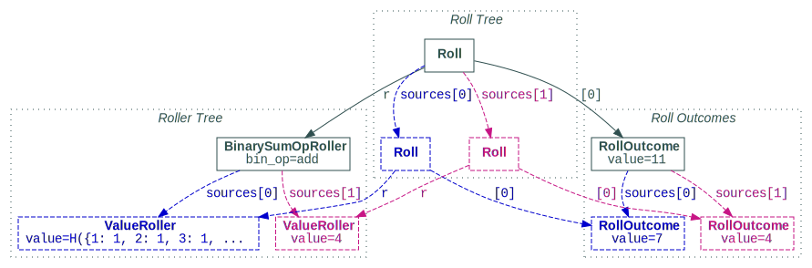
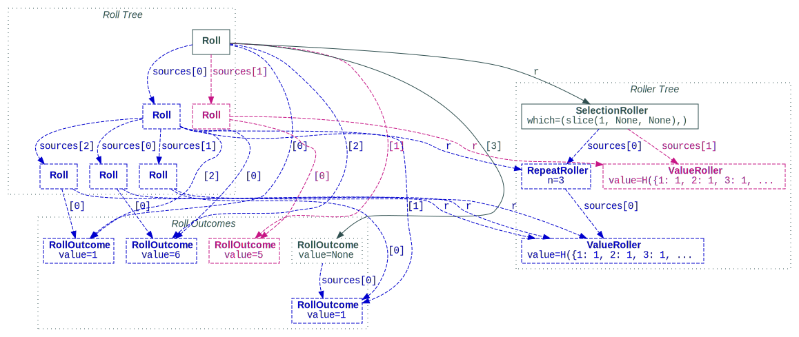
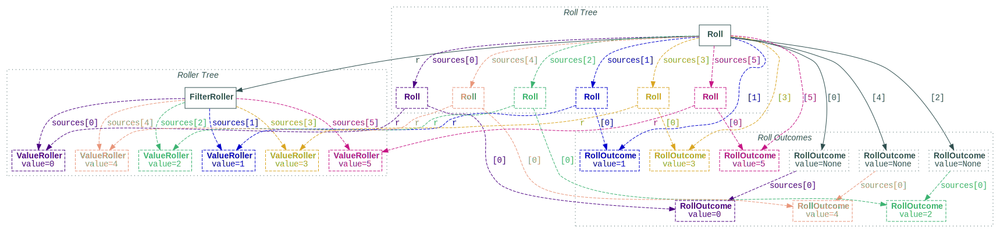
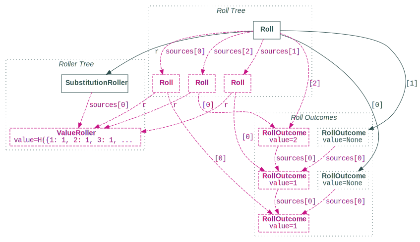

<!---
  Copyright and other protections apply. Please see the accompanying LICENSE file for
  rights and restrictions governing use of this software. All rights not expressly
  waived or licensed are reserved. If that file is missing or appears to be modified
  from its original, then please contact the author before viewing or using this
  software in any capacity.

  !!!!!!!!!!!!!!!!!!!!!!!!!!!!!!!!!!!!!!!!!!!!!!!!!!!!!!!!!!!!!!!!!!!!
  !!!!!!!!!!!!!!! IMPORTANT: READ THIS BEFORE EDITING! !!!!!!!!!!!!!!!
  !!!!!!!!!!!!!!!!!!!!!!!!!!!!!!!!!!!!!!!!!!!!!!!!!!!!!!!!!!!!!!!!!!!!
  Please keep each sentence on its own unwrapped line.
  It looks like crap in a text editor, but it has no effect on rendering, and it allows much more useful diffs.
  Thank you!
-->

!!! warning "Experimental"

    This functionality should be considered experimental.
    Be warned that future release may introduce incompatibilities or remove it altogether.
    [Feedback, suggestions, and contributions](contrib.md) are welcome and appreciated.


``dyce`` provides additional primitives for generating and inspecting rolls of weighted random outcomes without requiring the overhead of enumeration.

``` python
>>> from dyce import R

```

[``R`` objects][dyce.r.R] represent rollers.
Rollers produce [``Roll`` objects][dyce.r.Roll].
[``Roll`` objects][dyce.r.Roll] are sequences of [``RollOutcome`` objects][dyce.r.RollOutcome], which represent weighted random values.

Each object can be a node in a tree-like structure.
Rollers, for example, can represent scalars, histograms, pools, operators, etc., and can be assembled into trees representing more complex calculations.
Rolls can derive from other rolls, forming trees that are generally analogous to the roller trees that generated them.
Similarly, roll outcomes can derive from other roll outcomes.

The simplest roller we can create represents a single value.
Each roll it generates has that value as its sole outcome.
Let’s see what that looks like (now with tasty entity relationship diagrams).

<picture style="float: right; padding: 0 1.0em 0 1.0em; max-width: 33%;">
  <source srcset="../assets/graph_rollin_value_dark.svg" media="(prefers-color-scheme: dark)">
  
</picture>

``` python
>>> from dyce.r import ValueRoller
>>> r_1 = ValueRoller(1)
>>> roll = r_1.roll()
>>> roll.total()
1
>>> tuple(roll.outcomes())
(1,)
>>> roll
Roll(
  r=ValueRoller(value=1, annotation=''),
  roll_outcomes=(
    RollOutcome(
      value=1,
      sources=(),
    ),
  ),
  source_rolls=(),
)

```

Hopefully, that’s relatively straightforward.
Let’s look at some more substantial examples.

## Emulating a hundred-sided die using two ten-sided dice

<a href="https://whitewolf.fandom.com/wiki/D100"></a>

In many games it is common to emulate a hundred-sided die using a “ones” ten-sided die (faces numbered $[{ {0}, {1}, \ldots , {9} }]$) and a “tens” ten-sided die (faces numbered $[{ {00}, {10}, \ldots , {90} }]$).
Let’s try to model that as a roller and use it to generate a roll.

We start by creating two histograms[^1] representing our two ten-sided dice (``d00`` for our “tens” die and ``d10`` for our “ones“ die).

[^1]:

    If you’re not already familiar with histograms, consider skimming the [counting tutorial](countin.md).

``` python
>>> from dyce import H
>>> d10 = H(10) - 1
>>> d00 = 10 * d10

```

Next, we create a roller using the [``R.from_values`` class method][dyce.r.R.from_values].

``` python
>>> r_d100 = R.from_values(d00, d10) ; r_d100
PoolRoller(
  sources=(
    ValueRoller(value=H({0: 1, 10: 1, 20: 1, 30: 1, 40: 1, 50: 1, 60: 1, 70: 1, 80: 1, 90: 1}), annotation=''),
    ValueRoller(value=H({0: 1, 1: 1, 2: 1, 3: 1, 4: 1, 5: 1, 6: 1, 7: 1, 8: 1, 9: 1}), annotation=''),
  ),
  annotation='',
)

```

Well, wouldya look at that?
That durned class method created a whole roller *tree*, which is actually *three* rollers.

1. One [``ValueRoller``][dyce.r.ValueRoller] for the ``d00`` histogram;
1. Another for the ``d10`` histogram; and
1. A [``PoolRoller``][dyce.r.PoolRoller] for aggregating them both.

!!! tip

    We could have also composed an identical tree using roller implementations from [``dyce.r``](dyce.r.md) instead of the [``R.from_values``][dyce.r.R.from_values] convenience method.

    ``` python
    >>> from dyce.r import PoolRoller, ValueRoller
    >>> r_d100 == PoolRoller(sources=(ValueRoller(d00), ValueRoller(d10)))
    True

    ```

Let’s use our new roller to create a roll and retrieve its total.

<!-- BEGIN MONKEY PATCH --
For deterministic outcomes.

>>> import random
>>> from dyce import rng
>>> rng.RNG = random.Random(1633438594)

  -- END MONKEY PATCH -->

``` python
>>> roll = r_d100.roll()
>>> roll.total()
69

```

No surprises there.
Let’s dig a little deeper and ask for the roll’s outcome values.

``` python
>>> tuple(roll.outcomes())
(60, 9)

```

As we mentioned before, the top level of our roller tree is a [``PoolRoller``][dyce.r.PoolRoller], which aggregates (or “pools”) rolls from its sources.
For our roll, the aggregated outcomes are ``#!python 60`` are ``#!python 9``.

What does our pooled roll look like?

``` python
>>> roll
Roll(
  r=PoolRoller(
    sources=(
      ValueRoller(value=H({0: 1, 10: 1, 20: 1, 30: 1, 40: 1, 50: 1, 60: 1, 70: 1, 80: 1, 90: 1}), annotation=''),
      ValueRoller(value=H({0: 1, 1: 1, 2: 1, 3: 1, 4: 1, 5: 1, 6: 1, 7: 1, 8: 1, 9: 1}), annotation=''),
    ),
    annotation='',
  ),
  roll_outcomes=(
    RollOutcome(
      value=60,
      sources=(),
    ),
    RollOutcome(
      value=9,
      sources=(),
    ),
  ),
  source_rolls=(
    Roll(
      r=ValueRoller(value=H({0: 1, 10: 1, 20: 1, 30: 1, 40: 1, 50: 1, 60: 1, 70: 1, 80: 1, 90: 1}), annotation=''),
      roll_outcomes=(
        RollOutcome(
          value=60,
          sources=(),
        ),
      ),
      source_rolls=(),
    ),
    Roll(
      r=ValueRoller(value=H({0: 1, 1: 1, 2: 1, 3: 1, 4: 1, 5: 1, 6: 1, 7: 1, 8: 1, 9: 1}), annotation=''),
      roll_outcomes=(
        RollOutcome(
          value=9,
          sources=(),
        ),
      ),
      source_rolls=(),
    ),
  ),
)

```

<picture>
  <source srcset="../assets/graph_rollin_pool_dark.svg" media="(prefers-color-scheme: dark)">
  
</picture>

Let’s break that down so it doesn’t feel like trying to drink from a fire hose.

Calling the [``R.roll`` method][dyce.r.R.roll] on our [``PoolRoller``][dyce.r.PoolRoller] resulted in a [``Roll`` object][dyce.r.Roll].
Actually, it resulted in a roll *tree* (analogous to our roller tree).
Each [``Roll`` object][dyce.r.Roll] in that tree has:

* A reference to the [``R`` object][dyce.r.R] in the roller tree that generated it, retrieved via its [``r`` property][dyce.r.Roll.r];
* Zero or more [``RollOutcome`` objects][dyce.r.RollOutcome], retrieved by accessing the roll as a sequence (i.e., via ``#!python __getitem__``, ``#!python __len__``); and
* Zero or more source rolls, retrieved via its [``source_rolls`` property][dyce.r.Roll.source_rolls].

The [``RollOutcome`` objects][dyce.r.RollOutcome] *also* form trees (in our case, simple ones).
Each one has:

* A single value, retrieved via its [``value`` property][dyce.r.RollOutcome.value];
* Zero or more source outcomes from which the value was derived, retrieved via its [``sources`` property][dyce.r.RollOutcome.sources]; and
* A reference back to the roll that generated it, retrieved via its [``source_roll`` property][dyce.r.RollOutcome.source_roll] (omitted from the diagram for the sake of readability).

<!-- BEGIN MONKEY PATCH --
For deterministic outcomes.

>>> import random
>>> from dyce import rng
>>> rng.RNG = random.Random(1633440532)

  -- END MONKEY PATCH -->

!!! tip

    You might be wondering to yourself, “Self, one wonders, can one have a pool of pools?”
    Such questions command the response, “Why the heck not? Try it!”

    ``` python
    >>> two_r_d100s = PoolRoller(sources=(r_d100, r_d100))
    >>> roll_two = two_r_d100s.roll()
    >>> roll_two.total()
    63
    >>> tuple(roll_two.outcomes())
    (40, 2, 20, 1)

    ```

    So the answer is a resounding, ~~“Of course. What devious entity would *prohibit* such a thing? Please identify that creature so we may flog it until it achieves enlightenment,”~~ *“Yes.”*

## Composing rollers with arithmetic

Rollers support arithmetic operators.

<!-- BEGIN MONKEY PATCH --
For deterministic outcomes.

>>> import random
>>> from dyce import rng
>>> rng.RNG = random.Random(1633438430)

  -- END MONKEY PATCH -->

``` python
>>> d12 = H(12)
>>> r_d12_add_4 = ValueRoller(d12) + 4 ; r_d12_add_4
BinarySumOpRoller(
  bin_op=<built-in function add>,
  left_source=ValueRoller(value=H({1: 1, 2: 1, 3: 1, 4: 1, 5: 1, 6: 1, 7: 1, 8: 1, 9: 1, 10: 1, 11: 1, 12: 1}), annotation=''),
  right_source=ValueRoller(value=4, annotation=''),
  annotation='',
)
>>> r_d12_add_4.roll()
Roll(
  r=BinarySumOpRoller(...),
  roll_outcomes=(
    RollOutcome(
      value=11,
      sources=(
        RollOutcome(
          value=7,
          sources=(),
        ),
        RollOutcome(
          value=4,
          sources=(),
        ),
      ),
    ),
  ),
  source_rolls=(
    Roll(
      r=ValueRoller(value=H({1: 1, 2: 1, 3: 1, 4: 1, 5: 1, 6: 1, 7: 1, 8: 1, 9: 1, 10: 1, 11: 1, 12: 1}), annotation=''),
      roll_outcomes=(
        RollOutcome(
          value=7,
          sources=(),
        ),
      ),
      source_rolls=(),
    ),
    Roll(
      r=ValueRoller(value=4, annotation=''),
      roll_outcomes=(
        RollOutcome(
          value=4,
          sources=(),
        ),
      ),
      source_rolls=(),
    ),
  ),
)

```

<picture>
  <source srcset="../assets/graph_rollin_expr_dark.svg" media="(prefers-color-scheme: dark)">
  
</picture>

## Dropping dice from prior rolls – keeping the best three of ``3d6`` and ``1d8``

The trifecta of roller trees, roll trees, and outcome trees might appear complicated or redundant.
Everything serves a purpose.[^2]

[^2]:

    We may still be discovering what those purposes are.
    We have the utmost faith they exist, even if they have yet to reveal themselves.
    If you discover one, consider [contributing](contrib.md) an example.

Consider excluding (or “dropping”) dice from a roll.
How would we account for that?
Let’s see how to generate rolls that keep the best three outcomes from rolling three six-sided dice and one eight-sided die.

We start by using the [``R.from_value`` class method][dyce.r.R.from_value] to create [``ValueRoller``][dyce.r.ValueRoller]s for histograms representing our six- and eight-sided dice.

``` python
>>> d6 = H(6)
>>> d8 = H(8)
>>> r_d6 = R.from_value(d6) ; r_d6
ValueRoller(value=H({1: 1, 2: 1, 3: 1, 4: 1, 5: 1, 6: 1}), annotation='')
>>> r_d8 = R.from_value(d8) ; r_d8
ValueRoller(value=H({1: 1, 2: 1, 3: 1, 4: 1, 5: 1, 6: 1, 7: 1, 8: 1}), annotation='')

```

For homogeneous pools, we can use the matrix multiplication operator.

``` python
>>> r_3d6 = 3@r_d6 ; r_3d6
RepeatRoller(
  n=3,
  source=ValueRoller(value=H({1: 1, 2: 1, 3: 1, 4: 1, 5: 1, 6: 1}), annotation=''),
  annotation='',
)

```

Finally, we’ll create a [``SelectionRoller``][dyce.r.SelectionRoller] by calling the [``R.select_from_sources``][dyce.r.R.select_from_sources] method on our other rollers.

``` python
>>> r_best_3_of_3d6_d8 = R.select_from_sources((slice(1, None),), r_3d6, r_d8) ; r_best_3_of_3d6_d8
SelectionRoller(
  which=(slice(1, None, None),),
  sources=(
    RepeatRoller(
      n=3,
      source=ValueRoller(value=H({1: 1, 2: 1, 3: 1, 4: 1, 5: 1, 6: 1}), annotation=''),
      annotation='',
    ),
    ValueRoller(value=H({1: 1, 2: 1, 3: 1, 4: 1, 5: 1, 6: 1, 7: 1, 8: 1}), annotation=''),
  ),
  annotation='',
)

```

Oh boy!
Aren’t you super excited to try this thing out?

<!-- BEGIN MONKEY PATCH --
For deterministic outcomes.

>>> import random
>>> from dyce import rng
>>> rng.RNG = random.Random(1633438514)

  -- END MONKEY PATCH -->

``` python
>>> roll = r_best_3_of_3d6_d8.roll()
>>> tuple(roll.outcomes())
(1, 5, 6)

```

There are indeed three values, despite starting with four dice.
Given that the lowest value we see is a ``#!python 1``, we might assume that the eliminated value is also a ``#!python 1``.
But, we all know what happens when one assumes.

<picture>
  [](https://xkcd.com/1339/)
</picture>

Recall that in roll trees, a roll may have references to other rolls (its “source rolls”) from which it derives.
We should be able to get information about the dropped die by traversing that tree.
Let’s see if we can validate our assumption by looking at the outcomes from our roll’s direct source.

``` python
>>> from itertools import chain
>>> tuple(chain.from_iterable(source_roll.outcomes() for source_roll in roll.source_rolls))
(6, 1, 1, 5)

```

Yup!
We were right!
There’s the other ``#!python 1``, plain as day.
Our work here is do—

What?
You want to know *which* die we eliminated?
We can see that, too!

```python
>>> roll
Roll(
  r=SelectionRoller(
    which=(slice(1, None, None),),
    sources=(
      RepeatRoller(
        n=3,
        source=ValueRoller(value=H({1: 1, 2: 1, 3: 1, 4: 1, 5: 1, 6: 1}), annotation=''),
        annotation='',
      ),
      ValueRoller(value=H({1: 1, 2: 1, 3: 1, 4: 1, 5: 1, 6: 1, 7: 1, 8: 1}), annotation=''),
    ),
    annotation='',
  ),
  roll_outcomes=(
    ...

```

*\*snip\** ✂️

``` python linenums="147"
  ),
)
```

Oof.
☝️ That was … a *lot*.
Let’s visualize!

<picture>
  <source srcset="../assets/graph_rollin_select_1_dark.svg" media="(prefers-color-scheme: dark)">
  
</picture>

Holy entangled relationship diagrams, Batman!
One thing you may notice about our top-level roll is that it has *four* outcomes.
One of those kids is not like the others.
Specifically, it has a [``value``][dyce.r.RollOutcome.value] of ``#!python None``.
That’s our dropped outcome!

``` python
>>> len(roll) == 4
True
>>> roll[-1].value is None
True
>>> tuple(roll_outcome.value for roll_outcome in roll)
(1, 5, 6, None)

```

!!! info

    A roll outcome with a [``value``][dyce.r.RollOutcome.value] of ``#!python None`` is akin to a “tombstone”.
    It conveys one whose sources were present in immediately prior rolls but excluded from the current roll.
    Such roll outcomes must have at least one source.

    ``` python
    >>> from dyce.r import RollOutcome
    >>> RollOutcome(value=None)
    Traceback (most recent call last):
      ...
    ValueError: value can only be None if sources is non-empty

    ```

    The [``RollOutcome.euthanize``][dyce.r.RollOutcome.euthanize] method provides a convenient shorthand.

    ``` python
    >>> RollOutcome(42).euthanize()
    RollOutcome(
      value=None,
      sources=(
        RollOutcome(
          value=42,
          sources=(),
        ),
      ),
    )

    ```

    However, because such a roll signals its *absence* from the current roll, its value is *not* included by the [``Roll.outcomes`` method][dyce.r.Roll.outcomes].

We can programmatically verify that the excluded outcome originated from one of the six-sided dice.

``` python
>>> excluded = roll[-1]
>>> excluded.value is None
True
>>> excluded.sources[0].value
1
>>> excluded.sources[0].r is r_d6
True

```

We can also verify that the ``#!python 5`` came from the eight-sided die.

``` python
>>> five = roll[1]
>>> five.value
5
>>> five.r is r_d8
True

```

Alternatively, could have also used our old friend the [``P`` object][dyce.p.P] to eliminate the [``RepeatRoller``][dyce.r.RepeatRoller] for a similar, but structurally simpler result.

``` python
>>> from dyce import P
>>> R.select_from_values((slice(1, None),), 3@P(d6), d8).roll()
Roll(
  r=SelectionRoller(
    which=(slice(1, None, None),),
    sources=(
      ValueRoller(value=3@P(H({1: 1, 2: 1, 3: 1, 4: 1, 5: 1, 6: 1})), annotation=''),
      ValueRoller(value=H({1: 1, 2: 1, 3: 1, 4: 1, 5: 1, 6: 1, 7: 1, 8: 1}), annotation=''),
    ),
    annotation='',
  ),
  roll_outcomes=(
    ...

```

*\*snip\** ✂️

``` python linenums="79"
  ),
)
```

<picture>
  <source srcset="../assets/graph_rollin_select_2_dark.svg" media="(prefers-color-scheme: dark)">
  
</picture>

In this case, our results are still *mostly* traceable, since our pool is homogeneous.
However, results from [``P.roll``][dyce.p.P.roll] are sorted, meaning they lose association with their source histograms.
This risks ambiguity.
Consider:

<!-- BEGIN MONKEY PATCH --
For deterministic outcomes.

>>> import random
>>> from dyce import rng
>>> rng.RNG = random.Random(1633056346)

  -- END MONKEY PATCH -->

``` python
>>> P(6, 8).roll()
(4, 6)

```

Is the ``#!python 4`` from the ``#!python d6`` or ``#!python d8``? 🤔💭
_No one knows._

``` python
>>> R.from_value(P(6, 8))  # doctest: +SKIP
…: UserWarning: using a heterogeneous pool (P(6, 8)) is not recommended where traceability is important
  ...
ValueRoller(value=P(6, 8), annotation='')

```

## Filtering and substitution

``dyce`` provides two additional rollers for outcome manipulation.

[``FilterRoller``][dyce.r.FilterRoller]s [``euthanize``][dyce.r.RollOutcome.euthanize] outcomes that don’t meet provided criteria.

``` python
>>> r_filter = R.filter_from_values_iterable(
...   lambda outcome: bool(outcome.is_odd().value),
...   range(6),
... ) ; r_filter
FilterRoller(
  predicate=<function <lambda> at ...>,
  sources=(
    ValueRoller(value=0, annotation=''),
    ValueRoller(value=1, annotation=''),
    ValueRoller(value=2, annotation=''),
    ValueRoller(value=3, annotation=''),
    ValueRoller(value=4, annotation=''),
    ValueRoller(value=5, annotation=''),
  ),
  annotation='',
)
>>> roll = r_filter.roll()
>>> tuple(roll.outcomes())
(1, 3, 5)
>>> roll
Roll(
  r=...,
  roll_outcomes=(
    RollOutcome(
      value=None,
      sources=(
        RollOutcome(
          value=0,
          sources=(),
        ),
      ),
    ),
    RollOutcome(
      value=1,
      sources=(),
    ),
    RollOutcome(
      value=None,
      sources=(
        RollOutcome(
          value=2,
          sources=(),
        ),
      ),
    ),
    RollOutcome(
      value=3,
      sources=(),
    ),
    RollOutcome(
      value=None,
      sources=(
        RollOutcome(
          value=4,
          sources=(),
        ),
      ),
    ),
    RollOutcome(
      value=5,
      sources=(),
    ),
  ),
  source_rolls=(...),
)

```

<picture>
  <source srcset="../assets/graph_filter_dark.svg" media="(prefers-color-scheme: dark)">
  
</picture>

[``SubstitutionRoller``][dyce.r.SubstitutionRoller]s replace or append outcomes based on existing ones.

<!-- BEGIN MONKEY PATCH --
For deterministic outcomes.

>>> import random
>>> from dyce import rng
>>> rng.RNG = random.Random(1639492287)

  -- END MONKEY PATCH -->

``` python
>>> from dyce.r import CoalesceMode, SubstitutionRoller
>>> r_d6 = R.from_value(H(6))

>>> r_replace = SubstitutionRoller(
...   lambda outcome: r_d6.roll() if outcome.value == 1 else outcome,
...   r_d6,
...   max_depth=2,
... )
>>> r_replace.roll()
Roll(
  r=SubstitutionRoller(
    expansion_op=<function <lambda> at ...>,
    source=ValueRoller(value=H({1: 1, 2: 1, 3: 1, 4: 1, 5: 1, 6: 1}), annotation=''),
    coalesce_mode=<CoalesceMode.REPLACE: 1>,
    max_depth=2,
    annotation='',
  ),
  roll_outcomes=(
    RollOutcome(
      value=None,
      sources=(
        RollOutcome(
          value=1,
          sources=(),
        ),
      ),
    ),
    RollOutcome(
      value=None,
      sources=(
        RollOutcome(
          value=1,
          sources=(
            RollOutcome(
              value=1,
              sources=(),
            ),
          ),
        ),
      ),
    ),
    RollOutcome(
      value=2,
      sources=(
        RollOutcome(
          value=1,
          sources=(
            RollOutcome(
              value=1,
              sources=(),
            ),
          ),
        ),
      ),
    ),
  ),
  source_rolls=(...),
)

```

<picture>
  <source srcset="../assets/graph_substitute_replace_dark.svg" media="(prefers-color-scheme: dark)">
  
</picture>

<!-- BEGIN MONKEY PATCH --
For deterministic outcomes.

>>> import random
>>> from dyce import rng
>>> rng.RNG = random.Random(1639492287)

  -- END MONKEY PATCH -->

``` python
>>> r_append = SubstitutionRoller(
...   lambda outcome: r_d6.roll() if outcome.value == 1 else outcome,
...   r_d6,
...   coalesce_mode=CoalesceMode.APPEND,
...   max_depth=2,
... )
>>> r_append.roll()
Roll(
  r=SubstitutionRoller(
    expansion_op=<function <lambda> at ...>,
    source=ValueRoller(value=H({1: 1, 2: 1, 3: 1, 4: 1, 5: 1, 6: 1}), annotation=''),
    coalesce_mode=<CoalesceMode.APPEND: 2>,
    max_depth=2,
    annotation='',
  ),
  roll_outcomes=(
    RollOutcome(
      value=1,
      sources=(),
    ),
    RollOutcome(
      value=1,
      sources=(
        RollOutcome(
          value=1,
          sources=(),
        ),
      ),
    ),
    RollOutcome(
      value=2,
      sources=(
        RollOutcome(
          value=1,
          sources=(
            RollOutcome(
              value=1,
              sources=(),
            ),
          ),
        ),
      ),
    ),
  ),
  source_rolls=(...),
)

```

<picture>
  <source srcset="../assets/graph_substitute_append_dark.svg" media="(prefers-color-scheme: dark)">
  
</picture>

## Performance

How much overhead do all these data structures contribute?
It obviously depends on the complexity of the structure.
Consider a simple example ``d20 + d12 + 4``.
Let’s do that 5,000 times, sort the results, and take every other one starting with the highest.
We might use a pool, if we didn’t care about traceability.
Let’s compare that to our roller.

``` python
--8<-- "docs/assets/perf_pools_vs_rollers.txt"
```

<details>
<summary>Source: <a href="https://github.com/posita/dyce/blob/v{{ __vers_str__ }}/docs/assets/perf_pools_vs_rollers.ipy"><code>perf_pools_vs_rollers.ipy</code></a></summary>

``` python
--8<-- "docs/assets/perf_pools_vs_rollers.ipy"
```
</details>

In this particular case, our roller takes approximately ten times longer than our histogram pool.
It is unsurprising that a simple roller is slower than a simple pool, at least in part because the math is deferred until [``R.roll``][dyce.r.R.roll] time.
In more sophisticated cases, rollers may be more competitive with (or even surpass) their histogram or pool analogies, especially when initialization time is taken into account.

All that being said, for periodic rolls simulating handfuls (not thousands) of operations or dice, such performance disparities probably won’t matter that much.
Just use the primitives whose semantics work best for you.
If ever performance becomes an issue, [let me know](contrib.md), and we can collaborate on how to improve it.

## Further exploration

Consider reviewing the [roller API](dyce.r.md).

<!-- TODO(posita): In addition to generating random rolls, roller trees can be useful for translating from proprietary grammars. -->
<!--
[^#]:

    Well, *mostly*.
    We’ve omitted some trivial bits from the original above to improve readability.
    But the important parts are all there.
    Go back up and check if you don’t believe us.
    Rest assured, you’ll find everything is in order.
    Go ahead.
    We would’t *dream* of interpreting your hesitation as an affront to our integrity.
    One can’t be too careful, these days, can one?
    We’ll wait, arms folded, foot tapping impatiently, gaze directed toward the corner of the browser, but periodically diverted to glance at our watch, or perhaps rolled back up into our heads to dislodge a sigh.
    Everything as you had hoped?
    Wonderful.
    Let’s resume, shall we?
-->
