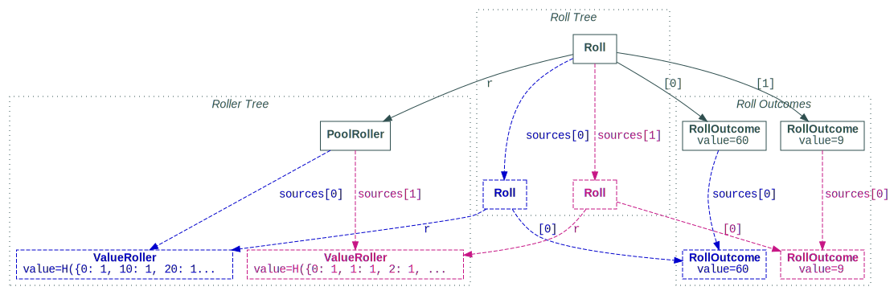

<!--- -*- encoding: utf-8 -*-
  Copyright and other protections apply. Please see the accompanying LICENSE file for
  rights and restrictions governing use of this software. All rights not expressly
  waived or licensed are reserved. If that file is missing or appears to be modified
  from its original, then please contact the author before viewing or using this
  software in any capacity.

  !!!!!!!!!!!!!!!!!!!!!!!!!!!!!!!!!!!!!!!!!!!!!!!!!!!!!!!!!!!!!!!!!!!!
  !!!!!!!!!!!!!!! IMPORTANT: READ THIS BEFORE EDITING! !!!!!!!!!!!!!!!
  !!!!!!!!!!!!!!!!!!!!!!!!!!!!!!!!!!!!!!!!!!!!!!!!!!!!!!!!!!!!!!!!!!!!
  Please keep each sentence on its own unwrapped line.
  It looks like crap in a text editor, but it has no effect on rendering, and it allows much more useful diffs.
  Thank you!
-->

!!! warning "Experimental"

    This functionality should be considered experimental.
    Be warned that future release may introduce incompatibilities or remove it altogether.
    [Suggestions and contributions](contrib.md) are welcome.


``dyce`` provides additional primitives useful for generating and inspecting rolls of weighted random outcomes without requiring costly enumeration:

``` python
>>> from dyce import R

```

[``R`` objects][dyce.r.R] represent rollers.
[``R`` objects][dyce.r.R] produce [``Roll`` objects][dyce.r.Roll].
[``Roll`` objects][dyce.r.Roll] are sequences of [``RollOutcome`` objects][dyce.r.RollOutcome], which represent weighted random values.

Each object can be a node in a tree-like structure.
Rollers, for example, are scalars, histograms, pools, operators, etc., and can be assembled into trees for more complex calculations.
Rolls can derive from other rolls, forming trees that are generally analogous to the roller trees that generated them.
Similarly, roll outcomes can derive from other roll outcomes.

Enough yappin’. Let’s see what all that means with a concrete example.


## An introduction – emulating a hundred-sided die using a D10 and D00[^1]

[^1]:

    If dusty green and copper is your thing, check [these babies](https://store.chessex.com:11552/Products/25415) out.

In many games it is common to emulate a hundred-sided die using one traditional “D10” ten-sided die (faces numbered $[{{0} .. {9}}]$) and one “D00” ten-sided die (faces numbered $[{{00}, {10}, \ldots , {90}}]$).
Let’s try to model that as a roller and use it to generate a roll.

We start by creating two histograms[^2] representing our two ten-sided dice (``d00`` for our “tens” die and ``d10`` for our “ones“ die):

[^2]:

    If you’re not already familiar with histograms, consider skimming the [counting tutorial](countin.md).

``` python
>>> from dyce import H
>>> d10 = H(10) - 1
>>> d00 = 10 * d10

```

Next, we create a roller using the [``R.from_values`` class method][dyce.r.R.from_values]:

``` python
>>> r_d100 = R.from_values(d00, d10) ; r_d100
PoolRoller(
  sources=(
    ValueRoller(value=H({0: 1, 10: 1, 20: 1, 30: 1, 40: 1, 50: 1, 60: 1, 70: 1, 80: 1, 90: 1}), annotation=''),
    ValueRoller(value=H({0: 1, 1: 1, 2: 1, 3: 1, 4: 1, 5: 1, 6: 1, 7: 1, 8: 1, 9: 1}), annotation=''),
  ),
  annotation='',
)

```

Well, wouldya look at that?
That durned class method created a whole roller *tree*, which is actually *three* rollers: one [``ValueRoller``][dyce.r.ValueRoller] for the ``d00`` histogram; another [``ValueRoller``][dyce.r.ValueRoller] for the ``d10`` histogram; and a [``PoolRoller``][dyce.r.PoolRoller] for aggregating the two [``ValueRoller``][dyce.r.ValueRoller]s as its sources.

!!! tip

    We could have also constructed an identical tree without the [``R.from_values``][dyce.r.R.from_values] convenience method by instead directly assembling the same composable roller implementations from [``dyce.r``](dyce.r.md):

    ``` python
    >>> from dyce.r import PoolRoller, ValueRoller
    >>> r_d100 == PoolRoller(sources=(ValueRoller(d00), ValueRoller(d10)))
    True

    ```

We can use our roller tree to generate [``Roll`` objects][dyce.r.Roll].
Rolls are sequences of zero or more [``RollOutcome`` objects][dyce.r.RollOutcome] with some added conveniences.
Of course, they can be inspected.
Let’s get a new roll and retrieve its total:

``` python
>>> roll = r_d100.roll()
>>> roll.total()  # doctest: +SKIP
69

```

Simple enough.
No surprises there.
Let’s dig a little deeper and ask for the roll’s outcome values:

``` python
>>> tuple(roll.outcomes())  # doctest: +SKIP
(60, 9)

```

As we mentioned before, the top level of our roller tree is a [``PoolRoller``][dyce.r.PoolRoller].
This aggregates (“pools”) rolls from its sources.
For our roll, one outcome is ``60``, and one is ``9``.
Three guesses which source was responsible for which value.[^3]

[^3]:

    If you’re not a fan of speculating when it comes to tracing roll outcomes, you’re in good company.
    As we’ll see shortly, roll trees and roll outcomes provide a lot of transparency, so you won’t have to guess.

!!! tip

    You might be wondering to yourself, “Self, one wonders, can one have a pool of pools?”
    Our customary response to any question whose heart contains the inquiry, “Can one … ?” is, “Why the heck not? Try it!”
    Luckily for us, that response is apt here.

    ``` python
    >>> two_r_d100s = PoolRoller(sources=(r_d100, r_d100))
    >>> roll_two = two_r_d100s.roll()
    >>> roll_two.total()  # doctest: +SKIP
    63
    >>> tuple(roll_two.outcomes())  # doctest: +SKIP
    (40, 2, 20, 1)

    ```

    So the answer is a resounding, ~~“Of course. What devious entity would *prohibit* such a thing? Please identify that creature so we may flog it until it achieves enlightenment,”~~ *“Yes.”*

Now let’s see what rolls are *really* made of:

``` python
>>> roll  # doctest: +SKIP
Roll(
  r=PoolRoller(
    sources=(
      ValueRoller(value=H({0: 1, 10: 1, 20: 1, 30: 1, 40: 1, 50: 1, 60: 1, 70: 1, 80: 1, 90: 1}), annotation=''),
      ValueRoller(value=H({0: 1, 1: 1, 2: 1, 3: 1, 4: 1, 5: 1, 6: 1, 7: 1, 8: 1, 9: 1}), annotation=''),
    ),
    annotation='',
  ),
  roll_outcomes=(
    RollOutcome(
      value=60,
      sources=(
        RollOutcome(
          value=60,
          sources=(),
        ),
      ),
    ),
    RollOutcome(
      value=9,
      sources=(
        RollOutcome(
          value=9,
          sources=(),
        ),
      ),
    ),
  ),
  sources=(
    Roll(
      r=ValueRoller(value=H({0: 1, 10: 1, 20: 1, 30: 1, 40: 1, 50: 1, 60: 1, 70: 1, 80: 1, 90: 1}), annotation=''),
      roll_outcomes=(
        RollOutcome(
          value=60,
          sources=(),
        ),
      ),
      sources=(),
    ),
    Roll(
      r=ValueRoller(value=H({0: 1, 1: 1, 2: 1, 3: 1, 4: 1, 5: 1, 6: 1, 7: 1, 8: 1, 9: 1}), annotation=''),
      roll_outcomes=(
        RollOutcome(
          value=9,
          sources=(),
        ),
      ),
      sources=(),
    ),
  ),
)

```

Whoo, boy!
Talk about trying to drink from a fire hose!
What have we gotten ourselves into with just this one, simple, contrived example?
Basically, this[^4]:

<picture>
  <source srcset="../graph_rollin_pool_dark.svg" media="(prefers-color-scheme: dark)">
  
</picture>

[^4]:

    Well, *mostly*.
    As you can see, we’ve omitted some trivial bits from the original above to improve readability.
    But the important parts are all there.
    Go back up and check if you don’t believe us.
    Rest assured, you’ll find everything is in order.
    Go ahead.
    We would’t *dream* of interpreting your hesitation as an affront to our integrity.
    One can’t be too careful, these days, can one?
    We’ll wait, arms folded, foot tapping impatiently, gaze directed toward the corner of the browser, but periodically diverted to glance at our watch, or perhaps rolled back up into our heads to dislodge a sigh.
    Everything as you had hoped?
    Wonderful.
    Let’s resume, shall we?

Let’s break that down.

Calling the [``R.roll`` method][dyce.r.R.roll] on our [``PoolRoller``][dyce.r.PoolRoller] resulted in a [``Roll`` object][dyce.r.Roll].
Actually, it resulted in a roll *tree* (analogous to our roller tree).
Each [``Roll`` object][dyce.r.Roll] in that tree has:

* A reference to the [``R`` object][dyce.r.R] in the roller tree that generated it, retrieved via the [``Roll.r`` property][dyce.r.Roll.r];
* Zero or more [``RollOutcome`` objects][dyce.r.RollOutcome], retrieved by accessing the roll as a sequence (i.e., via ``#!python __getitem__``, ``#!python __len__``); and
* Zero or more source rolls, retrieved via the [``Roll.sources`` property][dyce.r.Roll.sources].

The [``RollOutcome`` objects][dyce.r.RollOutcome] *also* form trees (in our case, simple ones).
Each one has:

* A single value, retrieved via the [``RollOutcome.value`` property][dyce.r.RollOutcome.value];
* Zero or more source roll outcomes from which the value was derived, retrieved via the [``RollOutcome.sources`` property][dyce.r.RollOutcome.sources]; and
* A [weak reference](https://docs.python.org/3/library/weakref.html) back to the roll that generated it, retrieved via the [``RollOutcome.roll`` property][dyce.r.RollOutcome.roll] (not pictured in the above diagram).

Navigating that structure is pretty flexible.

``` python
>>> roll.r is r_d100
True
>>> roll.sources[0].r == r_d100.sources[0] == ValueRoller(d00)
True
>>> roll.sources[1].r == r_d100.sources[1] == ValueRoller(d10)
True
>>> roll.sources[1][0] is roll[1].sources[0]  # RollOutcome
True
>>> roll.sources[1] is roll[1].sources[0].roll  # weakref back to Roll through RollOutcome
True

```

## Dropping dice from prior rolls – keeping the best three of 3d6 and 1d8

The trifecta of roller trees, roll trees, and roll outcome trees might appear complicated and redundant at first.
But everything serves a purpose.[^5]

Consider the case where we want to exclude (or “drop”) dice from a roll.
How would we account for that?
Let’s look at an example where we want to generate rolls that keep the best three outcomes from rolling three six-sided dice and one eight-sided die.

[^5]:

    We may still be discovering what those are.
    We have the utmost faith such purposes exist, even if they have yet to reveal themselves.

We start by using the [``R.from_value`` class method][dyce.r.R.from_value] to create [``ValueRoller``][dyce.r.ValueRoller]s for histograms representing our six- and eight-sided dice:

``` python
>>> d6 = H(6)
>>> d8 = H(8)
>>> r_d6 = R.from_value(d6) ; r_d6
ValueRoller(value=H(6), annotation='')
>>> r_d8 = R.from_value(d8) ; r_d8
ValueRoller(value=H(8), annotation='')

```

For homogeneous pools, we can use the matrix multiplication operator:

``` python
>>> r_3d6 = 3 @ r_d6 ; r_3d6
RepeatRoller(
  n=3,
  source=ValueRoller(value=H(6), annotation=''),
  annotation='',
)

```

We can pool those together using the [``R.from_rs`` class method][dyce.r.R.from_rs]:

``` python
>>> r_3d6_d8 = R.from_rs(r_3d6, r_d8) ; r_3d6_d8
PoolRoller(
  sources=(
    RepeatRoller(
      n=3,
      source=ValueRoller(value=H(6), annotation=''),
      annotation='',
    ),
    ValueRoller(value=H(8), annotation=''),
  ),
  annotation='',
)

```

Finally, we’ll create a [``SelectionRoller``][dyce.r.SelectionRoller] by calling the [``R.select``][dyce.r.R.select] method on our pool.

``` python
>>> r_best_3_of_3d6_d8 = r_3d6_d8.select(slice(1, None)) ; r_best_3_of_3d6_d8
SelectionRoller(
  which=(slice(1, None, None),),
  source=PoolRoller(
    sources=(
      RepeatRoller(
        n=3,
        source=ValueRoller(value=H(6), annotation=''),
        annotation='',
      ),
      ValueRoller(value=H(8), annotation=''),
    ),
    annotation='',
  ),
  annotation='',
)

```

Oh boy, oh boy, oh boy!
Aren’t you super excited to try this thing out?
Let’s do it!

``` python
>>> roll = r_best_3_of_3d6_d8.roll()
>>> tuple(roll.outcomes())  # doctest: +SKIP
(1, 5, 6)

```

Well that was … *anticlimactic*.
There are indeed three values.
Given that the lowest value is a `1`, we might assume that the eliminated value is also a `1`.
But, we all know what happens when one assumes.

[](https://xkcd.com/1339/)

Let’s see if we can validate our assumption by looking at the outcomes from our roll’s direct source.

``` python
>>> len(roll.sources) == 1
True
>>> tuple(roll.sources[0].outcomes())  # doctest: +SKIP
(6, 1, 1, 5)

```

Yup!
We were right!
There’s the other `1`, plain as day.
Our work is done he—
What?
You want to know *which* die we eliminated?

Fine. Let’s look at the roll!

```python
>>> roll
Roll(
  r=SelectionRoller(
    which=(slice(1, None, None),),
    source=PoolRoller(
      sources=(
        RepeatRoller(
          n=3,
          source=ValueRoller(value=H(6), annotation=''),
          annotation='',
        ),
        ValueRoller(value=H(8), annotation=''),
      ),
      annotation='',
    ),
    annotation='',
  ),
  roll_outcomes=(
    ...

```

``` python linenums="238"
  ),
)
```

Oof. That was … *a lot*.

You know what?
🤬 it.
We’re gonna draw this one, too.

<picture>
  <source srcset="../graph_rollin_select_dark.svg" media="(prefers-color-scheme: dark)">
  
</picture>

Holy entangled relationship diagrams, Batman!
(And you thought the previous one was hard to follow.)
One thing that you may notice is that our top-level roll actually has *four* roll outcomes, and one of them has a [``value``][dyce.r.RollOutcome.value] of ``#!python None``.

``` python
>>> len(roll) == 4
True
>>> roll[-1].value is None
True
>>> tuple(roll_outcome.value for roll_outcome in roll)  # doctest: +SKIP
(1, 5, 6, None)

```

!!! info

    A roll outcome with a [``value``][dyce.r.RollOutcome.value] of ``#!python None`` conveys one whose source(s) are excluded from the current roll.
    This implies that such a roll outcome must have at least one source.

    Does it know that?
    Let’s find out.

    ``` python
    >>> from dyce.r import RollOutcome
    >>> RollOutcome(value=None)
    Traceback (most recent call last):
      ...
    ValueError: value can only be None if sources is non-empty

    ```

    Yup, roll outcomes do indeed enforce that convention.
    However, as we saw above, because such rolls signal exclusion, their values are *not* included by the [``Roll.outcomes`` method][dyce.r.Roll.outcomes].

We can verify that the excluded roll outcome originated from one of the six-sided dice.

``` python
>>> excluded = roll[-1]
>>> excluded.sources[0].value  # doctest: +SKIP
1
>>> excluded.sources[0].roll.r is r_3d6_d8  # doctest: +SKIP
True
>>> excluded.sources[0].sources[0].value  # doctest: +SKIP
1
>>> excluded.sources[0].sources[0].roll.r is r_3d6  # doctest: +SKIP
True

```

We can also verify that the `5` came from the eight-sided die.

``` python
>>> five = roll[1]
>>> five.value  # doctest: +SKIP
5
>>> five.sources[0].roll.r is r_3d6_d8  # doctest: +SKIP
True
>>> five.sources[0].sources[0].value  # doctest: +SKIP
5
>>> five.sources[0].sources[0].roll.r is r_d8  # doctest: +SKIP
True

```

## Lean rolls — what if we don’t care about transparency?

What if all we wanted to do was generate some rolls, but we’re not interested in their detailed origin stories or that ridiculous entanglement of cross-references all the way down?
[``Roll.__init__``][dyce.r.Roll.__init__] will surgically remove any source references from its arguments if its *r* argument is annotated with ``#!python None``.

This has the effect that rollers annotated with ``#!python None`` will appear to generate “flat” rolls:

``` python
>>> r_forgetful_best_3_of_3d6_d8 = r_best_3_of_3d6_d8.annotate(None)
>>> roll = r_forgetful_best_3_of_3d6_d8.roll() ; roll  # doctest: +SKIP
Roll(
  r=SelectionRoller(
    which=(slice(1, None, None),),
    source=PoolRoller(
      sources=(
        RepeatRoller(
          n=3,
          source=ValueRoller(value=H(6), annotation=''),
          annotation='',
        ),
        ValueRoller(value=H(8), annotation=''),
      ),
      annotation='',
    ),
    annotation=None,
  ),
  roll_outcomes=(
    RollOutcome(
      value=2,
      sources=(),
    ),
    RollOutcome(
      value=3,
      sources=(),
    ),
    RollOutcome(
      value=5,
      sources=(),
    ),
  ),
  sources=(),
)

```

This isn’t magic.
It is merely a way to cleave away any accumulated history at the point of [``Roll`` object][dyce.r.Roll] construction by an appropriately-annotated roller.
To prevent *all* history accumulation for a roller tree, every roller in that tree must be annotated with ``#!python None``.

!!! warning

    Technically, this violates the immutability of roll outcomes:

    ``` python
    >>> from dyce.r import Roll
    >>> origin = RollOutcome(value=1)
    >>> descendant = RollOutcome(value=2, sources=(origin,)) ; descendant
    RollOutcome(
      value=2,
      sources=(
        RollOutcome(
          value=1,
          sources=(),
        ),
      ),
    )
    >>> roll = Roll(PoolRoller(annotation=None), roll_outcomes=(descendant,))
    >>> descendant  # sources are wiped out
    RollOutcome(
      value=2,
      sources=(),
    )

    ```

    ``dyce`` does not generally contemplate creation of rolls or roll outcomes outside the womb of [``R.roll``][dyce.r.R.roll] implementations.
    [``Roll``][dyce.r.Roll] and [``RollOutcome``][dyce.r.RollOutcome] objects generally mate for life, being created exclusively for (and in close proximity to) one another.
    A roll manipulating a roll outcome’s internal state post construction may seem unseemly, but that intimacy is a fundamental part of their primordial ritual.

    More practically, it frees each roller from having to do its own cleaving.

    That being said, you’re an adult.
    Do what you want.
    Just know that if you’re going to construct your own roll outcomes and pimp them out to different rolls all over town, they might come back with some parts missing.

    (See also the [``RollOutcome.roll`` property][dyce.r.RollOutcome.roll].)

<!-- In addition to generating random rolls, roller trees can be useful for translating from proprietary grammars. -->
