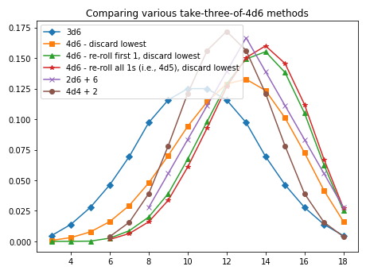
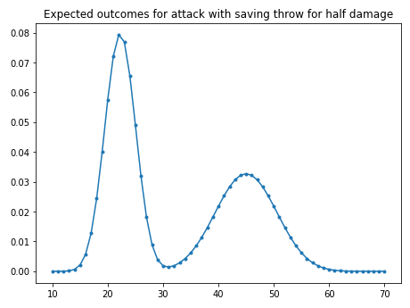
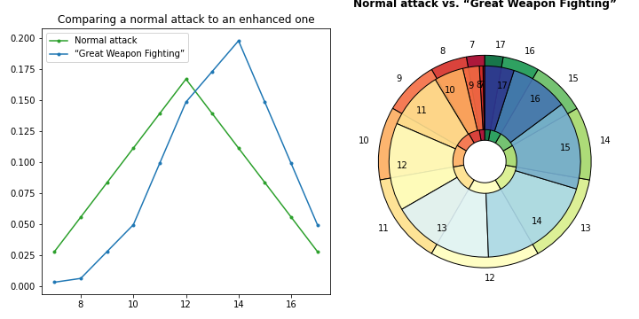
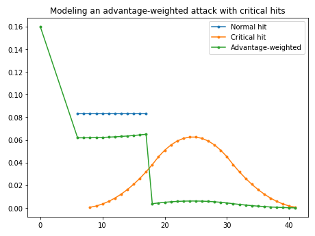
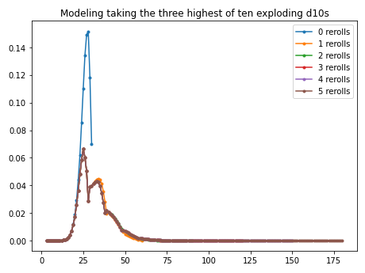
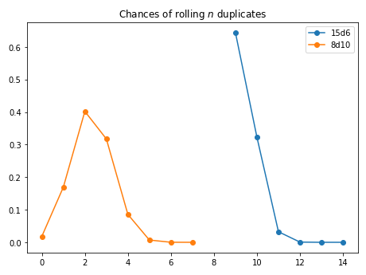
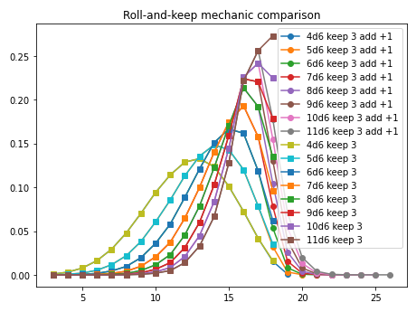

<!--- -*- encoding: utf-8 -*-
  Copyright and other protections apply. Please see the accompanying LICENSE file for
  rights and restrictions governing use of this software. All rights not expressly
  waived or licensed are reserved. If that file is missing or appears to be modified
  from its original, then please contact the author before viewing or using this
  software in any capacity.

  !!!!!!!!!!!!!!!!!!!!!!!!!!!!!!!!!!!!!!!!!!!!!!!!!!!!!!!!!!!!!!!!!!!!
  !!!!!!!!!!!!!!! IMPORTANT: READ THIS BEFORE EDITING! !!!!!!!!!!!!!!!
  !!!!!!!!!!!!!!!!!!!!!!!!!!!!!!!!!!!!!!!!!!!!!!!!!!!!!!!!!!!!!!!!!!!!
  Please keep each sentence on its own unwrapped line.
  It looks like crap in a text editor, but it has no effect on rendering, and it allows much more useful diffs.
  Thank you!
-->

The following examples and translations are intended to showcase ``dyce``’s flexibility.
If you have exposure to [another tool](), they may also help with transition.

## Modeling “[The Probability of 4d6, Drop the Lowest, Reroll 1s](http://prestonpoulter.com/2010/11/19/the-probability-of-4d6-drop-the-lowest-reroll-1s/)”

``` python
>>> from dyce import H, P
>>> res1 = 3 @ H(6)
>>> p_4d6 = 4@P(6)
>>> res2 = p_4d6.h(slice(1, None))  # discard the lowest die (index 0)
>>> d6_reroll_first_one = H(6).substitute(lambda h, outcome: H(6) if outcome == 1 else outcome)
>>> p_4d6_reroll_first_one = (4@P(d6_reroll_first_one))
>>> res3 = p_4d6_reroll_first_one.h(slice(1, None))  # discard the lowest
>>> p_4d6_reroll_all_ones = 4@P(H((2, 3, 4, 5, 6)))
>>> res4 = p_4d6_reroll_all_ones.h(slice(1, None))  # discard the lowest
>>> res5 = 2 @ H(6) + 6
>>> res6 = 4 @ H(4) + 2

```

Visualization:

``` python
>>> import matplotlib  # doctest: +SKIP
>>> matplotlib.pyplot.plot(
...   *res4.distribution_xy(),
...   marker="D",
...   label="3d6",
... )  # doctest: +SKIP
>>> matplotlib.pyplot.plot(
...   *res1.distribution_xy(),
...   marker="s",
...   label="4d6 - discard lowest",
... )  # doctest: +SKIP
>>> matplotlib.pyplot.plot(
...   *res2.distribution_xy(),
...   marker="^",
...   label="4d6 - re-roll first 1, discard lowest",
... )  # doctest: +SKIP
>>> matplotlib.pyplot.plot(
...   *res3.distribution_xy(),
...   marker="*",
...   label="4d6 - re-roll all 1s (i.e., 4d5), discard lowest",
... )  # doctest: +SKIP
>>> matplotlib.pyplot.plot(
...   *res5.distribution_xy(),
...   marker="x",
...   label="2d6 + 6",
... )  # doctest: +SKIP
>>> matplotlib.pyplot.plot(
...   *res6.distribution_xy(),
...   marker="o",
...   label="4d4 + 2",
... )  # doctest: +SKIP
>>> matplotlib.pyplot.legend()  # doctest: +SKIP
>>> matplotlib.pyplot.title(r"Comparing various take-three-of-4d6 methods")  # doctest: +SKIP
>>> matplotlib.pyplot.show()  # doctest: +SKIP

```

<!-- Should match any title of the corresponding plot title -->
<picture>
  <source srcset="../img/plot_4d6_variants_dark.png" media="(prefers-color-scheme: dark)">
  
</picture>

## Translating one example from [``markbrockettrobson/python_dice``](https://github.com/markbrockettrobson/python_dice#usage)

Source:

``` python
# …
program = [
  "VAR save_roll = d20",
  "VAR burning_arch_damage = 10d6 + 10",
  "VAR pass_save = ( save_roll >= 10 ) ",
  "VAR damage_half_on_save = burning_arch_damage // (pass_save + 1)",
  "damage_half_on_save"
]
# …
```

Translation:

``` python
>>> save_roll = H(20)
>>> burning_arch_damage = 10@H(6) + 10
>>> pass_save = save_roll.ge(10)
>>> damage_half_on_save = burning_arch_damage // (pass_save + 1)

```

Visualization:

``` python
>>> import matplotlib  # doctest: +SKIP
>>> outcomes, probabilities = damage_half_on_save.distribution_xy()
>>> matplotlib.pyplot.plot(outcomes, probabilities, marker=".")  # doctest: +SKIP
>>> matplotlib.pyplot.title(r"Expected outcomes for attack with saving throw for half damage")  # doctest: +SKIP
>>> matplotlib.pyplot.show()  # doctest: +SKIP

```

<!-- Should match any title of the corresponding plot title -->
<picture>
  <source srcset="../img/plot_burning_arch_dark.png" media="(prefers-color-scheme: dark)">
  
</picture>

An alternative using the [``H.substitute`` method][dyce.h.H.substitute]:

``` python
>>> save_roll.substitute(
...   lambda h, outcome:
...     burning_arch_damage // 2 if outcome >= 10
...     else burning_arch_damage
... ) == damage_half_on_save
True

```

## More translations from [``markbrockettrobson/python_dice``](https://github.com/markbrockettrobson/python_dice#usage)

``` python
>>> # VAR name = 1 + 2d3 - 3 * 4d2 // 5
>>> name = 1 + (2@H(3)) - 3 * (4@H(2)) // 5
>>> print(name.format(width=0))
{avg: 1.75, -1:  3.47%, 0: 13.89%, 1: 25.00%, 2: 29.17%, 3: 19.44%, 4:  8.33%, 5:  0.69%}

```

``` python
>>> # VAR out = 3 * ( 1 + 1d4 )
>>> out = 3 * (1 + 2@H(4))
>>> print(out.format(width=0))
{avg: 18.00, 9:  6.25%, 12: 12.50%, 15: 18.75%, 18: 25.00%, 21: 18.75%, 24: 12.50%, 27:  6.25%}

```

``` python
>>> # VAR g = (1d4 >= 2) AND !(1d20 == 2)
>>> g = H(4).ge(2) & H(20).ne(2)
>>> print(g.format(width=0))
{..., False: 28.75%, True: 71.25%}

```

``` python
>>> # VAR h = (1d4 >= 2) OR !(1d20 == 2)
>>> h = H(4).ge(2) | H(20).ne(2)
>>> print(h.format(width=0))
{..., False:  1.25%, True: 98.75%}

```

``` python
>>> # VAR abs = ABS( 1d6 - 1d6 )
>>> abs_ = abs(H(6) - H(6))
>>> print(abs_.format(width=0))
{avg: 1.94, 0: 16.67%, 1: 27.78%, 2: 22.22%, 3: 16.67%, 4: 11.11%, 5:  5.56%}

```

``` python
>>> # MAX(4d7, 2d10)
>>> _ = P(4@H(7), 2@H(10)).h(-1)
>>> print(_.format(width=0))
{avg: 16.60, 4:  0.00%, 5:  0.02%, 6:  0.07%, 7:  0.21%, ..., 25:  0.83%, 26:  0.42%, 27:  0.17%, 28:  0.04%}

```

``` python
>>> # MIN(50, d%)
>>> _ = P(H((50,)), P(100)).h(0)
>>> print(_.format(width=0))
{avg: 37.75, 1:  1.00%, 2:  1.00%, 3:  1.00%, ..., 47:  1.00%, 48:  1.00%, 49:  1.00%, 50: 51.00%}

```

## Translations from [``LordSembor/DnDice``](https://github.com/LordSembor/DnDice#examples)

Example 1 source:

``` python
from DnDice import d, gwf
single_attack = 2*d(6) + 5
# …
great_weapon_fighting = gwf(2*d(6)) + 5
# …
# comparison of the probability
print(single_attack.expectancies())
print(great_weapon_fighting.expectancies())
# [ 0.03,  0.06, 0.08, 0.11, 0.14, 0.17, 0.14, ...] (single attack)
# [0.003, 0.006, 0.03, 0.05, 0.10, 0.15, 0.17, ...] (gwf attack)
# …
```

Example 1 translation:

``` python
>>> single_attack = 2@H(6) + 5

>>> def gwf(h: H, outcome):
...   return h if outcome in (1, 2) else outcome

>>> great_weapon_fighting = 2@(H(6).substitute(gwf)) + 5  # reroll either die if it is a one or two
>>> print(single_attack.format(width=0))
{..., 7:  2.78%, 8:  5.56%, 9:  8.33%, 10: 11.11%, 11: 13.89%, 12: 16.67%, 13: 13.89%, ...}
>>> print(great_weapon_fighting.format(width=0))
{..., 7:  0.31%, 8:  0.62%, 9:  2.78%, 10:  4.94%, 11:  9.88%, 12: 14.81%, 13: 17.28%, ...}

```

Example 1 visualization:

``` python
>>> import matplotlib  # doctest: +SKIP
>>> from dyce.viz import display_burst
>>> plot_ax = matplotlib.pyplot.subplot2grid((1, 2), (0, 0))  # doctest: +SKIP
>>> burst_ax = matplotlib.pyplot.subplot2grid((1, 2), (0, 1))  # doctest: +SKIP
>>> sa_label = "Normal attack"
>>> plot_ax.plot(
...     *single_attack.distribution_xy(),
...     color="tab:green",
...     label=sa_label,
...     marker=".",
... )  # doctest: +SKIP
>>> gwf_label = "“Great Weapon Fighting”"
>>> plot_ax.plot(
...     *great_weapon_fighting.distribution_xy(),
...     color="tab:blue",
...     label=gwf_label,
...     marker=".",
... )  # doctest: +SKIP
>>> plot_ax.legend()  # doctest: +SKIP
>>> plot_ax.set_title(r"Comparing a normal attack to an enhanced one")  # doctest: +SKIP
>>> display_burst(
...     burst_ax,
...     h_inner=great_weapon_fighting,
...     outer=single_attack,
...     desc=f"{sa_label} vs. {gwf_label}",
...     inner_color="RdYlBu_r",
...     outer_color="RdYlGn_r",
...     alpha=0.9,
... )  # doctest: +SKIP
>>> matplotlib.pyplot.show()  # doctest: +SKIP

```

<!-- Should match any title of the corresponding plot title -->
<picture>
  <source srcset="../img/plot_great_weapon_fighting_dark.png" media="(prefers-color-scheme: dark)">
  
</picture>

Example 2 source:

``` python
from DnDice import d, advantage, plot

normal_hit = 1*d(12) + 5
critical_hit = 3*d(12) + 5

result = d()
for value, probability in advantage():
  if value == 20:
    result.layer(critical_hit, weight=probability)
  elif value + 5 >= 14:
    result.layer(normal_hit, weight=probability)
  else:
    result.layer(d(0), weight=probability)
result.normalizeExpectancies()
# …
```

Example 2 translation:

``` python
>>> normal_hit = H(12) + 5
>>> critical_hit = 3@H(12) + 5
>>> advantage = (2@P(20)).h(-1)

>>> def crit(_: H, outcome):
...   if outcome == 20: return critical_hit
...   elif outcome + 5 >= 14: return normal_hit
...   else: return 0

>>> advantage_weighted = advantage.substitute(crit)

```

Example 2 visualization:

``` python
>>> import matplotlib  # doctest: +SKIP
>>> matplotlib.pyplot.plot(
...   *normal_hit.distribution_xy(),
...   marker=".",
...   label="Normal hit",
... )  # doctest: +SKIP
>>> matplotlib.pyplot.plot(
...   *critical_hit.distribution_xy(),
...   marker=".",
...   label="Critical hit",
... )  # doctest: +SKIP
>>> matplotlib.pyplot.plot(
...   *advantage_weighted.distribution_xy(),
...   marker=".",
...   label="Advantage-weighted",
... )  # doctest: +SKIP
>>> matplotlib.pyplot.legend()  # doctest: +SKIP
>>> matplotlib.pyplot.title(r"Modeling an advantage-weighted attack with critical hits")  # doctest: +SKIP
>>> matplotlib.pyplot.show()  # doctest: +SKIP

```

<!-- Should match any title of the corresponding plot title -->
<picture>
  <source srcset="../img/plot_advantage_dark.png" media="(prefers-color-scheme: dark)">
  
</picture>

## Translation of the accepted answer to “[Roll and Keep in Anydice?](https://rpg.stackexchange.com/a/166637)”

Source:

```
output [highest 3 of 10d [explode d10]] named "10k3"
```

Translation:

``` python
>>> res = (10@P(H(10).explode(max_depth=3))).h(slice(-3, None))

```

Visualization:

``` python
>>> import matplotlib  # doctest: +SKIP
>>> for depth in range(6):
...   res = (10 @ P(H(10).explode(max_depth=depth))).h(slice(-3, None))
...   matplotlib.pyplot.plot(
...     *res.distribution_xy(),
...     marker=".",
...     label=f"{depth} rerolls",
...   )  # doctest: +SKIP
    matplotlib.pyplot.legend()  # doctest: +SKIP
>>> matplotlib.pyplot.title(r"Modeling taking the three highest of ten exploding d10s")  # doctest: +SKIP
>>> matplotlib.pyplot.show()  # doctest: +SKIP

```

<!-- Should match any title of the corresponding plot title -->
<picture>
  <source srcset="../img/plot_d10_explode_dark.png" media="(prefers-color-scheme: dark)">
  
</picture>

## Translation of the accepted answer to “[How do I count the number of duplicates in anydice?](https://rpg.stackexchange.com/a/111421)”

Source:

```
function: dupes in DICE:s {
  D: 0
  loop X over {2..#DICE} {
    if ((X-1)@DICE = X@DICE) { D: D + 1}
  }
  result: D
}
```

Translation:

``` python
>>> def dupes(p: P):
...   for roll, count in p.rolls_with_counts():
...     dupes = 0
...     for i in range(1, len(roll)):
...       # Outcomes are ordered, so we only have to look at one neighbor
...       if roll[i] == roll[i - 1]:
...         dupes += 1
...     yield dupes, count

>>> res = H(dupes(8@P(10)))

```

Visualization:

``` python
>>> from dyce.viz import plot_burst
>>> plot_burst(
...   res,
...   desc=r"Chances of rolling $n$ duplicates in 8d10",
... )  # doctest: +SKIP
>>> matplotlib.pyplot.show()  # doctest: +SKIP

```

<!-- Should match any title of the corresponding plot title -->
<picture>
  <source srcset="../img/plot_dupes_dark.png" media="(prefers-color-scheme: dark)">
  
</picture>

## Translation of “[How do I implement this specialized roll-and-keep mechanic in AnyDice?](https://rpg.stackexchange.com/a/190806)”

Source:

```
function: N:n of SIZE:n keep K:n extras add {
    result: [helper NdSIZE SIZE K]
}

function: helper ROLL:s SIZE:n K:n {
    COUNT: [count SIZE in ROLL]
    if COUNT > K { result: K*SIZE - K + COUNT }
    result: {1..K}@ROLL
}
```

Translation:

``` python
>>> def roll_and_keep(p: P, k: int):
...   assert p.is_homogeneous
...   max_d = max(p[-1]) if p else 0
...   for roll, count in p.rolls_with_counts():
...     total = sum(roll[-k:]) + sum(1 for outcome in roll[:-k] if outcome == max_d)
...     yield total, count
>>> H(roll_and_keep(6@P(6), 3))
H({3: 1, 4: 6, 5: 21, 6: 78, 7: 207, ..., 17: 5535, 18: 2500, 19: 375, 20: 30, 21: 1})

```

Visualization:

``` python
>>> import matplotlib  # doctest: +SKIP
>>> d, k = 6, 3
>>> for n in range(k + 1, k + 9):
...   p = n @ P(d)
...   res_roll_and_keep = H(roll_and_keep(p, k))
...   matplotlib.pyplot.plot(
...     *res_roll_and_keep.distribution_xy(),
...     marker="o",
...     label=f"{n}d{d} keep {k} add +1",
...   )  # doctest: +SKIP
>>> for n in range(k + 1, k + 9):
...   p = n @ P(d)
...   res_normal = p.h(slice(-k, None))
...   matplotlib.pyplot.plot(
...     *res_normal.distribution_xy(),
...     marker="s",
...     label=f"{n}d{d} keep {k}",
...   )  # doctest: +SKIP
>>> matplotlib.pyplot.legend()  # doctest: +SKIP
>>> matplotlib.pyplot.title(r"Roll-and-keep mechanic comparison")  # doctest: +SKIP
>>> matplotlib.pyplot.show()  # doctest: +SKIP

```

<!-- Should match any title of the corresponding plot title -->
<picture>
  <source srcset="../img/plot_roll_and_keep_dark.png" media="(prefers-color-scheme: dark)">
  
</picture>

## Translation of the accepted answer to “[Modelling \[sic\] opposed dice pools with a swap](https://rpg.stackexchange.com/a/112951)”

Source of basic ``brawl``:

```
function: brawl A:s vs B:s {
  SA: A >= 1@B
  SB: B >= 1@A
  if SA-SB=0 {
    result:(A > B) - (A < B)
  }
  result:SA-SB
}
output [brawl 3d6 vs 3d6] named "A vs B Damage"
```

Translation:

``` python
>>> from itertools import product

>>> def brawl(a: P, b: P):
...   for (roll_a, count_a), (roll_b, count_b) in product(
...       a.rolls_with_counts(),
...       b.rolls_with_counts(),
...   ):
...     a_successes = sum(1 for v in roll_a if v >= roll_b[-1])
...     b_successes = sum(1 for v in roll_b if v >= roll_a[-1])
...     yield a_successes - b_successes, count_a * count_b

```

Rudimentary visualization using built-in methods:

``` python
>>> res = H(brawl(3@P(6), 3@P(6))).lowest_terms()
>>> print(res.format(width=65))
avg |    0.00
std |    1.73
var |    2.99
 -3 |   7.86% |###
 -2 |  15.52% |#######
 -1 |  16.64% |########
  0 |  19.96% |#########
  1 |  16.64% |########
  2 |  15.52% |#######
  3 |   7.86% |###

```

Source of ``brawl`` with an optional dice swap:

```
function: set element I:n in SEQ:s to N:n {
  NEW: {}
  loop J over {1 .. #SEQ} {
    if I = J { NEW: {NEW, N} }
    else { NEW: {NEW, J@SEQ} }
  }
  result: NEW
}
function: brawl A:s vs B:s with optional swap {
  if #A@A >= 1@B {
    result: [brawl A vs B]
  }
  AX: [sort [set element #A in A to 1@B]]
  BX: [sort [set element 1 in B to #A@A]]
  result: [brawl AX vs BX]
}
output [brawl 3d6 vs 3d6 with optional swap] named "A vs B Damage"
```

Translation:

``` python
>>> def brawl_w_optional_swap(a: P, b: P):
...   for (roll_a, count_a), (roll_b, count_b) in product(
...       a.rolls_with_counts(),
...       b.rolls_with_counts(),
...   ):
...     if roll_a[0] < roll_b[-1]:
...       roll_a, roll_b = roll_a[1:] + roll_b[-1:], roll_a[:1] + roll_b[:-1]
...     roll_a = tuple(sorted(roll_a, reverse=True))
...     roll_b = tuple(sorted(roll_b, reverse=True))
...     a_successes = sum(1 for v in roll_a if v >= roll_b[0])
...     b_successes = sum(1 for v in roll_b if v >= roll_a[0])
...     result = a_successes - b_successes or (roll_a > roll_b) - (roll_a < roll_b)
...     yield result, count_a * count_b

```

Rudimentary visualization using built-in methods:

``` python
>>> res = H(brawl_w_optional_swap(3@P(6), 3@P(6))).lowest_terms()
>>> print(res.format(width=65))
avg |    2.36
std |    0.88
var |    0.77
 -1 |   1.42% |
  0 |   0.59% |
  1 |  16.65% |########
  2 |  23.19% |###########
  3 |  58.15% |#############################

>>> res = H(brawl_w_optional_swap(4@P(6), 4@P(6))).lowest_terms()
>>> print(res.format(width=65))
avg |    2.64
std |    1.28
var |    1.64
 -2 |   0.06% |
 -1 |   2.94% |#
  0 |   0.31% |
  1 |  18.16% |#########
  2 |  19.97% |#########
  3 |  25.19% |############
  4 |  33.37% |################

```
