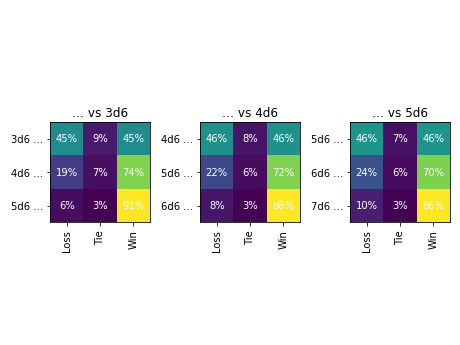
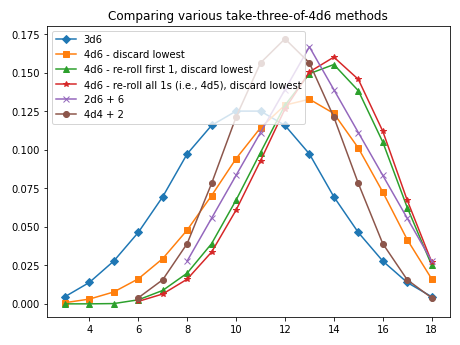
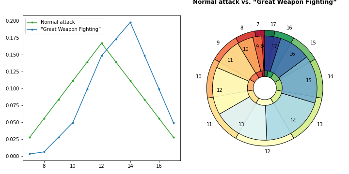

<!---
  Copyright and other protections apply. Please see the accompanying LICENSE file for
  rights and restrictions governing use of this software. All rights not expressly
  waived or licensed are reserved. If that file is missing or appears to be modified
  from its original, then please contact the author before viewing or using this
  software in any capacity.

  !!!!!!!!!!!!!!!!!!!!!!!!!!!!!!!!!!!!!!!!!!!!!!!!!!!!!!!!!!!!!!!!!!!!
  !!!!!!!!!!!!!!! IMPORTANT: READ THIS BEFORE EDITING! !!!!!!!!!!!!!!!
  !!!!!!!!!!!!!!!!!!!!!!!!!!!!!!!!!!!!!!!!!!!!!!!!!!!!!!!!!!!!!!!!!!!!
  Please keep each sentence on its own unwrapped line.
  It looks like crap in a text editor, but it has no effect on rendering, and it allows much more useful diffs.
  Thank you!
-->

The following examples and translations are intended to showcase ``dyce``’s flexibility.
If you have exposure to another tool, they may also help with transition.

## Checking Angry’s math on the [Tension Pool](https://theangrygm.com/definitive-tension-pool/)

In the [Angry GM](https://theangrygm.com/)’s publication of the [PDF version of his Tension Pool mechanic](https://theangrygm.com/wp-content/uploads/The-Tension-Pool.pdf), he includes some probabilities.
Can ``dyce`` check his work?
You bet!

Let’s reproduce his tables (with slightly different names to provide context).

| D6s in Pool | Angry’s Probability of At Least One ``1`` Showing |
|:-----------:|:-------------------------------------------------:|
| 1           | 16.7%                                             |
| 2           | 30.6%                                             |
| 3           | 42.1%                                             |
| 4           | 51.8%                                             |
| 5           | 59.8%                                             |
| 6           | 66.5%                                             |

How do we do compute these results using ``dyce``?

``` python
>>> from dyce import H
>>> one_in_d6 = H(6).eq(1)
>>> for n in range(1, 7):
...   ones_in_nd6 = n@one_in_d6
...   at_least_one_one_in_nd6 = ones_in_nd6.ge(1)
...   print(f"{n}: {at_least_one_one_in_nd6[1] / at_least_one_one_in_nd6.total:6.2%}")
1: 16.67%
2: 30.56%
3: 42.13%
4: 51.77%
5: 59.81%
6: 66.51%

```

So far so good.
Let’s keep going.

| 1d8 + 1d12 | Rarity or Severity   |
|:----------:|:--------------------:|
| 2-4        | Very Rare or Extreme |
| 5-6        | Rare or Major        |
| 7-8        | Uncommon or Moderate |
| 9-13       | Common or Minor      |
| 14-15      | Uncommon or Moderate |
| 16-17      | Rare or Major        |
| 18-20      | Very Rare or Extreme |

We need to map semantic outcomes to numbers (and back again).
How can we represent those in ``dyce``?
One way is [``IntEnum``](https://docs.python.org/3/library/enum.html#intenum)s.
``IntEnum``s have a property that allows them to substitute directly for ``int``s, which is very convenient.

``` python
>>> from enum import IntEnum

>>> class Complication(IntEnum):
...   NONE = 0  # this will come in handy later
...   COMMON = 1
...   UNCOMMON = 2
...   RARE = 3
...   VERY_RARE = 4

>>> OUTCOME_TO_RARITY_MAP = {
...   2: Complication.VERY_RARE,
...   3: Complication.VERY_RARE,
...   4: Complication.VERY_RARE,
...   5: Complication.RARE,
...   6: Complication.RARE,
...   7: Complication.UNCOMMON,
...   8: Complication.UNCOMMON,
...   9: Complication.COMMON,
...   10: Complication.COMMON,
...   11: Complication.COMMON,
...   12: Complication.COMMON,
...   13: Complication.COMMON,
...   14: Complication.UNCOMMON,
...   15: Complication.UNCOMMON,
...   16: Complication.RARE,
...   17: Complication.RARE,
...   18: Complication.VERY_RARE,
...   19: Complication.VERY_RARE,
...   20: Complication.VERY_RARE,
... }

```

Now let’s use our map to validate the probabilities of a particular outcome using that D8 and D12.

| Rarity or Impact     | Angry’s Probability of a Complication Arising |
|:--------------------:|:---------------------------------------------:|
| Common or Minor      | 41.7%                                         |
| Uncommon or Moderate | 27.1%                                         |
| Rare or Major        | 18.8%                                         |
| Very Rare or Extreme | 12.5%                                         |

``` python
>>> def outcome_to_rarity(h, outcome):
...   return OUTCOME_TO_RARITY_MAP[outcome]

>>> prob_of_complication = ((H(8) + H(12)).substitute(outcome_to_rarity))
>>> {outcome: f"{float(prob):6.2%}" for outcome, prob in prob_of_complication.distribution()}
{<Complication.COMMON: 1>: '41.67%',
 <Complication.UNCOMMON: 2>: '27.08%',
 <Complication.RARE: 3>: '18.75%',
 <Complication.VERY_RARE: 4>: '12.50%'}

```

Lookin’ good!
Now let’s put everything together.

| D6s in Pool | No Complication | Common Complication | Uncommon Complication | Rare Complication | Very Rare Complication |
|:-----------:|:---------------:|:-------------------:|:---------------------:|:-----------------:|:----------------------:|
| 1           | 83.3%           | 7.0%                | 4.5%                  | 3.1%              | 2.1%                   |
| 2           | 69.4%           | 12.7%               | 8.3%                  | 5.7%              | 3.8%                   |
| 3           | 57.9%           | 17.6%               | 11.4%                 | 7.9%              | 5.3%                   |
| 4           | 48.2%           | 21.6%               | 14.0%                 | 9.7%              | 6.5%                   |
| 5           | 40.2%           | 24.9%               | 16.2%                 | 11.2%             | 7.5%                   |
| 6           | 33.5%           | 27.7%               | 18.0%                 | 12.5%             | 8.3%                   |

``` python
>>> from typing import cast
>>> for n in range(1, 7):
...   ones_in_nd6 = n@one_in_d6
...   at_least_one_one_in_nd6 = ones_in_nd6.ge(1)
...   prob_complication_in_nd6 = at_least_one_one_in_nd6 * prob_of_complication
...   print("{} -> {}".format(n, {Complication(cast(int, outcome)).name: f"{float(prob):6.2%}" for outcome, prob in (prob_complication_in_nd6).distribution()}))
1 -> {'NONE': '83.33%', 'COMMON': ' 6.94%', 'UNCOMMON': ' 4.51%', 'RARE': ' 3.12%', 'VERY_RARE': ' 2.08%'}
2 -> {'NONE': '69.44%', 'COMMON': '12.73%', 'UNCOMMON': ' 8.28%', 'RARE': ' 5.73%', 'VERY_RARE': ' 3.82%'}
3 -> {'NONE': '57.87%', 'COMMON': '17.55%', 'UNCOMMON': '11.41%', 'RARE': ' 7.90%', 'VERY_RARE': ' 5.27%'}
4 -> {'NONE': '48.23%', 'COMMON': '21.57%', 'UNCOMMON': '14.02%', 'RARE': ' 9.71%', 'VERY_RARE': ' 6.47%'}
5 -> {'NONE': '40.19%', 'COMMON': '24.92%', 'UNCOMMON': '16.20%', 'RARE': '11.21%', 'VERY_RARE': ' 7.48%'}
6 -> {'NONE': '33.49%', 'COMMON': '27.71%', 'UNCOMMON': '18.01%', 'RARE': '12.47%', 'VERY_RARE': ' 8.31%'}

```

Neat!
Thanks to ``dyce``, we can confidently verify that Angry guy sure knows his math!

## Modeling *Ironsworn*’s core mechanic

Shawn Tomlin’s [*Ironsworn*](https://www.ironswornrpg.com/) melds a number of different influences in a fresh way.
Its core mechanic involves rolling an *action die* (a D6), adding a modifier, and comparing the resulting value to two *challenge dice* (D10s).
If the modified value from the action die is strictly greater than both challenge dice, the result is a strong success.
If it is strictly greater than only one challenge die, the result is a weak success.
If it is equal to or less than both challenge dice, it’s a failure.

A brute force way to model this is to enumerate the product of the three dice and then perform logical comparisons.

``` python
>>> from dyce import H, as_int
>>> from numerary.types import RealLikeSCU
>>> from enum import IntEnum, auto
>>> from typing import Iterator, Tuple, cast
>>> d6 = H(6)
>>> d10 = H(10)

>>> class IronResult(IntEnum):
...   FAILURE = 0
...   WEAK_SUCCESS = auto()
...   STRONG_SUCCESS = auto()

>>> def iron_results_brute_force(mod: int = 0) -> Iterator[Tuple[RealLikeSCU, int]]:
...   action_die = d6 + mod
...   for action, action_count in cast(Iterator[Tuple[int, int]], action_die.items()):
...     for first_challenge, first_challenge_count in cast(Iterator[Tuple[int, int]], d10.items()):
...       for second_challenge, second_challenge_count in cast(Iterator[Tuple[int, int]], d10.items()):
...         action_beats_first_challenge = action > first_challenge
...         action_beats_second_challenge = action > second_challenge
...         if action_beats_first_challenge and action_beats_second_challenge:
...           outcome = IronResult.STRONG_SUCCESS
...         elif action_beats_first_challenge or action_beats_second_challenge:
...           outcome = IronResult.WEAK_SUCCESS
...         else:
...           outcome = IronResult.FAILURE
...         yield outcome, action_count * first_challenge_count * second_challenge_count

>>> # By choosing our function's return type with care, we can lean on H.__init__ for
>>> # the accounting. (That's what it's there for!)
>>> iron_distributions_by_mod = {
...   mod: H(iron_results_brute_force(mod)) for mod in range(5)
... }
>>> for mod, iron_distribution in iron_distributions_by_mod.items():
...   print("{:+} -> {}".format(mod, {
...     IronResult(cast(int, outcome)).name: f"{float(prob):6.2%}"
...     for outcome, prob in iron_distribution.distribution()
...   }))
+0 -> {'FAILURE': '59.17%', 'WEAK_SUCCESS': '31.67%', 'STRONG_SUCCESS': ' 9.17%'}
+1 -> {'FAILURE': '45.17%', 'WEAK_SUCCESS': '39.67%', 'STRONG_SUCCESS': '15.17%'}
+2 -> {'FAILURE': '33.17%', 'WEAK_SUCCESS': '43.67%', 'STRONG_SUCCESS': '23.17%'}
+3 -> {'FAILURE': '23.17%', 'WEAK_SUCCESS': '43.67%', 'STRONG_SUCCESS': '33.17%'}
+4 -> {'FAILURE': '15.17%', 'WEAK_SUCCESS': '39.67%', 'STRONG_SUCCESS': '45.17%'}

```

While relatively straightforward, this approach is very verbose.
If we recognize that our problem involves a [dependent probability](countin.md#dependent-probabilities), we can re-characterize our solution in terms of [``H.substitute``][dyce.h.H.substitute].
We can also deploy a counting trick on the two D10s.

``` python
>>> {
...   mod: (d6 + mod).substitute(
...     lambda _, action: 2@(d10.lt(action))
...   ) for mod in range(5)
... } == iron_distributions_by_mod
True

```

!!! question "What’s with that ``#!python 2@(d10.lt(action))``?"

    Let’s break it down.
    ``#!python H(10).lt(value)`` will tell us how often a single D10 is less than ``#!python value``.

    ``` python
    >>> H(10).lt(5)  # how often a D10 is strictly less than 5
    H({False: 6, True: 4})

    ```

    By summing those results (and taking advantage of the fact that, in Python, ``#!python bool``s act like ``#!python int``s when it comes to arithmetic operators), we can count how often that happens with more than one interchangeable D10s.

    ``` python
    >>> h = H(10).lt(5) + H(10).lt(5) ; h
    H({0: 36, 1: 48, 2: 16})
    >>> h.total
    100

    ```

    How do we interpret those results?
    36 times out of a hundred, neither D10 will be strictly less than five.
    48 times out of a hundred, exactly one of the D10s will be strictly less than five.
    16 times out of a hundred, both D10s will be strictly less than five.

    [``H``][dyce.h.H]’s ``#!python @`` operator provides a shorthand.

    ``` python
    >>> # The parentheses are technically redundant, but clarify the intention
    >>> 2@(H(10).lt(5)) == H(10).lt(5) + H(10).lt(5)
    True

    ```

!!! question "Why doesn’t ``#!python 2@(H(6).gt(H(10))`` work?"

    ``#!python H(6).gt(H(10))`` will compute how often a six-sided die is strictly greater than a ten-sided die.
    ``#!python 2@(H(6).gt(H(10)))`` will show the frequencies that a first six-sided die is strictly greater than a first ten-sided die and a second six-sided die is strictly greater than a second ten-sided die.
    This isn’t quite what we want, since the mechanic calls for rolling a single six-sided die and comparing that result to each of two ten-sided dice.
    Other than [``H.substitute``][dyce.h.H.substitute], ``dyce`` does not provide an internal mechanism for handling dependent probabilities, so we either have to use that or find another way to express the dependency.

Now for a _twist_.
In cooperative or solo play, a failure or success is particularly spectacular when the D10s come up doubles.
The trick to mapping that to ``dyce`` is recognizing that we now have a dependent probability that involves *three* independent variables: the (modded) D6, a first D10, and a second D10.
We also deploy a technique involving ``#!python partial`` to parameterize our ``#!python mod`` value.

``` python
>>> class IronSoloResult(IntEnum):
...   SPECTACULAR_FAILURE = -1
...   FAILURE = auto()
...   WEAK_SUCCESS = auto()
...   STRONG_SUCCESS = auto()
...   SPECTACULAR_SUCCESS = auto()

>>> def sub_d6(__, d6_outcome, mod = 0):
...   def sub_first_d10(__, first_challenge):
...     def sub_second_d10(__, second_challenge):
...       action = d6_outcome + mod
...       action_beats_first_challenge = action > first_challenge
...       action_beats_second_challenge = action > second_challenge
...       doubles = first_challenge == second_challenge
...       if action_beats_first_challenge and action_beats_second_challenge:
...         return IronSoloResult.SPECTACULAR_SUCCESS if doubles else IronSoloResult.STRONG_SUCCESS
...       elif action_beats_first_challenge or action_beats_second_challenge:
...         return IronSoloResult.WEAK_SUCCESS
...       else:
...         return IronSoloResult.SPECTACULAR_FAILURE if doubles else IronSoloResult.FAILURE
...     return d10.substitute(sub_second_d10)
...   return d10.substitute(sub_first_d10)

```

Visualization:

``` python
>>> from collections import defaultdict
>>> from functools import partial
>>> import matplotlib  # doctest: +SKIP
>>> fig, axes = matplotlib.pyplot.subplots()  # doctest: +SKIP
>>> by_result = defaultdict(list)
>>> mods = list(range(-2, 5))
>>> for mod in mods:
...   results_for_mod = d6.substitute(partial(sub_d6, mod=mod))
...   distribution_for_mod = dict(results_for_mod.distribution())
...   for result in IronSoloResult:
...     result_val = float(distribution_for_mod.get(result, 0))
...     by_result[result].append(result_val)
>>> labels = [str(mod) for mod in mods]
>>> bottoms = [0.0 for _ in mods]
>>> for result in IronSoloResult:
...   result_vals = by_result[result]
...   assert len(result_vals) == len(mods)
...   axes.bar(labels, result_vals, bottom=bottoms, label=result.name)  # doctest: +SKIP
...   bottoms = [
...     bottom + result_val
...     for bottom, result_val in zip(bottoms, result_vals)
...   ]
>>> axes.legend()  # doctest: +SKIP
>>> axes.set_xlabel("modifier")  # doctest: +SKIP
>>> fig.title("Ironsworn distributions")  # doctest: +SKIP

```

<!-- Should match any title of the corresponding plot title -->
<picture>
  <source srcset="../img/plot_ironsworn_dark.png" media="(prefers-color-scheme: dark)">
  
</picture>

## Advanced topic – modeling *Risis*

*[Risus](http://risus.cumberlandgames.com/)* and its many [community-developed alternative rules](http://www.risusiverse.com/home/optional-rules) not only make for entertaining reading, but are fertile ground for stressing ergonomics and capabilities of any discrete outcome modeling tool.
We can easily model its opposed combat system for various starting configurations through the first round.

``` python
>>> for them in range(3, 6):
...   print("---")
...   for us in range(them, them + 3):
...     first_round = (us@H(6)).vs(them@H(6))  # -1 is a loss, 0 is a tie, 1 is a win
...     results = first_round.format(width=0)
...     print(f"{us}d6 vs {them}d6: {results}")
---
3d6 vs 3d6: {..., -1: 45.36%, 0:  9.28%, 1: 45.36%}
4d6 vs 3d6: {..., -1: 19.17%, 0:  6.55%, 1: 74.28%}
5d6 vs 3d6: {..., -1:  6.07%, 0:  2.99%, 1: 90.93%}
---
4d6 vs 4d6: {..., -1: 45.95%, 0:  8.09%, 1: 45.95%}
5d6 vs 4d6: {..., -1: 22.04%, 0:  6.15%, 1: 71.81%}
6d6 vs 4d6: {..., -1:  8.34%, 0:  3.26%, 1: 88.40%}
---
5d6 vs 5d6: {..., -1: 46.37%, 0:  7.27%, 1: 46.37%}
6d6 vs 5d6: {..., -1: 24.24%, 0:  5.79%, 1: 69.96%}
7d6 vs 5d6: {..., -1: 10.36%, 0:  3.40%, 1: 86.24%}

```

This highlights the mechanic’s notorious “death spiral”, which we can visualize as a heat map.

``` python
>>> from typing import List, Tuple
>>> col_names = ["Loss", "Tie", "Win"]  # mapping from [-1, 0, 1], respectively
>>> col_ticks = list(range(len(col_names)))
>>> num_rows = 3
>>> fig, axes = matplotlib.pyplot.subplots(1, num_rows)  # doctest: +SKIP
>>> for i, them in enumerate(range(3, 3 + num_rows)):
...   ax = axes[i]  # doctest: +SKIP
...   row_names: List[str] = []
...   rows: List[Tuple[float, ...]] = []
...   for us in range(them, them + num_rows):
...     row_names.append(f"{us}d6 …")
...     rows.append((us@H(6)).vs(them@H(6)).distribution_xy()[-1])
...   _ = ax.imshow(rows)  # doctest: +SKIP
...   ax.set_title(f"… vs {them}d6")  # doctest: +SKIP
...   ax.set_xticks(col_ticks)  # doctest: +SKIP
...   ax.set_xticklabels(col_names, rotation=90)  # doctest: +SKIP
...   ax.set_yticks(list(range(len(rows))))  # doctest: +SKIP
...   ax.set_yticklabels(row_names)  # doctest: +SKIP
...   for y in range(len(row_names)):
...     for x in range(len(col_names)):
...       _ = ax.text(
...         x, y,
...         f"{rows[y][x]:.0%}",
...         ha="center", va="center",color="w",
...       )  # doctest: +SKIP
>>> fig.tight_layout()  # doctest: +SKIP

```

Calling ``#!python matplotlib.pyplot.show`` presents:

<!-- Should match any title of the corresponding plot title -->
<picture>
  <source srcset="../img/plot_risus_first_round_dark.png" media="(prefers-color-scheme: dark)">
  
</picture>

### Modeling entire multi-round combats

With a little ~~elbow~~ *finger* grease, we can roll up our … erm … fingerless gloves and even model various starting configurations through to completion to get a better sense of the impact of any initial disparity (in this case, applying dynamic programming to avoid redundant computations).

``` python
>>> from typing import Callable, Dict, Tuple
>>> from dyce import H, P
>>> def risus_combat_driver(
...     us: int,  # number of dice we still have
...     them: int,  # number of dice they still have
...     us_vs_them_func: Callable[[int, int], H],
... ) -> H:
...   if us < 0 or them < 0:
...     raise ValueError(f"cannot have negative numbers (us: {us}, them: {them})")
...   if us == 0 and them == 0:
...     return H({0: 1})  # should not happen unless combat(0, 0) is called from the start
...   already_solved: Dict[Tuple[int, int], H] = {}
...
...   def _resolve(us: int, them: int) -> H:
...     if (us, them) in already_solved: return already_solved[(us, them)]
...     elif us == 0: return H({-1: 1})  # we are out of dice, they win
...     elif them == 0: return H({1: 1})  # they are out of dice, we win
...     this_round = us_vs_them_func(us, them)
...
...     def _next_round(_: H, outcome) -> H:
...       if outcome < 0: return _resolve(us - 1, them)  # we lost this round, and one die
...       elif outcome > 0: return _resolve(us, them - 1)  # they lost this round, and one die
...       else: return H({})  # ignore (immediately re-roll) all ties
...
...     already_solved[(us, them)] = this_round.substitute(_next_round)
...     return already_solved[(us, them)]
...
...   return _resolve(us, them)

>>> for t in range(3, 6):
...   print("---")
...   for u in range(t, t + 3):
...     results = risus_combat_driver(
...       u, t,
...       lambda u, t: (u@H(6)).vs(t@H(6))
...     ).format(width=0)
...     print(f"{u}d6 vs {t}d6: {results}")
---
3d6 vs 3d6: {..., -1: 50.00%, 1: 50.00%}
4d6 vs 3d6: {..., -1: 10.50%, 1: 89.50%}
5d6 vs 3d6: {..., -1:  0.66%, 1: 99.34%}
---
4d6 vs 4d6: {..., -1: 50.00%, 1: 50.00%}
5d6 vs 4d6: {..., -1: 12.25%, 1: 87.75%}
6d6 vs 4d6: {..., -1:  1.07%, 1: 98.93%}
---
5d6 vs 5d6: {..., -1: 50.00%, 1: 50.00%}
6d6 vs 5d6: {..., -1: 13.66%, 1: 86.34%}
7d6 vs 5d6: {..., -1:  1.49%, 1: 98.51%}

```

There’s lot going on there.
Let’s dissect it.

``` python
def risus_combat_driver(
    us: int,  # number of dice we still have
    them: int,  # number of dice they still have
    us_vs_them_func: Callable[[int, int], H],
) -> H:
  ...
```

Our “driver” takes three arguments:

1. How many dice we have left (``#!python us``);
1. How many dice the opposition has left (``#!python them``); and
1. A resolution function (``#!python us_vs_them_func``) that takes counts of each party’s remaining dice and returns a histogram encoding the probability of winning or losing a single round akin to the [``H.vs`` method][dyce.h.H.vs]:

    * An outcome of ``#!python -1`` signals the likelihood of the opposition’s victory
    * An outcome of ``#!python 1`` signals the likelihood of our victory.
    * An outcome of ``#!python 0`` signals the likelihood of a tie.

    This is intentional, since we’re going to leverage that very method later.

``` python linenums="7"
  if us < 0 or them < 0:
    raise ValueError(f"cannot have negative numbers (us: {us}, them: {them})")
  if us == 0 and them == 0:
    return H({0: 1})  # should not happen unless combat(0, 0) is called from the start
  already_solved: Dict[Tuple[int, int], H] = {}
```

We make some preliminary checks that guard access to our recursive implementation so that it can be a little cleaner.
We also set up a ``#!python dict`` to keep track of results we‘ve already computed.
For example, we might compute a case where we lose a die, then our opposition loses a die.
We arrive at a similar case where our opposition loses a die, then we lose a die.
Both cases are similar from that point on.
We’ll keep track of those, so we don’t have to recompute them.

``` python linenums="13"
  def _resolve(us: int, them: int) -> H:
    ...
```

``` python linenums="27"
  return _resolve(us, them)
```

Skipping over its implementation for now, we define a our recursive implementation (``#!python _resolve``) and then call it with our initial arguments.

``` python linenums="13"
  def _resolve(us: int, them: int) -> H:
    if (us, them) in already_solved: return already_solved[(us, them)]
    elif us == 0: return H({-1: 1})  # we are out of dice, they win
    elif them == 0: return H({1: 1})  # they are out of dice, we win
```

Getting back to that implementation, these are our base cases.
First we check to see if we’ve already solved for this case (memoization), in which case we can just return it.
Then we check whether either party has run out of dice, in which case the combat is over.
If we have none of those cases, we get to work.

!!! note

    In this function, we do not check for the case where *both* parties are at zero.
    Because only one party can lose a die during each round, the only way both parties can be at zero simultaneously is if they both started at zero.
    Since we guarded against that case in the enclosing function, we don’t have to worry about that here.
    Either ``#!python us`` is zero, ``#!python them`` is zero, or neither is zero.

``` python linenums="17"
    this_round = us_vs_them_func(us, them)
```

Then, we compute the outcomes for _this round_ using the provided resolution function.

``` python linenums="19"
    def _next_round(_: H, outcome) -> H:
      ...
```

``` python linenums="24"
    already_solved[(us, them)] = this_round.substitute(_next_round)
    return already_solved[(us, them)]
```

Keeping in mind that we’re inside our recursive implementation, we define a substitution function specifically for use with [``H.substitute``][dyce.h.H.substitute].
This allows us to take our computation for this round, and “fold in” subsequent rounds.
We keep track of the result in our memoization ``#!python dict`` before returning it.

``` python linenums="19"
    def _next_round(_: H, outcome) -> H:
      if outcome < 0: return _resolve(us - 1, them)  # we lost this round, and one die
      elif outcome > 0: return _resolve(us, them - 1)  # they lost this round, and one die
      else: return H({})  # ignore (immediately re-roll) all ties
```

Our substitution function is pretty straightforward.
Where we are asked whether we want to provide a substitution for a round we lost, we lose a die and recurse.
Where we are asked for a substitution for a round we won, our opposition loses a die and we recurse.
We ignore ties (simulating that we re-roll them in place until they are no longer ties).

``` python linenums="32"
    ... risus_combat_driver(
      u, t,
      lambda u, t: (u@H(6)).vs(t@H(6))
    ) ...
```

At this point, we can define a simple ``#!python lambda`` that wraps [``H.vs``][dyce.h.H.vs] and submit it to our driver to enumerate resolution outcomes from various starting positions.

!!! note

    This is a complicated example that involves some fairly sophisticated programming techniques (recursion, memoization, closures, etc.).
    The point is not to suggest that such techniques are required to be productive.
    However, it is useful to show that ``dyce`` is flexible enough to model these types of outcomes in a couple dozen lines of code.
    It is high-level enough to lean on for nuanced number crunching without a lot of detailed knowledge, while still being low-level enough that authors knowledgeable of advanced programming techniques are not precluded from using them.

### Modeling different combat resolution methods

Using our ``#!python risus_combat_driver`` from above, we can craft a alternative resolution function to model the less death-spirally “Best of Set” alternative mechanic from *[The Risus Companion](https://ghalev.itch.io/risus-companion)* with the optional “Goliath Rule” for resolving ties.

``` python
>>> def deadly_combat_vs(us: int, them: int) -> H:
...   best_us = (us@P(6)).h(-1)
...   best_them = (them@P(6)).h(-1)
...   h = best_us.vs(best_them)
...   # Goliath Rule: tie goes to the party with fewer dice in this round
...   h = h.substitute(lambda h, outcome: (us < them) - (us > them) if outcome == 0 else outcome)
...   return h

>>> for t in range(3, 5):
...   print("---")
...   for u in range(t, t + 3):
...     results = risus_combat_driver(u, t, deadly_combat_vs).format(width=0)
...     print(f"{u}d6 vs {t}d6: {results}")
---
3d6 vs 3d6: {..., -1: 50.00%, 1: 50.00%}
4d6 vs 3d6: {..., -1: 36.00%, 1: 64.00%}
5d6 vs 3d6: {..., -1: 23.23%, 1: 76.77%}
---
4d6 vs 4d6: {..., -1: 50.00%, 1: 50.00%}
5d6 vs 4d6: {..., -1: 40.67%, 1: 59.33%}
6d6 vs 4d6: {..., -1: 30.59%, 1: 69.41%}

```

Modeling the “[Evens Up](http://www.risusiverse.com/home/optional-rules/evens-up)” alternative dice mechanic is currently beyond the capabilities of ``dyce`` without additional work.
This is for two reasons.
First, with [one narrow exception][dyce.h.H.substitute], ``dyce`` only provides a mechanism to substitute outcomes, not counts.
This means we can’t arbitrarily *increase* the likelihood of achieving a particular outcome through substitution.
Second, ``dyce``’s substitution mechanism only resolves outcomes through a fixed number of iterations (not an infinite series).
Most of the time, this is good enough.

Both of these limitations can be circumvented where infinite series can be computed and encoded as histograms.
For this mechanic, we can observe that a single six-sided die (``1d6``) has a $\frac{1}{2}$ chance of coming up even, thereby earning a “success”.
We can also observe that it has a $\frac{1}{6}$ chance of showing a six, earning an additional roll.
That second roll has a $\frac{1}{2}$ chance of coming up even, as well as a $\frac{1}{6}$ chance of earning another roll, and so on.
In other words, the number of successes one can expect to roll are:

$$
\frac{1}{2}
+ \frac{1}{6} \left( \frac{1}{2}
  + \frac{1}{6} \left( \frac{1}{2}
    + \frac{1}{6} \left( \frac{1}{2}
      + \ldots
    \right)
  \right)
\right)
$$

Or, in the alternative:

$$
\frac{1}{2}
+ \frac{1}{2}\frac{1}{6}
+ \frac{1}{2}\frac{1}{6}\frac{1}{6}
+ \frac{1}{2}\frac{1}{6}\frac{1}{6}\frac{1}{6}
+ \ldots
$$

Or simply:

$$
\frac{1}{{2} \times {6}^{0}}
+ \frac{1}{{2} \times {6}^{1}}
+ \frac{1}{{2} \times {6}^{2}}
+ \frac{1}{{2} \times {6}^{3}}
+ \ldots
$$

So what is that? We probably don’t know unless we do math for a living, or at least as an active hobby.
(The author does neither, which is partially what motivated the creation of this library.)
Computing the value to the first hundred iterations offers a clue.

``` python
>>> 1/2 * sum(1 / (6 ** i) for i in range(100))
0.59999999999999975575093458246556110680103302001953125

```

It appears convergent around $\frac{3}{5}$.
Let’s see if we can validate that.
An [article from MathIsFun.com](https://www.mathsisfun.com/algebra/infinite-series.html) provides useful guidance.
The section on geometric series is easily adapted to our problem.

$$
\begin{matrix}
S
& = &
\frac{1}{{2} \times {6}^{0}}
+ \frac{1}{{2} \times {6}^{1}}
+ \frac{1}{{2} \times {6}^{2}}
+ \frac{1}{{2} \times {6}^{3}}
+ \frac{1}{{2} \times {6}^{4}}
+ \ldots \\
& = &
\overbrace{ \frac{1}{2} }
+ \underbrace{ \frac{1}{12} + \frac{1}{72} + \frac{1}{432} + \frac{1}{2\,592} + \ldots } \\
\end{matrix}
$$

$$
\begin{matrix}
\frac{1}{6}S
& = &
\frac{1}{6}\frac{1}{{2} \times {6}^{0}}
+ \frac{1}{6}\frac{1}{{2} \times {6}^{1}}
+ \frac{1}{6}\frac{1}{{2} \times {6}^{2}}
+ \frac{1}{6}\frac{1}{{2} \times {6}^{3}}
+ \ldots \\
& = &
\underbrace{ \frac{1}{12} + \frac{1}{72} + \frac{1}{432} + \frac{1}{2\,592} + \ldots } \\
\end{matrix}
$$

$$
S = \overbrace{ \frac{1}{2} } + \underbrace{ \frac{1}{6}S }
$$

$$
S - \frac{1}{6}S = \frac{1}{2}
$$

$$
\frac{5}{6}S = \frac{1}{2}
$$

$$
S = \frac{3}{5}
$$

Well, butter my butt and call me a biscuit! Math really _is_ fun! 🧈 🤠 🧮

!!! info

    The Archimedean visualization technique mentioned in the [aforementioned article](https://www.mathsisfun.com/algebra/infinite-series.html) also adapts well to this case.
    It involves no algebra and is left as an exercise to the reader … at least one with nothing more pressing to do.

Armed with this knowledge, we can now model “Evens Up” using our ``#!python risus_combat_driver`` from above.
We can also deploy a trick using ``#!python partial`` to parameterize use of the Goliath Rule.

``` python
>>> from functools import partial
>>> d6_evens_exploding_on_six = H({1: 3, 0: 2})  # 3 dubyas, 2 doughnuts

>>> def evens_up_vs(us: int, them: int, goliath: bool = False) -> H:
...   h = (us@d6_evens_exploding_on_six).vs(them@d6_evens_exploding_on_six)
...   if goliath:
...     h = h.substitute(lambda h, outcome: (us < them) - (us > them) if outcome == 0 else outcome)
...   return h

>>> for t in range(3, 5):
...   print("- - - - - - - With Goliath Rule - - - - - -  Without Goliath Rule - - - -")
...   for u in range(t, t + 3):
...     goliath_results = risus_combat_driver(u, t, partial(evens_up_vs, goliath=True)).format(width=0)
...     no_goliath_results = risus_combat_driver(u, t, partial(evens_up_vs, goliath=False)).format(width=0)
...     print(f"{u}d6 vs {t}d6:   {goliath_results}   {no_goliath_results}")
- - - - - - - With Goliath Rule - - - - - -  Without Goliath Rule - - - -
3d6 vs 3d6:   {..., -1: 50.00%, 1: 50.00%}   {..., -1: 50.00%, 1: 50.00%}
4d6 vs 3d6:   {..., -1: 27.49%, 1: 72.51%}   {..., -1: 14.38%, 1: 85.62%}
5d6 vs 3d6:   {..., -1:  9.27%, 1: 90.73%}   {..., -1:  1.99%, 1: 98.01%}
- - - - - - - With Goliath Rule - - - - - -  Without Goliath Rule - - - -
4d6 vs 4d6:   {..., -1: 50.00%, 1: 50.00%}   {..., -1: 50.00%, 1: 50.00%}
5d6 vs 4d6:   {..., -1: 28.50%, 1: 71.50%}   {..., -1: 16.44%, 1: 83.56%}
6d6 vs 4d6:   {..., -1: 10.50%, 1: 89.50%}   {..., -1:  2.86%, 1: 97.14%}

```

## Modeling “[The Probability of 4d6, Drop the Lowest, Reroll 1s](http://prestonpoulter.com/2010/11/19/the-probability-of-4d6-drop-the-lowest-reroll-1s/)”

``` python
>>> from dyce import H, P
>>> res1 = 3@H(6)
>>> p_4d6 = 4@P(6)
>>> res2 = p_4d6.h(slice(1, None))  # discard the lowest die (index 0)
>>> d6_reroll_first_one = H(6).substitute(lambda h, outcome: H(6) if outcome == 1 else outcome)
>>> p_4d6_reroll_first_one = (4@P(d6_reroll_first_one))
>>> res3 = p_4d6_reroll_first_one.h(slice(1, None))  # discard the lowest
>>> p_4d6_reroll_all_ones = 4@P(H((2, 3, 4, 5, 6)))
>>> res4 = p_4d6_reroll_all_ones.h(slice(1, None))  # discard the lowest
>>> res5 = 2@H(6) + 6
>>> res6 = 4@H(4) + 2

```

Visualization:

``` python
>>> import matplotlib  # doctest: +SKIP
>>> matplotlib.pyplot.plot(
...   *res4.distribution_xy(),
...   marker="D",
...   label="3d6",
... )  # doctest: +SKIP
>>> matplotlib.pyplot.plot(
...   *res1.distribution_xy(),
...   marker="s",
...   label="4d6 - discard lowest",
... )  # doctest: +SKIP
>>> matplotlib.pyplot.plot(
...   *res2.distribution_xy(),
...   marker="^",
...   label="4d6 - re-roll first 1, discard lowest",
... )  # doctest: +SKIP
>>> matplotlib.pyplot.plot(
...   *res3.distribution_xy(),
...   marker="*",
...   label="4d6 - re-roll all 1s (i.e., 4d5), discard lowest",
... )  # doctest: +SKIP
>>> matplotlib.pyplot.plot(
...   *res5.distribution_xy(),
...   marker="x",
...   label="2d6 + 6",
... )  # doctest: +SKIP
>>> matplotlib.pyplot.plot(
...   *res6.distribution_xy(),
...   marker="o",
...   label="4d4 + 2",
... )  # doctest: +SKIP
>>> matplotlib.pyplot.legend()  # doctest: +SKIP
>>> matplotlib.pyplot.show()  # doctest: +SKIP

```

<!-- Should match any title of the corresponding plot title -->
<picture>
  <source srcset="../img/plot_4d6_variants_dark.png" media="(prefers-color-scheme: dark)">
  
</picture>

## Translating one example from [``markbrockettrobson/python_dice``](https://github.com/markbrockettrobson/python_dice#usage)

Source:

``` python
# …
program = [
  "VAR save_roll = d20",
  "VAR burning_arch_damage = 10d6 + 10",
  "VAR pass_save = ( save_roll >= 10 ) ",
  "VAR damage_half_on_save = burning_arch_damage // (pass_save + 1)",
  "damage_half_on_save"
]
# …
```

Translation:

``` python
>>> from dyce import H
>>> save_roll = H(20)
>>> burning_arch_damage = 10@H(6) + 10
>>> pass_save = save_roll.ge(10)
>>> damage_half_on_save = burning_arch_damage // (pass_save + 1)

```

Visualization:

``` python
>>> import matplotlib  # doctest: +SKIP
>>> outcomes, probabilities = damage_half_on_save.distribution_xy()
>>> matplotlib.pyplot.plot(outcomes, probabilities, marker=".")  # doctest: +SKIP
>>> matplotlib.pyplot.title("Expected outcomes for attack with saving throw for half damage")  # doctest: +SKIP
>>> matplotlib.pyplot.show()  # doctest: +SKIP

```

<!-- Should match any title of the corresponding plot title -->
<picture>
  <source srcset="../img/plot_burning_arch_dark.png" media="(prefers-color-scheme: dark)">
  
</picture>

An alternative using the [``H.substitute`` method][dyce.h.H.substitute]:

``` python
>>> import operator
>>> save_roll.substitute(
...   lambda h, outcome:
...     burning_arch_damage // 2 if operator.__ge__(outcome, 10)
...     else burning_arch_damage
... ) == damage_half_on_save
True

```

## More translations from [``markbrockettrobson/python_dice``](https://github.com/markbrockettrobson/python_dice#usage)

``` python
>>> # VAR name = 1 + 2d3 - 3 * 4d2 // 5
>>> name = 1 + (2@H(3)) - 3 * (4@H(2)) // 5
>>> print(name.format(width=0))
{avg: 1.75, -1:  3.47%, 0: 13.89%, 1: 25.00%, 2: 29.17%, 3: 19.44%, 4:  8.33%, 5:  0.69%}

```

``` python
>>> # VAR out = 3 * ( 1 + 1d4 )
>>> out = 3 * (1 + 2@H(4))
>>> print(out.format(width=0))
{avg: 18.00, 9:  6.25%, 12: 12.50%, 15: 18.75%, 18: 25.00%, 21: 18.75%, 24: 12.50%, 27:  6.25%}

```

``` python
>>> # VAR g = (1d4 >= 2) AND !(1d20 == 2)
>>> g = H(4).ge(2) & H(20).ne(2)
>>> print(g.format(width=0))
{..., False: 28.75%, True: 71.25%}

```

``` python
>>> # VAR h = (1d4 >= 2) OR !(1d20 == 2)
>>> h = H(4).ge(2) | H(20).ne(2)
>>> print(h.format(width=0))
{..., False:  1.25%, True: 98.75%}

```

``` python
>>> # VAR abs = ABS( 1d6 - 1d6 )
>>> abs_ = abs(H(6) - H(6))
>>> print(abs_.format(width=0))
{avg: 1.94, 0: 16.67%, 1: 27.78%, 2: 22.22%, 3: 16.67%, 4: 11.11%, 5:  5.56%}

```

``` python
>>> # MAX(4d7, 2d10)
>>> _ = P(4@H(7), 2@H(10)).h(-1)
>>> print(_.format(width=0))
{avg: 16.60, 4:  0.00%, 5:  0.02%, 6:  0.07%, 7:  0.21%, ..., 25:  0.83%, 26:  0.42%, 27:  0.17%, 28:  0.04%}

```

``` python
>>> # MIN(50, d%)
>>> _ = P(H((50,)), P(100)).h(0)
>>> print(_.format(width=0))
{avg: 37.75, 1:  1.00%, 2:  1.00%, 3:  1.00%, ..., 47:  1.00%, 48:  1.00%, 49:  1.00%, 50: 51.00%}

```

## Translations from [``LordSembor/DnDice``](https://github.com/LordSembor/DnDice#examples)

Example 1 source:

``` python
from DnDice import d, gwf
single_attack = 2*d(6) + 5
# …
great_weapon_fighting = gwf(2*d(6)) + 5
# …
# comparison of the probability
print(single_attack.expectancies())
print(great_weapon_fighting.expectancies())
# [ 0.03,  0.06, 0.08, 0.11, 0.14, 0.17, 0.14, ...] (single attack)
# [0.003, 0.006, 0.03, 0.05, 0.10, 0.15, 0.17, ...] (gwf attack)
# …
```

Example 1 translation:

``` python
>>> from dyce import H
>>> single_attack = 2@H(6) + 5

>>> def gwf(h: H, outcome):
...   return h if outcome in (1, 2) else outcome

>>> great_weapon_fighting = 2@(H(6).substitute(gwf)) + 5  # reroll either die if it is a one or two
>>> print(single_attack.format(width=0))
{..., 7:  2.78%, 8:  5.56%, 9:  8.33%, 10: 11.11%, 11: 13.89%, 12: 16.67%, 13: 13.89%, ...}
>>> print(great_weapon_fighting.format(width=0))
{..., 7:  0.31%, 8:  0.62%, 9:  2.78%, 10:  4.94%, 11:  9.88%, 12: 14.81%, 13: 17.28%, ...}

```

Example 1 visualization:

``` python
>>> import matplotlib  # doctest: +SKIP
>>> from dyce.viz import display_burst
>>> ax_plot = matplotlib.pyplot.subplot2grid((1, 2), (0, 0))  # doctest: +SKIP
>>> ax_burst = matplotlib.pyplot.subplot2grid((1, 2), (0, 1))  # doctest: +SKIP
>>> label_sa = "Normal attack"
>>> ax_plot.plot(
...     *single_attack.distribution_xy(),
...     color="tab:green",
...     label=label_sa,
...     marker=".",
... )  # doctest: +SKIP
>>> label_gwf = "“Great Weapon Fighting”"
>>> ax_plot.plot(
...     *great_weapon_fighting.distribution_xy(),
...     color="tab:blue",
...     label=label_gwf,
...     marker=".",
... )  # doctest: +SKIP
>>> ax_plot.legend()  # doctest: +SKIP
>>> ax_plot.set_title("Comparing a normal attack to an enhanced one")  # doctest: +SKIP
>>> display_burst(
...     ax_burst,
...     h_inner=great_weapon_fighting,
...     outer=single_attack,
...     desc=f"{label_sa} vs. {label_gwf}",
...     inner_color="RdYlBu_r",
...     outer_color="RdYlGn_r",
...     alpha=0.9,
... )  # doctest: +SKIP
>>> matplotlib.pyplot.show()  # doctest: +SKIP

```

<!-- Should match any title of the corresponding plot title -->
<picture>
  <source srcset="../img/plot_great_weapon_fighting_dark.png" media="(prefers-color-scheme: dark)">
  
</picture>

Example 2 source:

``` python
from DnDice import d, advantage, plot

normal_hit = 1*d(12) + 5
critical_hit = 3*d(12) + 5

result = d()
for value, probability in advantage():
  if value == 20:
    result.layer(critical_hit, weight=probability)
  elif value + 5 >= 14:
    result.layer(normal_hit, weight=probability)
  else:
    result.layer(d(0), weight=probability)
result.normalizeExpectancies()
# …
```

Example 2 translation:

``` python
>>> normal_hit = H(12) + 5
>>> critical_hit = 3@H(12) + 5
>>> advantage = (2@P(20)).h(-1)

>>> def crit(_: H, outcome):
...   if outcome == 20: return critical_hit
...   elif outcome + 5 >= 14: return normal_hit
...   else: return 0

>>> advantage_weighted = advantage.substitute(crit)

```

Example 2 visualization:

``` python
>>> import matplotlib  # doctest: +SKIP
>>> matplotlib.pyplot.plot(
...   *normal_hit.distribution_xy(),
...   marker=".",
...   label="Normal hit",
... )  # doctest: +SKIP
>>> matplotlib.pyplot.plot(
...   *critical_hit.distribution_xy(),
...   marker=".",
...   label="Critical hit",
... )  # doctest: +SKIP
>>> matplotlib.pyplot.plot(
...   *advantage_weighted.distribution_xy(),
...   marker=".",
...   label="Advantage-weighted",
... )  # doctest: +SKIP
>>> matplotlib.pyplot.legend()  # doctest: +SKIP
>>> matplotlib.pyplot.title("Modeling an advantage-weighted attack with critical hits")  # doctest: +SKIP
>>> matplotlib.pyplot.show()  # doctest: +SKIP

```

<!-- Should match any title of the corresponding plot title -->
<picture>
  <source srcset="../img/plot_advantage_dark.png" media="(prefers-color-scheme: dark)">
  
</picture>

## Translation of the accepted answer to “[Roll and Keep in Anydice?](https://rpg.stackexchange.com/a/166637)”

Source:

```
output [highest 3 of 10d [explode d10]] named "10k3"
```

Translation:

``` python
>>> from dyce import H, P
>>> res = (10@P(H(10).explode(max_depth=3))).h(slice(-3, None))

```

Visualization:

``` python
>>> import matplotlib  # doctest: +SKIP
>>> for depth in range(6):
...   res = (10@P(H(10).explode(max_depth=depth))).h(slice(-3, None))
...   matplotlib.pyplot.plot(
...     *res.distribution_xy(),
...     marker=".",
...     label=f"{depth} rerolls",
...   )  # doctest: +SKIP
    matplotlib.pyplot.legend()  # doctest: +SKIP
>>> matplotlib.pyplot.title("Modeling taking the three highest of ten exploding d10s")  # doctest: +SKIP
>>> matplotlib.pyplot.show()  # doctest: +SKIP

```

<!-- Should match any title of the corresponding plot title -->
<picture>
  <source srcset="../img/plot_d10_explode_dark.png" media="(prefers-color-scheme: dark)">
  
</picture>

## Translation of the accepted answer to “[How do I count the number of duplicates in anydice?](https://rpg.stackexchange.com/a/111421)”

Source:

```
function: dupes in DICE:s {
  D: 0
  loop X over {2..#DICE} {
    if ((X-1)@DICE = X@DICE) { D: D + 1}
  }
  result: D
}
```

Translation:

``` python
>>> from dyce import H, P

>>> def dupes(p: P):
...   for roll, count in p.rolls_with_counts():
...     dupes = 0
...     for i in range(1, len(roll)):
...       # Outcomes are ordered, so we only have to look at one neighbor
...       if roll[i] == roll[i - 1]:
...         dupes += 1
...     yield dupes, count

>>> res_15d6 = H(dupes(15@P(6)))
>>> res_8d10 = H(dupes(8@P(10)))

```

Visualization:

``` python
>>> import matplotlib  # doctest: +SKIP
>>> matplotlib.pyplot.plot(
...   *res_15d6.distribution_xy(),
...   marker="o",
...   label="15d6",
... )  # doctest: +SKIP
>>> matplotlib.pyplot.plot(
...   *res_8d10.distribution_xy(),
...   marker="o",
...   label="8d10",
... )  # doctest: +SKIP
>>> matplotlib.pyplot.legend()  # doctest: +SKIP
>>> matplotlib.pyplot.title("Chances of rolling $n$ duplicates")  # doctest: +SKIP

```

<!-- Should match any title of the corresponding plot title -->
<picture>
  <source srcset="../img/plot_dupes_dark.png" media="(prefers-color-scheme: dark)">
  
</picture>

## Translation of “[How do I implement this specialized roll-and-keep mechanic in AnyDice?](https://rpg.stackexchange.com/a/190806)”

Source:

```
function: N:n of SIZE:n keep K:n extras add {
    result: [helper NdSIZE SIZE K]
}

function: helper ROLL:s SIZE:n K:n {
    COUNT: [count SIZE in ROLL]
    if COUNT > K { result: K*SIZE - K + COUNT }
    result: {1..K}@ROLL
}
```

Translation:

``` python
>>> from dyce import H, P

>>> def roll_and_keep(p: P, k: int):
...   assert p.is_homogeneous
...   max_d = max(p[-1]) if p else 0
...   for roll, count in p.rolls_with_counts():
...     total = sum(roll[-k:]) + sum(1 for outcome in roll[:-k] if outcome == max_d)
...     yield total, count

>>> H(roll_and_keep(6@P(6), 3))
H({3: 1, 4: 6, 5: 21, 6: 78, 7: 207, ..., 17: 5535, 18: 2500, 19: 375, 20: 30, 21: 1})

```

Visualization:

``` python
>>> import matplotlib  # doctest: +SKIP
>>> d, k = 6, 3
>>> for n in range(k + 1, k + 9):
...   p = n@P(d)
...   res_roll_and_keep = H(roll_and_keep(p, k))
...   matplotlib.pyplot.plot(
...     *res_roll_and_keep.distribution_xy(),
...     marker="o",
...     label=f"{n}d{d} keep {k} add +1",
...   )  # doctest: +SKIP
>>> for n in range(k + 1, k + 9):
...   p = n@P(d)
...   res_normal = p.h(slice(-k, None))
...   matplotlib.pyplot.plot(
...     *res_normal.distribution_xy(),
...     marker="s",
...     label=f"{n}d{d} keep {k}",
...   )  # doctest: +SKIP
>>> matplotlib.pyplot.legend()  # doctest: +SKIP
>>> matplotlib.pyplot.title("Roll-and-keep mechanic comparison")  # doctest: +SKIP
>>> matplotlib.pyplot.show()  # doctest: +SKIP

```

<!-- Should match any title of the corresponding plot title -->
<picture>
  <source srcset="../img/plot_roll_and_keep_dark.png" media="(prefers-color-scheme: dark)">
  
</picture>

## Translation of the accepted answer to “[Modelling \[sic\] opposed dice pools with a swap](https://rpg.stackexchange.com/a/112951)”

Source of basic ``brawl``:

```
function: brawl A:s vs B:s {
  SA: A >= 1@B
  SB: B >= 1@A
  if SA-SB=0 {
    result:(A > B) - (A < B)
  }
  result:SA-SB
}
output [brawl 3d6 vs 3d6] named "A vs B Damage"
```

Translation:

``` python
>>> from itertools import product
>>> from dyce import P

>>> def brawl(a: P, b: P):
...   for (roll_a, count_a), (roll_b, count_b) in product(
...       a.rolls_with_counts(),
...       b.rolls_with_counts(),
...   ):
...     a_successes = sum(1 for v in roll_a if v >= roll_b[-1])
...     b_successes = sum(1 for v in roll_b if v >= roll_a[-1])
...     yield a_successes - b_successes, count_a * count_b

```

Rudimentary visualization using built-in methods:

``` python
>>> from dyce import H
>>> res = H(brawl(3@P(6), 3@P(6))).lowest_terms()
>>> print(res.format())
avg |    0.00
std |    1.73
var |    2.99
 -3 |   7.86% |###
 -2 |  15.52% |#######
 -1 |  16.64% |########
  0 |  19.96% |#########
  1 |  16.64% |########
  2 |  15.52% |#######
  3 |   7.86% |###

```

Source of ``brawl`` with an optional dice swap:

```
function: set element I:n in SEQ:s to N:n {
  NEW: {}
  loop J over {1 .. #SEQ} {
    if I = J { NEW: {NEW, N} }
    else { NEW: {NEW, J@SEQ} }
  }
  result: NEW
}
function: brawl A:s vs B:s with optional swap {
  if #A@A >= 1@B {
    result: [brawl A vs B]
  }
  AX: [sort [set element #A in A to 1@B]]
  BX: [sort [set element 1 in B to #A@A]]
  result: [brawl AX vs BX]
}
output [brawl 3d6 vs 3d6 with optional swap] named "A vs B Damage"
```

Translation:

``` python
>>> def brawl_w_optional_swap(a: P, b: P):
...   for (roll_a, count_a), (roll_b, count_b) in product(
...       a.rolls_with_counts(),
...       b.rolls_with_counts(),
...   ):
...     if roll_a[0] < roll_b[-1]:
...       roll_a, roll_b = roll_a[1:] + roll_b[-1:], roll_a[:1] + roll_b[:-1]
...     roll_a = tuple(sorted(roll_a, reverse=True))
...     roll_b = tuple(sorted(roll_b, reverse=True))
...     a_successes = sum(1 for v in roll_a if v >= roll_b[0])
...     b_successes = sum(1 for v in roll_b if v >= roll_a[0])
...     result = a_successes - b_successes or (roll_a > roll_b) - (roll_a < roll_b)
...     yield result, count_a * count_b

```

Rudimentary visualization using built-in methods:

``` python
>>> res = H(brawl_w_optional_swap(3@P(6), 3@P(6))).lowest_terms()
>>> print(res.format())
avg |    2.36
std |    0.88
var |    0.77
 -1 |   1.42% |
  0 |   0.59% |
  1 |  16.65% |########
  2 |  23.19% |###########
  3 |  58.15% |#############################

>>> res = H(brawl_w_optional_swap(4@P(6), 4@P(6))).lowest_terms()
>>> print(res.format())
avg |    2.64
std |    1.28
var |    1.64
 -2 |   0.06% |
 -1 |   2.94% |#
  0 |   0.31% |
  1 |  18.16% |#########
  2 |  19.97% |#########
  3 |  25.19% |############
  4 |  33.37% |################

```
