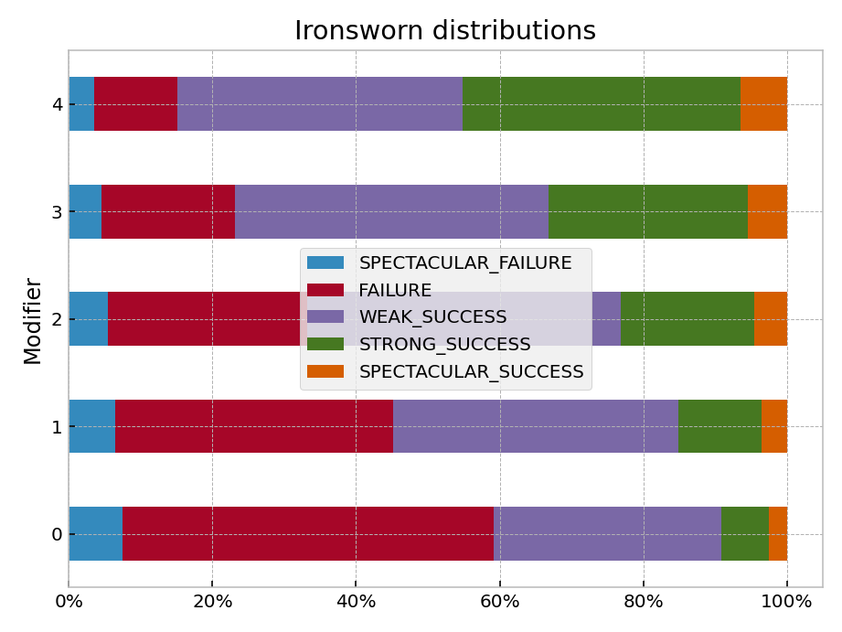
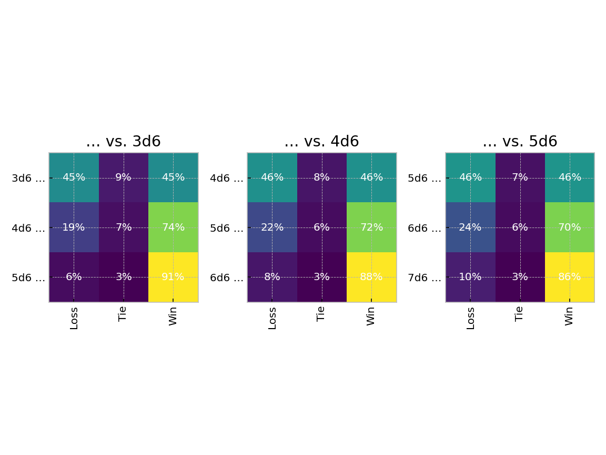
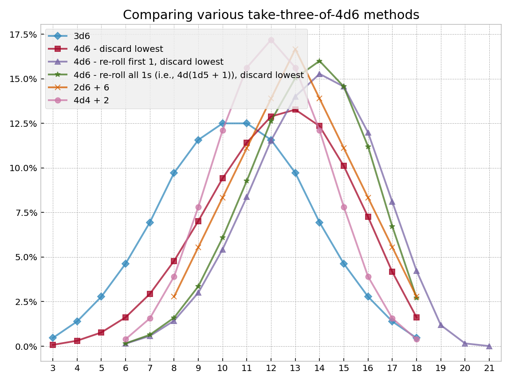
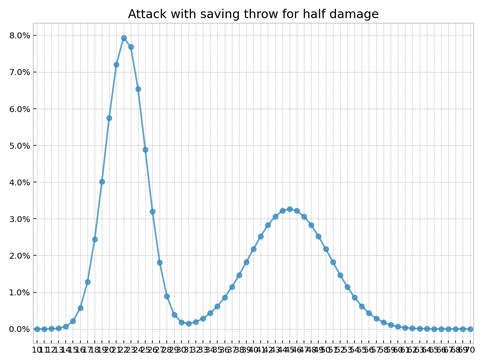
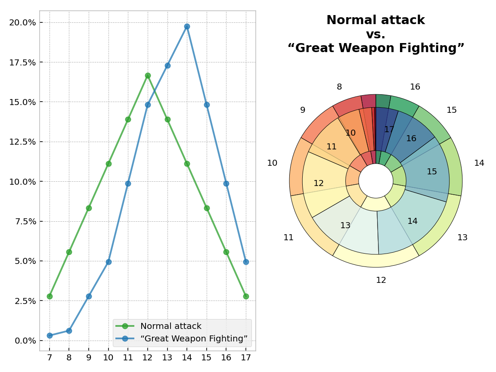
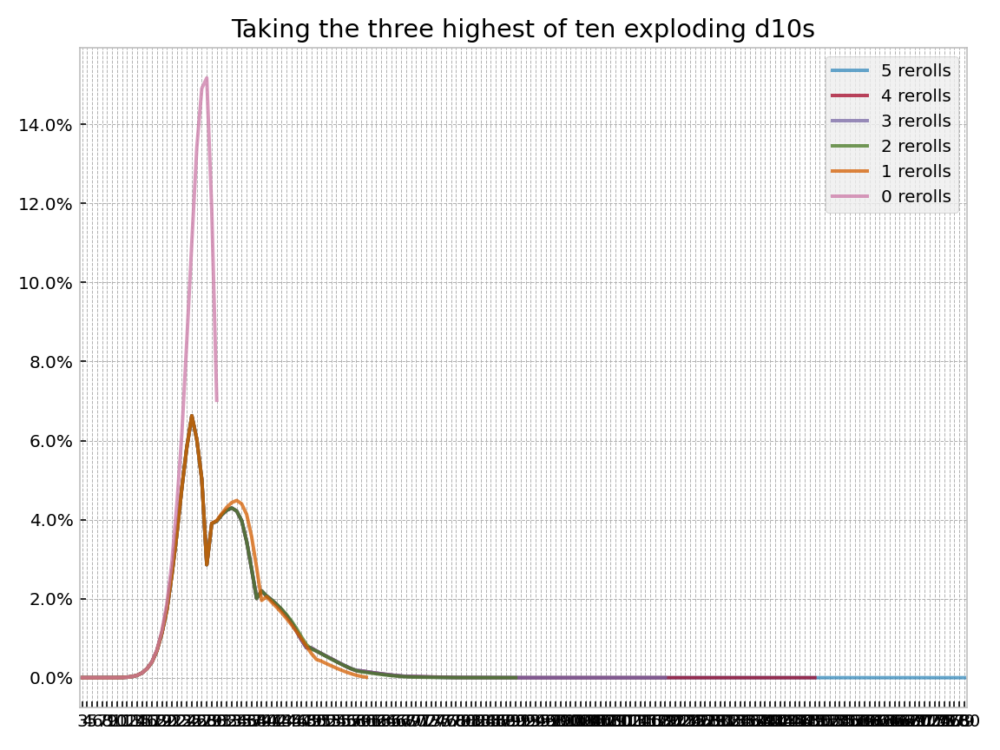
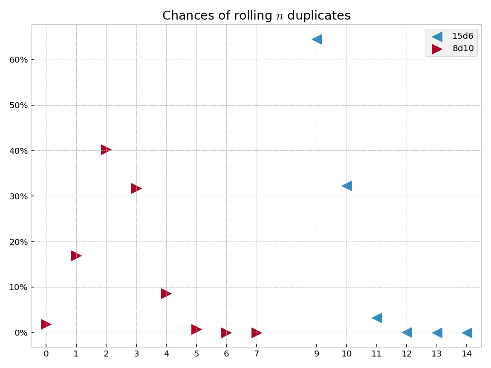
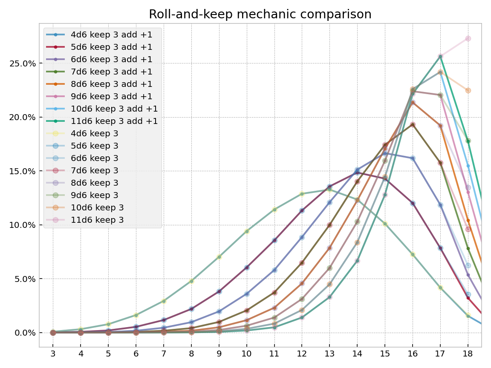

<!---
  Copyright and other protections apply. Please see the accompanying LICENSE file for
  rights and restrictions governing use of this software. All rights not expressly
  waived or licensed are reserved. If that file is missing or appears to be modified
  from its original, then please contact the author before viewing or using this
  software in any capacity.

  !!!!!!!!!!!!!!!!!!!!!!!!!!!!!!!!!!!!!!!!!!!!!!!!!!!!!!!!!!!!!!!!!!!!
  !!!!!!!!!!!!!!! IMPORTANT: READ THIS BEFORE EDITING! !!!!!!!!!!!!!!!
  !!!!!!!!!!!!!!!!!!!!!!!!!!!!!!!!!!!!!!!!!!!!!!!!!!!!!!!!!!!!!!!!!!!!
  Please keep each sentence on its own unwrapped line.
  It looks like crap in a text editor, but it has no effect on rendering, and it allows much more useful diffs.
  Thank you!
-->

The following examples and translations are intended to showcase ``dyce``’s flexibility.
If you have exposure to another tool, they may also help with transition.

## Checking Angry’s math on the [Tension Pool](https://theangrygm.com/definitive-tension-pool/)

In the [Angry GM](https://theangrygm.com/)’s publication of the [PDF version of his Tension Pool mechanic](https://theangrygm.com/wp-content/uploads/The-Tension-Pool.pdf), he includes some probabilities.
Can ``dyce`` check his work?
You bet!

Let’s reproduce his tables (with slightly different names to provide context).

| d6s in pool | Angry’s probability of at least one ``1`` showing |
|:-----------:|:-------------------------------------------------:|
| 1           | 16.7%                                             |
| 2           | 30.6%                                             |
| 3           | 42.1%                                             |
| 4           | 51.8%                                             |
| 5           | 59.8%                                             |
| 6           | 66.5%                                             |

How do we do compute these results using ``dyce``?

``` python
>>> from dyce import H
>>> one_in_d6 = H(6).eq(1)
>>> for n in range(1, 7):
...   ones_in_nd6 = n@one_in_d6
...   at_least_one_one_in_nd6 = ones_in_nd6.ge(1)
...   print(f"{n}: {at_least_one_one_in_nd6[1] / at_least_one_one_in_nd6.total:6.2%}")
1: 16.67%
2: 30.56%
3: 42.13%
4: 51.77%
5: 59.81%
6: 66.51%

```

So far so good.
Let’s keep going.

| 1d8 + 1d12 | Rarity or Severity   |
|:----------:|:--------------------:|
| 2-4        | Very Rare or Extreme |
| 5-6        | Rare or Major        |
| 7-8        | Uncommon or Moderate |
| 9-13       | Common or Minor      |
| 14-15      | Uncommon or Moderate |
| 16-17      | Rare or Major        |
| 18-20      | Very Rare or Extreme |

We need to map semantic outcomes to numbers (and back again).
How can we represent those in ``dyce``?
One way is [``IntEnum``](https://docs.python.org/3/library/enum.html#intenum)s.
``IntEnum``s have a property that allows them to substitute directly for ``int``s, which, with a little nudging, is very convenient.

``` python
>>> from enum import IntEnum

>>> class Complication(IntEnum):
...   NONE = 0  # this will come in handy later
...   COMMON = 1
...   UNCOMMON = 2
...   RARE = 3
...   VERY_RARE = 4

>>> OUTCOME_TO_RARITY_MAP = {
...   2: Complication.VERY_RARE,
...   3: Complication.VERY_RARE,
...   4: Complication.VERY_RARE,
...   5: Complication.RARE,
...   6: Complication.RARE,
...   7: Complication.UNCOMMON,
...   8: Complication.UNCOMMON,
...   9: Complication.COMMON,
...   10: Complication.COMMON,
...   11: Complication.COMMON,
...   12: Complication.COMMON,
...   13: Complication.COMMON,
...   14: Complication.UNCOMMON,
...   15: Complication.UNCOMMON,
...   16: Complication.RARE,
...   17: Complication.RARE,
...   18: Complication.VERY_RARE,
...   19: Complication.VERY_RARE,
...   20: Complication.VERY_RARE,
... }

```

Now let’s use our map to validate the probabilities of a particular outcome using that d8 and d12.

| Rarity or impact     | Angry’s probability of a Complication arising |
|:--------------------:|:---------------------------------------------:|
| Common or Minor      | 41.7%                                         |
| Uncommon or Moderate | 27.1%                                         |
| Rare or Major        | 18.8%                                         |
| Very Rare or Extreme | 12.5%                                         |

``` python
>>> from dyce import H
>>> from dyce.evaluation import foreach
>>> prob_of_complication = foreach(
...   lambda h_result: OUTCOME_TO_RARITY_MAP[h_result.outcome],
...   h_result=H(8) + H(12),
... )
>>> {outcome: f"{float(prob):6.2%}" for outcome, prob in prob_of_complication.distribution()}
{<Complication.COMMON: 1>: '41.67%',
 <Complication.UNCOMMON: 2>: '27.08%',
 <Complication.RARE: 3>: '18.75%',
 <Complication.VERY_RARE: 4>: '12.50%'}

```

Lookin’ good!
Now let’s put everything together.

| d6s in pool | None  | Common | Uncommon | Rare  | Very Rare |
|:-----------:|:-----:|:------:|:--------:|:-----:|:---------:|
| 1           | 83.3% | 7.0%   | 4.5%     | 3.1%  | 2.1%      |
| 2           | 69.4% | 12.7%  | 8.3%     | 5.7%  | 3.8%      |
| 3           | 57.9% | 17.6%  | 11.4%    | 7.9%  | 5.3%      |
| 4           | 48.2% | 21.6%  | 14.0%    | 9.7%  | 6.5%      |
| 5           | 40.2% | 24.9%  | 16.2%    | 11.2% | 7.5%      |
| 6           | 33.5% | 27.7%  | 18.0%    | 12.5% | 8.3%      |

``` python
>>> from typing import cast
>>> for n in range(1, 7):
...   ones_in_nd6 = n@one_in_d6
...   at_least_one_one_in_nd6 = ones_in_nd6.ge(1)
...   prob_complication_in_nd6 = at_least_one_one_in_nd6 * prob_of_complication
...   complications_for_nd6 = {
...     Complication(cast(int, outcome)).name: f"{float(prob):6.2%}"
...     for outcome, prob in (prob_complication_in_nd6).distribution()
...   }
...   print("{} -> {}".format(n, complications_for_nd6))
1 -> {'NONE': '83.33%', 'COMMON': ' 6.94%', 'UNCOMMON': ' 4.51%', 'RARE': ' 3.12%', 'VERY_RARE': ' 2.08%'}
2 -> {'NONE': '69.44%', 'COMMON': '12.73%', 'UNCOMMON': ' 8.28%', 'RARE': ' 5.73%', 'VERY_RARE': ' 3.82%'}
3 -> {'NONE': '57.87%', 'COMMON': '17.55%', 'UNCOMMON': '11.41%', 'RARE': ' 7.90%', 'VERY_RARE': ' 5.27%'}
4 -> {'NONE': '48.23%', 'COMMON': '21.57%', 'UNCOMMON': '14.02%', 'RARE': ' 9.71%', 'VERY_RARE': ' 6.47%'}
5 -> {'NONE': '40.19%', 'COMMON': '24.92%', 'UNCOMMON': '16.20%', 'RARE': '11.21%', 'VERY_RARE': ' 7.48%'}
6 -> {'NONE': '33.49%', 'COMMON': '27.71%', 'UNCOMMON': '18.01%', 'RARE': '12.47%', 'VERY_RARE': ' 8.31%'}

```

Well butter my butt, and call me a biscuit!
That Angry guy sure knows his math!

## Modeling *Ironsworn*’s core mechanic

Shawn Tomlin’s [*Ironsworn*](https://www.ironswornrpg.com/) melds a number of different influences in a fresh way.
Its core mechanic involves rolling an *action die* (a d6), adding a modifier, and comparing the resulting value to two *challenge dice* (d10s).
If the modified value from the action die is strictly greater than both challenge dice, the result is a strong success.
If it is strictly greater than only one challenge die, the result is a weak success.
If it is equal to or less than both challenge dice, it’s a failure.

A verbose way to model this is to enumerate the product of the three dice and then perform logical comparisons.
However, if we recognize that our problem involves a [dependent probability](countin.md#dependent-probabilities), we can craft a solution in terms of [``foreach``][dyce.evaluation.foreach].
We can also deploy a counting trick with the two d10s.

``` python
>>> from dyce import H, as_int
>>> from dyce.evaluation import foreach
>>> from numerary.types import RealLike
>>> from enum import IntEnum, auto
>>> from typing import cast
>>> d6 = H(6)
>>> d10 = H(10)
>>> mods = list(range(0, 5))

>>> class IronResult(IntEnum):
...   FAILURE = 0
...   WEAK_SUCCESS = auto()
...   STRONG_SUCCESS = auto()

>>> iron_distributions_by_mod = {
...   mod: foreach(lambda action: 2@(d10.lt(action.outcome)), action=d6 + mod).zero_fill(IronResult)
...   for mod in mods
... }
>>> for mod, iron_distribution in iron_distributions_by_mod.items():
...   print("{:+} -> {}".format(mod, {
...     IronResult(cast(int, outcome)).name: f"{float(prob):6.2%}"
...     for outcome, prob in iron_distribution.distribution()
...   }))
+0 -> {'FAILURE': '59.17%', 'WEAK_SUCCESS': '31.67%', 'STRONG_SUCCESS': ' 9.17%'}
+1 -> {'FAILURE': '45.17%', 'WEAK_SUCCESS': '39.67%', 'STRONG_SUCCESS': '15.17%'}
+2 -> {'FAILURE': '33.17%', 'WEAK_SUCCESS': '43.67%', 'STRONG_SUCCESS': '23.17%'}
+3 -> {'FAILURE': '23.17%', 'WEAK_SUCCESS': '43.67%', 'STRONG_SUCCESS': '33.17%'}
+4 -> {'FAILURE': '15.17%', 'WEAK_SUCCESS': '39.67%', 'STRONG_SUCCESS': '45.17%'}

```

!!! question "What’s with that ``#!python 2@(d10.lt(action))``?"

    Let’s break it down.
    ``#!python H(10).lt(value)`` will tell us how often a single d10 is less than ``#!python value``.

    ``` python
    >>> H(10).lt(5)  # how often a d10 is strictly less than 5
    H({False: 6, True: 4})

    ```

    By summing those results (and taking advantage of the fact that, in Python, ``#!python bool``s act like ``#!python int``s when it comes to arithmetic operators), we can count how often that happens with more than one interchangeable d10.

    ``` python
    >>> h = H(10).lt(5) + H(10).lt(5) ; h
    H({0: 36, 1: 48, 2: 16})
    >>> h.total
    100

    ```

    How do we interpret those results?
    36 times out of a hundred, neither d10 will be strictly less than five.
    48 times out of a hundred, exactly one of the d10s will be strictly less than five.
    16 times out of a hundred, both d10s will be strictly less than five.

    [``H``][dyce.h.H]’s ``#!python @`` operator provides a shorthand.

    ``` python
    >>> # The parentheses are technically redundant, but clarify the intention
    >>> 2@(H(10).lt(5)) == H(10).lt(5) + H(10).lt(5)
    True

    ```

!!! question "Why doesn’t ``#!python 2@(H(6).gt(H(10))`` work?"

    ``#!python H(6).gt(H(10))`` will compute how often a six-sided die is strictly greater than a ten-sided die.
    ``#!python 2@(H(6).gt(H(10)))`` will show the frequencies that a first six-sided die is strictly greater than a first ten-sided die and a second six-sided die is strictly greater than a second ten-sided die.
    This isn’t quite what we want, since the mechanic calls for rolling a single six-sided die and comparing that result to each of two ten-sided dice.

Now for a _twist_.
In cooperative or solo play, a failure or success is particularly spectacular when the d10s come up doubles.
The key to mapping that to ``dyce`` internals is recognizing that we have a dependent probability that involves *three* independent variables: the (modded) d6, a first d10, and a second d10.

[``foreach``][dyce.evaluation.foreach] is especially useful where there are multiple independent terms.

``` python
>>> from dyce.evaluation import HResult

>>> class IronSoloResult(IntEnum):
...   FAILURE = 0
...   WEAK_SUCCESS = auto()
...   STRONG_SUCCESS = auto()
...   SPECTACULAR_SUCCESS = auto()
...   SPECTACULAR_FAILURE = -1

>>> def iron_solo_dependent_term(action: HResult, first_challenge: HResult, second_challenge: HResult, mod=0):
...   modded_action = action.outcome + mod
...   beats_first_challenge = modded_action > first_challenge.outcome
...   beats_second_challenge = modded_action > second_challenge.outcome
...   doubles = first_challenge.outcome == second_challenge.outcome
...   if beats_first_challenge and beats_second_challenge:
...     return IronSoloResult.SPECTACULAR_SUCCESS if doubles else IronSoloResult.STRONG_SUCCESS
...   elif beats_first_challenge or beats_second_challenge:
...     return IronSoloResult.WEAK_SUCCESS
...   else:
...     return IronSoloResult.SPECTACULAR_FAILURE if doubles else IronSoloResult.FAILURE

>>> foreach(iron_solo_dependent_term, action=d6, first_challenge=d10, second_challenge=d10)
H({<IronSoloResult.SPECTACULAR_FAILURE: -1>: 9,
 <IronSoloResult.FAILURE: 0>: 62,
 <IronSoloResult.WEAK_SUCCESS: 1>: 38,
 <IronSoloResult.STRONG_SUCCESS: 2>: 8,
 <IronSoloResult.SPECTACULAR_SUCCESS: 3>: 3})

```

By defining our dependent term function to include ``#!python mod`` as a parameter with a default argument, we can use ``#!python partial`` to manipulate it, which is helpful for visualization.

<table id="T_ironsworn">
  <thead>
    <tr>
      <th class="blank level0" >&nbsp;</th>
      <th id="T_ironsworn_level0_col0" class="col_heading level0 col0" >SPECTACULAR_FAILURE</th>
      <th id="T_ironsworn_level0_col1" class="col_heading level0 col1" >FAILURE</th>
      <th id="T_ironsworn_level0_col2" class="col_heading level0 col2" >WEAK_SUCCESS</th>
      <th id="T_ironsworn_level0_col3" class="col_heading level0 col3" >STRONG_SUCCESS</th>
      <th id="T_ironsworn_level0_col4" class="col_heading level0 col4" >SPECTACULAR_SUCCESS</th>
    </tr>
    <tr>
      <th class="index_name level0" >Modifier</th>
      <th class="blank col0" >&nbsp;</th>
      <th class="blank col1" >&nbsp;</th>
      <th class="blank col2" >&nbsp;</th>
      <th class="blank col3" >&nbsp;</th>
      <th class="blank col4" >&nbsp;</th>
    </tr>
  </thead>
  <tbody>
    <tr>
      <th id="T_ironsworn_level0_row0" class="row_heading level0 row0" >0</th>
      <td id="T_ironsworn_row0_col0" class="data row0 col0" >7.50%</td>
      <td id="T_ironsworn_row0_col1" class="data row0 col1" >51.67%</td>
      <td id="T_ironsworn_row0_col2" class="data row0 col2" >31.67%</td>
      <td id="T_ironsworn_row0_col3" class="data row0 col3" >6.67%</td>
      <td id="T_ironsworn_row0_col4" class="data row0 col4" >2.50%</td>
    </tr>
    <tr>
      <th id="T_ironsworn_level0_row1" class="row_heading level0 row1" >1</th>
      <td id="T_ironsworn_row1_col0" class="data row1 col0" >6.50%</td>
      <td id="T_ironsworn_row1_col1" class="data row1 col1" >38.67%</td>
      <td id="T_ironsworn_row1_col2" class="data row1 col2" >39.67%</td>
      <td id="T_ironsworn_row1_col3" class="data row1 col3" >11.67%</td>
      <td id="T_ironsworn_row1_col4" class="data row1 col4" >3.50%</td>
    </tr>
    <tr>
      <th id="T_ironsworn_level0_row2" class="row_heading level0 row2" >2</th>
      <td id="T_ironsworn_row2_col0" class="data row2 col0" >5.50%</td>
      <td id="T_ironsworn_row2_col1" class="data row2 col1" >27.67%</td>
      <td id="T_ironsworn_row2_col2" class="data row2 col2" >43.67%</td>
      <td id="T_ironsworn_row2_col3" class="data row2 col3" >18.67%</td>
      <td id="T_ironsworn_row2_col4" class="data row2 col4" >4.50%</td>
    </tr>
    <tr>
      <th id="T_ironsworn_level0_row3" class="row_heading level0 row3" >3</th>
      <td id="T_ironsworn_row3_col0" class="data row3 col0" >4.50%</td>
      <td id="T_ironsworn_row3_col1" class="data row3 col1" >18.67%</td>
      <td id="T_ironsworn_row3_col2" class="data row3 col2" >43.67%</td>
      <td id="T_ironsworn_row3_col3" class="data row3 col3" >27.67%</td>
      <td id="T_ironsworn_row3_col4" class="data row3 col4" >5.50%</td>
    </tr>
    <tr>
      <th id="T_ironsworn_level0_row4" class="row_heading level0 row4" >4</th>
      <td id="T_ironsworn_row4_col0" class="data row4 col0" >3.50%</td>
      <td id="T_ironsworn_row4_col1" class="data row4 col1" >11.67%</td>
      <td id="T_ironsworn_row4_col2" class="data row4 col2" >39.67%</td>
      <td id="T_ironsworn_row4_col3" class="data row4 col3" >38.67%</td>
      <td id="T_ironsworn_row4_col4" class="data row4 col4" >6.50%</td>
    </tr>
  </tbody>
</table>

<!-- Should match any title of the corresponding plot title -->
<picture>
  <source srcset="../assets/plot_ironsworn_dark.png" media="(prefers-color-scheme: dark)">
  
</picture>

<details>
<summary>
Source: <a href="https://github.com/posita/dyce/blob/v{{ __vers_str__ }}/docs/assets/plot_ironsworn.py"><code>plot_ironsworn.py</code></a><br>
  Interactive version: <a href="../jupyter/lab/?path=ironsworn.ipynb"></a>
</summary>

``` python
--8<-- "docs/assets/plot_ironsworn.py"
```
</details>

## Advanced topic – modeling *Risis*

*[Risus](http://risus.cumberlandgames.com/)* and its many [community-developed alternative rules](http://www.risusiverse.com/home/optional-rules) not only make for entertaining reading, but are fertile ground for stressing ergonomics and capabilities of any discrete outcome modeling tool.
We can easily model the first round of its opposed combat system for various starting configurations.

``` python
>>> for them in range(3, 6):
...   print("---")
...   for us in range(them, them + 3):
...     first_round = (us@H(6)).vs(them@H(6))  # -1 is a loss, 0 is a tie, 1 is a win
...     risus_results = first_round.format(width=0)
...     print(f"{us}d6 vs. {them}d6: {risus_results}")
---
3d6 vs. 3d6: {..., -1: 45.36%, 0:  9.28%, 1: 45.36%}
4d6 vs. 3d6: {..., -1: 19.17%, 0:  6.55%, 1: 74.28%}
5d6 vs. 3d6: {..., -1:  6.07%, 0:  2.99%, 1: 90.93%}
---
4d6 vs. 4d6: {..., -1: 45.95%, 0:  8.09%, 1: 45.95%}
5d6 vs. 4d6: {..., -1: 22.04%, 0:  6.15%, 1: 71.81%}
6d6 vs. 4d6: {..., -1:  8.34%, 0:  3.26%, 1: 88.40%}
---
5d6 vs. 5d6: {..., -1: 46.37%, 0:  7.27%, 1: 46.37%}
6d6 vs. 5d6: {..., -1: 24.24%, 0:  5.79%, 1: 69.96%}
7d6 vs. 5d6: {..., -1: 10.36%, 0:  3.40%, 1: 86.24%}

```

This highlights the mechanic’s notorious “death spiral”, which we can visualize as a heat map.

<!-- Should match any title of the corresponding plot title -->
<picture>
  <source srcset="../assets/plot_risus_first_round_dark.png" media="(prefers-color-scheme: dark)">
  
</picture>

<details>
<summary>
  Source: <a href="https://github.com/posita/dyce/blob/v{{ __vers_str__ }}/docs/assets/plot_risus_first_round.py"><code>plot_risus_first_round.py</code></a><br>
  Interactive version: <a href="../jupyter/lab/?path=risus.ipynb"></a>
</summary>

``` python
--8<-- "docs/assets/plot_risus_first_round.py"
```
</details>

### Modeling entire multi-round combats

With a little ~~elbow~~ *finger* grease, we can roll up our … erm … fingerless gloves and even model various starting configurations through to completion to get a better sense of the impact of any initial disparity (in this case, applying dynamic programming to avoid redundant computations).

``` python
>>> from dyce import H, P
>>> from dyce.evaluation import HResult, foreach
>>> import sys
>>> from enum import IntEnum, auto
>>> from typing import Callable
>>> from functools import cache

>>> class Risus(IntEnum):
...   LOSS = -1
...   DRAW = auto()
...   WIN = auto()

>>> def risus_combat_driver(
...     us: int,  # number of dice we still have
...     them: int,  # number of dice they still have
...     us_vs_them_func: Callable[[int, int], H],
... ) -> H:
...   if us < 0 or them < 0:
...     raise ValueError(f"cannot have negative numbers (us: {us}, them: {them})")
...   if us == 0 and them == 0:
...     return H({0: 1})  # should not happen unless combat(0, 0) is called from the start
...
...   @cache
...   def _resolve(us: int, them: int) -> H:
...     if us == 0: return H({-1: 1})  # we are out of dice, they win
...     if them == 0: return H({1: 1})  # they are out of dice, we win
...     this_round = us_vs_them_func(us, them)
...
...     def _next_round(this_round: HResult) -> H:
...       if this_round.outcome == Risus.LOSS: return _resolve(us - 1, them)  # we lost this round, and one die
...       elif this_round.outcome == Risus.WIN: return _resolve(us, them - 1)  # they lost this round, and one die
...       elif this_round.outcome == Risus.DRAW: return H({})  # ignore (immediately re-roll) all ties
...       else: assert False, f"unrecognized this_round.outcome {this_round.outcome}"
...
...     return foreach(_next_round, this_round=this_round, limit=-1)
...   return _resolve(us, them)

>>> for t in range(3, 6):
...   print("---")
...   for u in range(t, t + 3):
...     risus_results = risus_combat_driver(
...       u, t,
...       lambda u, t: (u@H(6)).vs(t@H(6))
...     ).format(width=0)
...     print(f"{u}d6 vs. {t}d6: {risus_results}")
---
3d6 vs. 3d6: {..., -1: 50.00%, 1: 50.00%}
4d6 vs. 3d6: {..., -1: 10.50%, 1: 89.50%}
5d6 vs. 3d6: {..., -1:  0.66%, 1: 99.34%}
---
4d6 vs. 4d6: {..., -1: 50.00%, 1: 50.00%}
5d6 vs. 4d6: {..., -1: 12.25%, 1: 87.75%}
6d6 vs. 4d6: {..., -1:  1.07%, 1: 98.93%}
---
5d6 vs. 5d6: {..., -1: 50.00%, 1: 50.00%}
6d6 vs. 5d6: {..., -1: 13.66%, 1: 86.34%}
7d6 vs. 5d6: {..., -1:  1.49%, 1: 98.51%}

```

There’s lot going on there.
Let’s dissect it.

``` python linenums="17"
@cache
def risus_combat_driver(
    us: int,  # number of dice we still have
    them: int,  # number of dice they still have
    us_vs_them_func: Callable[[int, int], H],
) -> H:
  ...
```

Our “driver” takes three arguments:

1. How many dice we have left (``#!python us``);
1. How many dice the opposition has left (``#!python them``); and
1. A resolution function (``#!python us_vs_them_func``) that takes counts of each party’s remaining dice and returns a histogram encoding the probability of winning or losing a single round akin to the [``H.vs`` method][dyce.h.H.vs]:

    * An outcome of ``#!python -1`` signals the opposition’s victory
    * An outcome of ``#!python 1`` signals our victory.
    * An outcome of ``#!python 0`` signals a tie.

The [``#!python @cache`` decorator](https://docs.python.org/3/library/functools.html#functools.cache) does simple memoization for us because there are redundancies.
For example, we might compute a case where we lose a die, then our opposition loses a die.
We arrive at a similar case where our opposition loses a die, then we lose a die.
Both cases would be identical from that point on.
In this context, ``@cache`` helps us avoid recomputing redundant sub-trees.

``` python linenums="23"
  if us < 0 or them < 0:
    raise ValueError(f"cannot have negative numbers (us: {us}, them: {them})")
  if us == 0 and them == 0:
    return H({0: 1})  # should not happen unless combat(0, 0) is called from the start
```

We make some preliminary checks that guard access to our recursive implementation so that it can be a little cleaner.

``` python linenums="28"
  def _resolve(us: int, them: int) -> H:
    ...
```

``` python linenums="40"
  return _resolve(us, them)
```

Skipping over its implementation for now, we define a our memoized recursive implementation (``#!python _resolve``) and then call it with our initial arguments.

``` python linenums="28"
  def _resolve(us: int, them: int) -> H:
    if us == 0: return H({-1: 1})  # we are out of dice, they win
    if them == 0: return H({1: 1})  # they are out of dice, we win
```

Getting back to that implementation, these are our base cases.
We check whether either party has run out of dice, in which case the combat is over.
If we have none of those cases, we get to work.

!!! note

    In this function, we do not check for the case where *both* parties are at zero.
    Because only one party can lose a die during each round, the only way both parties can be at zero simultaneously is if they both started at zero.
    Since we guard against that case in the enclosing function, we don’t have to worry about it here.
    Either ``#!python us`` is zero, ``#!python them`` is zero, or neither is zero.

``` python linenums="31"
    this_round = us_vs_them_func(us, them)
```

Then, we compute the outcomes for _this round_ using the provided resolution function.

``` python linenums="33"
    def _next_round(this_round: HResult) -> H:
      ...
```

``` python linenums="38"
    return _next_round(this_round=this_round)
```

Keeping in mind that we’re inside our recursive implementation, we define a dependent term.
This allows us to take our computation for this round, and “fold in” subsequent rounds.

``` python linenums="33"
    def _next_round(this_round) -> H:
      if this_round.outcome < 0: return _resolve(us - 1, them)  # we lost this round, and one die
      elif this_round.outcome > 0: return _resolve(us, them - 1)  # they lost this round, and one die
      else: return H({})  # ignore (immediately re-roll) all ties
```

Our dependent term is pretty straightforward.
Where we are asked to resolve a round we lost, we lose a die and recurse.
Where we are asked to resolve a round we won, our opposition loses a die and we recurse.
We ignore ties (simulating that we re-roll them in place until they are no longer ties).

``` python linenums="45"
    ... risus_combat_driver(
      u, t,
      lambda u, t: (u@H(6)).vs(t@H(6))
    ) ...
```

At this point, we can define a simple ``#!python lambda`` that wraps [``H.vs``][dyce.h.H.vs] and submit it to our driver to enumerate resolution outcomes from various starting positions.

!!! note

    This is a complicated example that involves some fairly sophisticated programming techniques (recursion, memoization, nested functions, etc.).
    The point is not to suggest that such techniques are required to be productive.
    However, it is useful to show that ``dyce`` is flexible enough to model these types of outcomes in a couple dozen lines of code.
    It is high-level enough to lean on for nuanced number crunching without a lot of detailed knowledge, while still being low-level enough that authors knowledgeable of advanced programming techniques are not precluded from using them.

### Modeling different combat resolution methods

Using our ``#!python risus_combat_driver`` from above, we can craft a alternative resolution function to model the less death-spirally “Best of Set” alternative mechanic from *[The Risus Companion](https://ghalev.itch.io/risus-companion)* with the optional “Goliath Rule” for resolving ties.

``` python
>>> def deadly_combat_vs(us: int, them: int) -> H:
...   best_us = (us@P(6)).h(-1)
...   best_them = (them@P(6)).h(-1)
...   h = best_us.vs(best_them)
...   # Goliath Rule: tie goes to the party with fewer dice in this round
...   h = foreach(
...     lambda h_result: (us < them) - (us > them) if h_result.outcome == 0 else h_result.outcome,
...     h_result=h,
...   )
...   return h

>>> for t in range(3, 6):
...   print("---")
...   for u in range(t, t + 3):
...     risus_results = risus_combat_driver(u, t, deadly_combat_vs).format(width=0)
...     print(f"{u}d6 vs. {t}d6: {risus_results}")
---
3d6 vs. 3d6: {..., -1: 50.00%, 1: 50.00%}
4d6 vs. 3d6: {..., -1: 36.00%, 1: 64.00%}
5d6 vs. 3d6: {..., -1: 23.23%, 1: 76.77%}
---
4d6 vs. 4d6: {..., -1: 50.00%, 1: 50.00%}
5d6 vs. 4d6: {..., -1: 40.67%, 1: 59.33%}
6d6 vs. 4d6: {..., -1: 30.59%, 1: 69.41%}
---
5d6 vs. 5d6: {..., -1: 50.00%, 1: 50.00%}
6d6 vs. 5d6: {..., -1: 44.13%, 1: 55.87%}
7d6 vs. 5d6: {..., -1: 36.89%, 1: 63.11%}

```

The “[Evens Up](http://www.risusiverse.com/home/optional-rules/evens-up)” alternative dice mechanic presents some challenges.

First, ``dyce``’s substitution mechanism only resolves outcomes through a fixed number of iterations, so it can only approximate probabilities for infinite series.
Most of the time, the implications are largely theoretical with a sufficient number of iterations.
This is no exception.

Second, with [one narrow exception][dyce.evaluation.aggregate_weighted], ``dyce`` only provides a mechanism to directly foreach outcomes, not counts.
This means we can’t arbitrarily *increase* the likelihood of achieving a particular outcome through replacement.
With some creativity, we can work around that, too.

In the case of “Evens Up”, we need to keep track of whether an even number was rolled, but we also need to keep rolling (and accumulating) as long as sixes are rolled.
This behaves a lot like an exploding die with three values (miss, hit, and hit-and-explode).
Further, we can observe that every “run” will be zero or more exploding hits terminated by either a miss or a non-exploding hit.

If we choose our values carefully, we can encode how many times we’ve encountered relevant events as we explode.

``` python
>>> from dyce.evaluation import explode
>>> import operator
>>> MISS = 0
>>> HIT = 1
>>> HIT_EXPLODE = 2
>>> d_evens_up_raw = H((
...   MISS,  # 1
...   HIT,  # 2
...   MISS,  # 3
...   HIT,  # 4
...   MISS,  # 5
...   HIT_EXPLODE,  # 6
... ))

>>> d_evens_up_exploded = explode(d_evens_up_raw, limit=3) ; d_evens_up_exploded
H({0: 648, 1: 432, 2: 108, 3: 72, 4: 18, 5: 12, 6: 3, 7: 2, 8: 1})

```

For every value that is even, we ended in a miss.
For every value that is odd, we ended in a hit that will need to be tallied.
Dividing by two and ignoring any remainder will tell us how many exploding hits we had along the way.

``` python
>>> def decode_hits(h_result: HResult):
...   return (h_result.outcome + 1) // 2  # equivalent to h_result.outcome // 2 + h_result.outcome % 2

>>> d_evens_up = foreach(decode_hits, h_result=d_evens_up_exploded)
>>> print(d_evens_up.format())
avg |    0.60
std |    0.69
var |    0.48
  0 |  50.00% |#########################
  1 |  41.67% |####################
  2 |   6.94% |###
  3 |   1.16% |
  4 |   0.23% |

```

We can now approximate a complete “Evens Up” combat using our ``#!python risus_combat_driver`` from above.
We can also deploy a trick using ``#!python partial`` to parameterize use of the Goliath Rule.

``` python
>>> from functools import partial

>>> def evens_up_vs(us: int, them: int, goliath: bool = False) -> H:
...   h = (us@d_evens_up).vs(them@d_evens_up)
...   if goliath:
...     h = foreach(
...       lambda h_result: (us < them) - (us > them) if h_result.outcome == 0 else h_result.outcome,
...       h_result=h,
...     )
...   return h

>>> for t in range(3, 5):
...   print("-----------   ---- With Goliath Rule -----   --- Without Goliath Rule ---")
...   for u in range(t, t + 3):
...     goliath_results = risus_combat_driver(u, t, partial(evens_up_vs, goliath=True)).format(width=0)
...     no_goliath_results = risus_combat_driver(u, t, partial(evens_up_vs, goliath=False)).format(width=0)
...     print(f"{u}d6 vs. {t}d6:   {goliath_results}   {no_goliath_results}")
-----------   ---- With Goliath Rule -----   --- Without Goliath Rule ---
3d6 vs. 3d6:   {..., -1: 50.00%, 1: 50.00%}   {..., -1: 50.00%, 1: 50.00%}
4d6 vs. 3d6:   {..., -1: 29.51%, 1: 70.49%}   {..., -1: 19.08%, 1: 80.92%}
5d6 vs. 3d6:   {..., -1: 12.32%, 1: 87.68%}   {..., -1:  4.57%, 1: 95.43%}
-----------   ---- With Goliath Rule -----   --- Without Goliath Rule ---
4d6 vs. 4d6:   {..., -1: 50.00%, 1: 50.00%}   {..., -1: 50.00%, 1: 50.00%}
5d6 vs. 4d6:   {..., -1: 30.52%, 1: 69.48%}   {..., -1: 21.04%, 1: 78.96%}
6d6 vs. 4d6:   {..., -1: 13.68%, 1: 86.32%}   {..., -1:  5.88%, 1: 94.12%}

```

## Modeling “[The Probability of 4d6, Drop the Lowest, Reroll 1s](http://prestonpoulter.com/2010/11/19/the-probability-of-4d6-drop-the-lowest-reroll-1s/)”

``` python
>>> from dyce import H, P
>>> from dyce.evaluation import foreach
>>> from itertools import chain
>>> p_4d6 = 4 @ P(6)
>>> d6_reroll_first_one = foreach(lambda h_result: h if h_result.outcome == 1 else h_result.outcome, h_result=H(6))
>>> p_4d6_reroll_first_one = 4 @ P(d6_reroll_first_one)
>>> p_4d6_reroll_all_ones = 4 @ P(H(5) + 1)
>>> attr_results: dict[str, H] = {
...     "3d6": 3 @ H(6),
...     "4d6 - discard lowest": p_4d6.h(slice(1, None)),
...     "4d6 - re-roll first 1, discard lowest": p_4d6_reroll_first_one.h(slice(1, None)),
...     "4d6 - re-roll all 1s (i.e., 4d(1d5 + 1)), discard lowest": p_4d6_reroll_all_ones.h(slice(1, None)),
...     "2d6 + 6": 2 @ H(6) + 6,
...     "4d4 + 2": 4 @ H(4) + 2,
... }

```

Visualization:

<!-- Should match any title of the corresponding plot title -->
<picture>
  <source srcset="../assets/plot_4d6_variants_dark.png" media="(prefers-color-scheme: dark)">
  
</picture>

<details>
<summary>
  Source: <a href="https://github.com/posita/dyce/blob/v{{ __vers_str__ }}/docs/assets/plot_4d6_variants.py"><code>plot_4d6_variants.py</code></a><br>
  Interactive version: <a href="../jupyter/lab/?path=4d6_variants.ipynb"></a>
</summary>

``` python
--8<-- "docs/assets/plot_4d6_variants.py"
```
</details>

## Translating one example from [``markbrockettrobson/python_dice``](https://github.com/markbrockettrobson/python_dice#usage)

Source:

``` python
# …
program = [
  "VAR save_roll = d20",
  "VAR burning_arch_damage = 10d6 + 10",
  "VAR pass_save = ( save_roll >= 10 ) ",
  "VAR damage_half_on_save = burning_arch_damage // (pass_save + 1)",
  "damage_half_on_save"
]
# …
```

Translation:

``` python
>>> from dyce import H
>>> save_roll = H(20)
>>> burning_arch_damage = 10@H(6) + 10
>>> pass_save = save_roll.ge(10)
>>> damage_half_on_save = burning_arch_damage // (pass_save + 1)

```

Visualization:

<!-- Should match any title of the corresponding plot title -->
<picture>
  <source srcset="../assets/plot_burning_arch_dark.png" media="(prefers-color-scheme: dark)">
  
</picture>

<details>
<summary>
  Source: <a href="https://github.com/posita/dyce/blob/v{{ __vers_str__ }}/docs/assets/plot_burning_arch.py"><code>plot_burning_arch.py</code></a><br>
  Interactive version: <a href="../jupyter/lab/?path=burning_arch.ipynb"></a>
</summary>

``` python
--8<-- "docs/assets/plot_burning_arch.py"
```
</details>

An alternative using [``foreach``][dyce.evaluation.foreach]:

``` python
>>> from dyce.evaluation import foreach
>>> import operator
>>> foreach(
...   lambda h_result: (
...     burning_arch_damage // 2
...     if operator.__ge__(h_result.outcome, 10)
...     else burning_arch_damage
...   ),
...   h_result=save_roll,
... ) == damage_half_on_save
True

```

## More translations from [``markbrockettrobson/python_dice``](https://github.com/markbrockettrobson/python_dice#usage)

``` python
>>> # VAR name = 1 + 2d3 - 3 * 4d2 // 5
>>> name = 1 + (2@H(3)) - 3 * (4@H(2)) // 5
>>> print(name.format(width=0))
{avg: 1.75, -1:  3.47%, 0: 13.89%, 1: 25.00%, 2: 29.17%, 3: 19.44%, 4:  8.33%, 5:  0.69%}

```

``` python
>>> # VAR out = 3 * ( 1 + 1d4 )
>>> out = 3 * (1 + 2@H(4))
>>> print(out.format(width=0))
{avg: 18.00, 9:  6.25%, 12: 12.50%, 15: 18.75%, 18: 25.00%, 21: 18.75%, 24: 12.50%, 27:  6.25%}

```

``` python
>>> # VAR g = (1d4 >= 2) AND !(1d20 == 2)
>>> g = H(4).ge(2) & H(20).ne(2)
>>> print(g.format(width=0))
{..., False: 28.75%, True: 71.25%}

```

``` python
>>> # VAR h = (1d4 >= 2) OR !(1d20 == 2)
>>> h = H(4).ge(2) | H(20).ne(2)
>>> print(h.format(width=0))
{..., False:  1.25%, True: 98.75%}

```

``` python
>>> # VAR abs = ABS( 1d6 - 1d6 )
>>> abs_h = abs(H(6) - H(6))
>>> print(abs_h.format(width=0))
{avg: 1.94, 0: 16.67%, 1: 27.78%, 2: 22.22%, 3: 16.67%, 4: 11.11%, 5:  5.56%}

```

``` python
>>> # MAX(4d7, 2d10)
>>> max_h = P(4@H(7), 2@H(10)).h(-1)
>>> print(max_h.format(width=0))
{avg: 16.60, 4:  0.00%, 5:  0.02%, 6:  0.07%, 7:  0.21%, ..., 25:  0.83%, 26:  0.42%, 27:  0.17%, 28:  0.04%}

```

``` python
>>> # MIN(50, d%)
>>> min_h = P(H((50,)), P(100)).h(0)
>>> print(min_h.format(width=0))
{avg: 37.75, 1:  1.00%, 2:  1.00%, 3:  1.00%, ..., 47:  1.00%, 48:  1.00%, 49:  1.00%, 50: 51.00%}

```

## Translations from [``LordSembor/DnDice``](https://github.com/LordSembor/DnDice#examples)

Example 1 source:

``` python
from DnDice import d, gwf
single_attack = 2*d(6) + 5
# …
great_weapon_fighting = gwf(2*d(6)) + 5
# …
# comparison of the probability
print(single_attack.expectancies())
print(great_weapon_fighting.expectancies())
# [ 0.03,  0.06, 0.08, 0.11, 0.14, 0.17, 0.14, ...] (single attack)
# [0.003, 0.006, 0.03, 0.05, 0.10, 0.15, 0.17, ...] (gwf attack)
# …
```

Example 1 translation:

``` python
>>> from dyce import H
>>> from dyce.evaluation import HResult, foreach
>>> single_attack = 2@H(6) + 5

>>> def gwf(dmg):
...   return dmg.h if dmg.outcome in (1, 2) else dmg.outcome

>>> great_weapon_fighting = 2@(foreach(gwf, dmg=H(6))) + 5  # reroll either die if it is a one or two
>>> print(single_attack.format(width=0))
{..., 7:  2.78%, 8:  5.56%, 9:  8.33%, 10: 11.11%, 11: 13.89%, 12: 16.67%, 13: 13.89%, ...}
>>> print(great_weapon_fighting.format(width=0))
{..., 7:  0.31%, 8:  0.62%, 9:  2.78%, 10:  4.94%, 11:  9.88%, 12: 14.81%, 13: 17.28%, ...}

```

Example 1 visualization:

<!-- Should match any title of the corresponding plot title -->
<picture>
  <source srcset="../assets/plot_great_weapon_fighting_dark.png" media="(prefers-color-scheme: dark)">
  
</picture>

<details>
<summary>
  Source: <a href="https://github.com/posita/dyce/blob/v{{ __vers_str__ }}/docs/assets/plot_great_weapon_fighting.py"><code>plot_great_weapon_fighting.py</code></a><br>
  Interactive version: <a href="../jupyter/lab/?path=great_weapon_fighting.ipynb"></a>
</summary>

``` python
--8<-- "docs/assets/plot_great_weapon_fighting.py"
```
</details>

Example 2 source:

``` python
from DnDice import d, advantage, plot

normal_hit = 1*d(12) + 5
critical_hit = 3*d(12) + 5

result = d()
for value, probability in advantage():
  if value == 20:
    result.layer(critical_hit, weight=probability)
  elif value + 5 >= 14:
    result.layer(normal_hit, weight=probability)
  else:
    result.layer(d(0), weight=probability)
result.normalizeExpectancies()
# …
```

Example 2 translation:

``` python
>>> from dyce.evaluation import HResult, foreach
>>> normal_hit = H(12) + 5
>>> critical_hit = 3@H(12) + 5
>>> advantage = (2@P(20)).h(-1)

>>> def crit(attack: HResult):
...   if attack.outcome == 20: return critical_hit
...   elif attack.outcome + 5 >= 14: return normal_hit
...   else: return 0

>>> advantage_weighted = foreach(crit, attack=advantage)

```

Example 2 visualization:

<!-- Should match any title of the corresponding plot title -->
<picture>
  <source srcset="../assets/plot_advantage_dark.png" media="(prefers-color-scheme: dark)">
  
</picture>

<details>
<summary>
  Source: <a href="https://github.com/posita/dyce/blob/v{{ __vers_str__ }}/docs/assets/plot_advantage.py"><code>plot_advantage.py</code></a><br>
  Interactive version: <a href="../jupyter/lab/?path=advantage.ipynb"></a>
</summary>

``` python
--8<-- "docs/assets/plot_advantage.py"
```
</details>

## Translation of the accepted answer to “[Roll and Keep in Anydice?](https://rpg.stackexchange.com/a/166637)”

Source:

```
output [highest 3 of 10d [explode d10]] named "10k3"
```

Translation:

``` python
>>> from dyce import H, P
>>> from dyce.evaluation import explode
>>> res = (10@P(explode(H(10), limit=3))).h(slice(-3, None))

```

Visualization:

<!-- Should match any title of the corresponding plot title -->
<picture>
  <source srcset="../assets/plot_d10_explode_dark.png" media="(prefers-color-scheme: dark)">
  
</picture>

<details>
<summary>
  Source: <a href="https://github.com/posita/dyce/blob/v{{ __vers_str__ }}/docs/assets/plot_d10_explode.py"><code>plot_d10_explode.py</code></a><br>
  Interactive version: <a href="../jupyter/lab/?path=d10_explode.ipynb"></a>
</summary>

``` python
--8<-- "docs/assets/plot_d10_explode.py"
```
</details>

## Translation of the accepted answer to “[How do I count the number of duplicates in anydice?](https://rpg.stackexchange.com/a/111421)”

Source:

```
function: dupes in DICE:s {
  D: 0
  loop X over {2..#DICE} {
    if ((X-1)@DICE = X@DICE) { D: D + 1}
  }
  result: D
}
```

Translation:

``` python
>>> from dyce import P
>>> from dyce.evaluation import PResult, foreach

>>> def dupes(p_result: PResult):
...     dupes = 0
...     for i in range(1, len(p_result.roll)):
...         if p_result.roll[i] == p_result.roll[i - 1]:
...             dupes += 1
...     return dupes

>>> res_15d6 = foreach(dupes, p_result=15@P(6))
>>> res_8d10 = foreach(dupes, p_result=8@P(10))

```

Visualization:

<!-- Should match any title of the corresponding plot title -->
<picture>
  <source srcset="../assets/plot_dupes_dark.png" media="(prefers-color-scheme: dark)">
  
</picture>

<details>
<summary>
  Source: <a href="https://github.com/posita/dyce/blob/v{{ __vers_str__ }}/docs/assets/plot_dupes.py"><code>plot_dupes.py</code></a><br>
  Interactive version: <a href="../jupyter/lab/?path=dupes.ipynb"></a>
</summary>

``` python
--8<-- "docs/assets/plot_dupes.py"
```
</details>

## Translation of “[How do I implement this specialized roll-and-keep mechanic in AnyDice?](https://rpg.stackexchange.com/a/190806)”

Source:

```
function: N:n of SIZE:n keep K:n extras add {
    result: [helper NdSIZE SIZE K]
}

function: helper ROLL:s SIZE:n K:n {
    COUNT: [count SIZE in ROLL]
    if COUNT > K { result: K*SIZE - K + COUNT }
    result: {1..K}@ROLL
}
```

Translation:

``` python
>>> from dyce import H, P

>>> def roll_and_keep(p: P, k: int):
...   assert p.is_homogeneous()
...   max_d = max(p[-1]) if p else 0
...   for roll, count in p.rolls_with_counts():
...     total = sum(roll[-k:]) + sum(1 for outcome in roll[:-k] if outcome == max_d)
...     yield total, count

>>> H(roll_and_keep(6@P(6), 3))
H({3: 1, 4: 6, 5: 21, 6: 78, 7: 207, ..., 17: 5535, 18: 2500, 19: 375, 20: 30, 21: 1})

```

Visualization:

<!-- Should match any title of the corresponding plot title -->
<picture>
  <source srcset="../assets/plot_roll_and_keep_dark.png" media="(prefers-color-scheme: dark)">
  
</picture>

<details>
<summary>
  Source: <a href="https://github.com/posita/dyce/blob/v{{ __vers_str__ }}/docs/assets/plot_roll_and_keep.py"><code>plot_roll_and_keep.py</code></a><br>
  Interactive version: <a href="../jupyter/lab/?path=roll_and_keep.ipynb"></a>
</summary>

``` python
--8<-- "docs/assets/plot_roll_and_keep.py"
```
</details>

## Translation of the accepted answer to “[Modelling opposed dice pools with a swap](https://rpg.stackexchange.com/a/112951)”

Source of basic ``brawl``:

```
function: brawl A:s vs B:s {
  SA: A >= 1@B
  SB: B >= 1@A
  if SA-SB=0 {
    result:(A > B) - (A < B)
  }
  result:SA-SB
}
output [brawl 3d6 vs 3d6] named "A vs B Damage"
```

Translation:

``` python
>>> from dyce.evaluation import PResult

>>> def brawl(p_result_a: PResult, p_result_b: PResult):
...   a_successes = sum(1 for v in p_result_a.roll if v >= p_result_b.roll[-1])
...   b_successes = sum(1 for v in p_result_b.roll if v >= p_result_a.roll[-1])
...   return a_successes - b_successes

```

Rudimentary visualization using built-in methods:

``` python
>>> from dyce import P
>>> from dyce.evaluation import foreach
>>> res = foreach(brawl, p_result_a=3@P(6), p_result_b=3@P(6))
>>> print(res.format())
avg |    0.00
std |    1.73
var |    2.99
 -3 |   7.86% |###
 -2 |  15.52% |#######
 -1 |  16.64% |########
  0 |  19.96% |#########
  1 |  16.64% |########
  2 |  15.52% |#######
  3 |   7.86% |###

```

Source of ``brawl`` with an optional dice swap:

```
function: set element I:n in SEQ:s to N:n {
  NEW: {}
  loop J over {1 .. #SEQ} {
    if I = J { NEW: {NEW, N} }
    else { NEW: {NEW, J@SEQ} }
  }
  result: NEW
}
function: brawl A:s vs B:s with optional swap {
  if #A@A >= 1@B {
    result: [brawl A vs B]
  }
  AX: [sort [set element #A in A to 1@B]]
  BX: [sort [set element 1 in B to #A@A]]
  result: [brawl AX vs BX]
}
output [brawl 3d6 vs 3d6 with optional swap] named "A vs B Damage"
```

Translation:

``` python
>>> def brawl_w_optional_swap(p_result_a: PResult, p_result_b: PResult):
...   roll_a, roll_b = p_result_a.roll, p_result_b.roll
...   if roll_a[0] < roll_b[-1]:
...     roll_a, roll_b = roll_a[1:] + roll_b[-1:], roll_a[:1] + roll_b[:-1]
...     # Sort greatest-to-least after the swap
...     roll_a = tuple(sorted(roll_a, reverse=True))
...     roll_b = tuple(sorted(roll_b, reverse=True))
...   else:
...     # Reverse to be greatest-to-least
...     roll_a = roll_a[::-1]
...     roll_b = roll_b[::-1]
...   a_successes = sum(1 for v in roll_a if v >= roll_b[0])
...   b_successes = sum(1 for v in roll_b if v >= roll_a[0])
...   return a_successes - b_successes or (roll_a > roll_b) - (roll_a < roll_b)

```

Rudimentary visualization using built-in methods:

``` python
>>> res = foreach(brawl_w_optional_swap, p_result_a=3@P(6), p_result_b=3@P(6))
>>> print(res.format())
avg |    2.36
std |    0.88
var |    0.77
 -1 |   1.42% |
  0 |   0.59% |
  1 |  16.65% |########
  2 |  23.19% |###########
  3 |  58.15% |#############################

>>> res = foreach(brawl_w_optional_swap, p_result_a=4@P(6), p_result_b=4@P(6))
>>> print(res.format())
avg |    2.64
std |    1.28
var |    1.64
 -2 |   0.06% |
 -1 |   2.94% |#
  0 |   0.31% |
  1 |  18.16% |#########
  2 |  19.97% |#########
  3 |  25.19% |############
  4 |  33.37% |################

```
